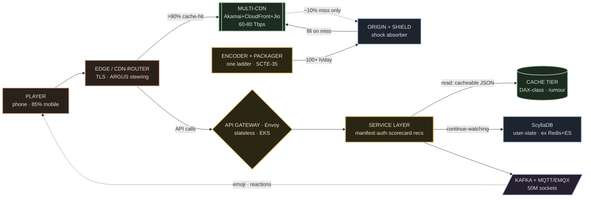

# 03 · High-Level Design

The board. Nine components, a diagram, and a numbered trace of one viewer joining at the
moment Dhoni walks out — then the same board under a push-storm surge. The recurring
question this doc answers: **how do you serve the same cricket ball to 72 million phones at
once without your own servers ever feeling the crowd?** `[V ICC — 72.5M, T20WC '26 final]`

---

## The nine components

| # | Component | State it owns | Why it exists |
|---|---|---|---|
| 1 | **Player** | playback buffer | the phone. ~85% of viewing is mobile on marginal 2G/3G networks — the buffer is the whole reason latency is traded away. `[V]` |
| 2 | **Edge / CDN-router** | none | TLS termination + steering. Picks which CDN this viewer pulls from; doesn't serve video itself. |
| 3 | **Multi-CDN** ★ CENTRE | cached segments (copies) | **the hero.** Akamai · AWS CloudFront · Jio CDN, steered by **ARGUS**, **>90% cache-hit**. One segment fans out to millions of edges. This is the machine. `[V multi-CDN, 2026 blog]` |
| 4 | **Origin + shield** | the master copies | the **"shock absorber"** (their word). Holds the authoritative segments; the shield tier means only cache-misses ever reach it. `[V]` |
| 5 | **Encoder + packager** | the encode ladder | **one** ladder per match — 100+ hours of live transcode/day, HLS + **SCTE-35** ad markers. 72M viewers ≠ 72M encodes. `[V]` |
| 6 | **API gateway (Envoy)** | none — stateless | the front door for every non-video call. Fleets on EKS; 200+ load balancers collapsed into one Envoy layer. `[R strong]` |
| 7 | **Service layer** | none — stateless | manifest · auth · scorecard · entitlement · recs. 800+ microservices; kill boxes, add boxes. `[R strong]` |
| 8 | **Cache tier** | cacheable JSON (rumour) | scorecards/summaries served from a DAX-class cache off a dedicated CDN domain — keeps read storms off the compute path. `[R]` |
| 9 | **ScyllaDB (user-state)** | continue-watching / watch-history | the one durable write path — **replaced a 500GB Redis cluster + 20TB Elasticsearch** at ~500M users. `[V vendor case study]` |
| + | **Fanout: Kafka + MQTT/EMQX** | 50M live sockets | the social pipe — emoji/reactions batched through Kafka → MQTT on EMQX to **50M concurrent connections.** `[V Hotstar blog]` |

Only the **video-delivery band** (2–5) and the **ScyllaDB owner** (9) touch bytes that
matter; the API band routes and caches, the fanout band holds sockets.

---

## The board

Read it as **three bands**:

- **The video-delivery band** (player → edge → multi-CDN → origin+shield ← encoder) —
  video is **static files**. The encoder makes copies once; the CDN fans them out to
  millions. Your servers never stream to a viewer. This band carries **60–80 Tbps per live
  event (2026)** `[V]` — up from the historic **10+ Tbps at 25.3M concurrent (2019)** `[V,
  date it]`.
- **The API band** (edge → gateway → service layer → cache tier / ScyllaDB) — the servers'
  war. Video is easy; the platform APIs are the fight — **1M+ requests/sec at 25.3M
  concurrent (2019)** `[V, date it]`. Stateless fleets, cache in front, one durable store
  behind.
- **The fanout band** (service layer → Kafka + MQTT/EMQX → player) — **50M sockets** of
  emoji and social. Batched, not per-request.

---

## The video-delivery band — the CDN is the whole trick

- **One segment, one edge tree, millions of phones.** The encoder produces **one** encode
  ladder per match (100+ h/day of transcode, SCTE-35 markers baked in). That segment lands
  on the origin, the shield tier caches it, and the **multi-CDN** replicates the *same
  cached bytes* out to millions of edge locations. 72M viewers pull copies; nobody pulls
  from your origin. `[V]`
- **Cache-hit is the survival line.** At **>90% cache-hit**, the origin sees only ~10% of
  requests — survivable. `[R]` Let hit-rate slip to 70% and the origin suddenly eats **3×**
  the load: a melt. The whole architecture is a bet that the CDN almost always already has
  the byte.
- **Multi-CDN, steered.** **Akamai + AWS CloudFront + Jio CDN** `[V, 2026 blog]`, routed by
  **ARGUS + a QoS Routing Manager**: per-CDN health scores (packet-failure-rate + rebuffering
  + RTT), safety gates (never route a CDN below a 5% warm-up floor), two-phase capacity
  steering. `[V]` One CDN browns out → traffic shifts, the ball keeps playing. CDN-failure is
  a *rehearsed* chaos drill, not a hypothetical. `[V]`
- **The origin is a "shock absorber."** Their word. It holds master copies and absorbs the
  miss traffic the CDN doesn't cover — sized so that even a bad cache-hit hour doesn't reach
  the encoders.

> **Video is static files. The CDN does the fanout; your origin only feels the misses.**

---

## The API band — the storm the CDN can't carry

The CDN carries the video for free; every *other* tap in the app — manifest fetch, login,
scorecard refresh, "is this match live?", recommendations — hits **your** cloud. That's the
real fight: **1M+ requests/sec at the 2019 record.** `[V, date it]`

- **Stateless everywhere.** The **Envoy gateway** and the **service layer** hold no session.
  N identical boxes on EKS; scale by adding boxes, kill one and nobody notices. (200+ load
  balancers were collapsed into the one Envoy layer.) `[R strong]`
- **Manifest and auth stay off the hot path of *video*.** Getting the signed manifest and
  the entitlement check happens **once, at join** — then the player pulls segments straight
  from the edge. The API band never sits between the phone and the next segment; if it did,
  1M joins/min would drag it into the video path and kill playback.
- **Cache the rumour.** Match-day APIs are split **cacheable vs must-compute.** Scorecards
  and summaries — same answer for everyone — are served as **cacheable JSON** from a
  DAX-class cache off a dedicated CDN domain (>10M req/min at P99<100ms). `[R]` Only the
  genuinely per-user calls (sessions, recs) reach compute. Staggered TTLs stop a thundering
  herd when everyone refreshes on a wicket.
- **The DB decision.** Continue-watching / watch-history — the one thing that must survive
  a reboot — lives in **ScyllaDB**, which **replaced a 500GB Redis cluster + 20TB
  Elasticsearch** at ~500M users. `[V]` One tuned store instead of two strained ones.

---

## The fanout band — 50M sockets, batched

Emoji and social reactions can't be request/response at this scale. The pipe: player →
**Golang ingest → Kafka (batched every 500ms) → Spark (2s windows) → MQTT on EMQX** →
player. EMQX holds ~250k connections/node, ~4M/ELB, 8-node clusters federated by a Go
"reverse bridge" to **50M concurrent sockets** (5B emojis in one tournament). `[V]` The
lesson: batch the fanout; never open a per-user, per-event round-trip at 50M.

---

## Trace 1 — one viewer joins at the Dhoni moment

Dhoni walks out; ~10M people join in ~10 minutes. `[R]` One of them is you:

1. You tap **play** → **edge** terminates TLS, **ARGUS** steers you to a CDN. ①
2. **API gateway → service layer** checks your **entitlement/auth** and returns a **signed
   manifest** — once. ②③
3. Your player reads the manifest and pulls **HLS segments straight from the CDN edge** —
   **>90%** of them already cached, the ball on your screen ~15–20s behind the stadium (by
   design, to protect the buffer). ④⑤
4. The scorecard widget reads **cacheable JSON** from the cache tier — never compute. ⑥
5. **ScyllaDB** records where you are for continue-watching. ⑦
6. You tap the 🔥 emoji → it rides **Kafka → MQTT/EMQX** into the 50M-socket stream. ⑧

**Total load on your origin — near zero. Total streams encoded for you — a fraction of
one.**

## Trace 2 — the same board under a push-storm surge

A push notification fires — "IND needs 6 off the last ball" — and **1M+ joins land in one
minute.** `[V join rate]`

- **The video band doesn't flinch.** The segments are already cached across the multi-CDN;
  a million new phones just pull existing copies. Cache-hit stays >90%; the origin barely
  moves. **60–80 Tbps** is the band's design point, not its ceiling.
- **The API band was pre-provisioned.** Because reactive autoscaling can't beat a 90s
  push-reaction budget, the fleets were **stepped up on a concurrency ladder before the
  over began** — with a ~2M-concurrent buffer already warm. The gateway and service layer
  absorb the join wave off pre-baked capacity, not a cold scale-up. `[V doctrine — detail
  in 05]`
- **Panic readiness.** If any tier still strains, non-critical services shed first —
  **recommendations, personalization, watchlist die; playback, auth, payments stay P0** —
  and freed servers are recycled into the critical path. A server→client flag tells phones
  to skip non-essential calls. "Nobody cares for your surround features if they cannot
  consume your primary feature. **The video must play on.**" `[V]`

The surge is absorbed in **three places: the CDN cache, the pre-provisioned API ladder, and
graceful degradation.** Nothing scaled *reactively*; the crowd was planned for.

---

## The inverse of IRCTC — same crowd, opposite war

Hold this board next to [IRCTC's](../irctc/03-high-level-design.md). Same nightmare — a
month of demand in one minute, tens of millions racing the same instant — and the **exact
opposite** engineering:

- **IRCTC is a write war.** 25M people fighting over one berth; the whole design funnels to
  a **single-writer per train-date** so no seat is ever sold twice. The truth is contended.
- **Hotstar is a read war.** 72M people wanting the **same bytes**; the whole design fans
  those bytes out through a CDN so no server ever feels the crowd. There is **no inventory to
  race for** — every viewer can have a copy.

Payments stay P0 on both. But IRCTC caches the rumour and guards one door; Hotstar copies the
truth and opens millions of them. `[V guardrail — the contrast is canon]`

> **Interview line:** "The crowd is the same size as IRCTC's and the war is the exact
> opposite — 72M *reads* of one cricket ball, not 25M *writes* fighting one berth. So the
> answer is a CDN that fans static files out at >90% cache-hit, an origin that only feels the
> misses, a stateless API band with the manifest fetched once off the video path, and a
> concurrency ladder pre-provisioned before the toss — because at 1M joins a minute you can't
> autoscale, you plan."

---

## What to carry forward

- **Video is static files.** One encode ladder → origin+shield → **multi-CDN** (Akamai +
  CloudFront + Jio, ARGUS-steered) → millions of phones. Your servers never stream to a
  viewer. `[V]`
- **Cache-hit is the survival line.** >90% hit → origin sees ~10%; 70% → 3× the origin load,
  a melt. `[R]`
- **The API storm is the real fight** — 1M+ RPS (2019). Stateless Envoy/EKS fleets, manifest
  + auth fetched **once off the video path**, cacheable JSON in front, **ScyllaDB** (ex
  500GB-Redis + 20TB-ES) as the one durable store. `[V]`
- **You don't autoscale a live match — you pre-provision.** Concurrency ladders + a ~2M
  buffer before the toss; **panic mode** sheds recs/watchlist to protect playback/auth/pay.
- **Inverse of IRCTC:** same crowd, reads not writes — copy the truth a million times instead
  of guarding one door. `[V]`

**Honesty labels:** encoder + DRM vendors **UNKNOWN** (never named); concurrency figures =
**ICC-official only**; 1M RPS / 10 Tbps are **2019, dated**; 60–80 Tbps is **2026**; "10k+
instances" is folklore, not used.

Next: [04 · Services & interactions →](./04-services-and-interactions.md) ·
[05 · Scale & resilience deep-dive →](./05-scale-and-resilience-deep-dive.md)
