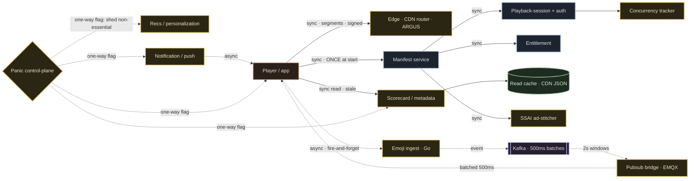

# 04 · Services & Interactions

The follow-up round opens here. The high-level design ([03](./03-high-level-design.md))
draws nine boxes. But **boxes aren't services** — a box is a region of responsibility. The
first thing a senior interviewer asks: *"Your map had nine boxes. Carve this into real
microservices. Name them, give each ONE job, and then the part juniors skip — tell me exactly
who calls whom, synchronous or asynchronous, and which ones are allowed to die."*

> This is **domain decomposition** — how *I'd* carve it, a **design decision `[D]`**, not a
> claim about Hotstar's internal service list (EKS + ~800 microservices behind an Envoy gateway
> is `[R]`; the exact roster is **not published — UNKNOWN**). Two things inside are **verified
> `[V]`**: Go on the hot paths (emoji ingest + pubsub bridge, their own blog) and the panic
> ordering — **recommendations/personalization die first**.

---

## The service census — twelve services, one job each

Confidence · **P-tier** in the last column (P0 = never degrades; P2 = allowed to die).

| # | Service | The one sentence | Conf · Tier |
|---|---|---|---|
| 1 | **Edge / CDN router** | TLS termination and live steering — the ARGUS brain routes each cohort to the healthiest CDN. | `[V]` steering · **P0** |
| 2 | **Manifest service** | Signs the short-TTL playback URL — the one door auth passes through. | `[D]` · **P0** |
| 3 | **Playback-session + auth** | Who are you, and can you watch — resolved *once*, at the start. | `[D]` · **P0** |
| 4 | **Entitlement / subscription** | Is the subscription live right now. | `[D]` · **P0** |
| 5 | **Concurrency tracker** | The business number the platform scales on — the *internal* signal is critical, but the *client read* degrades (cacheable, seconds-stale). | `[V]` metric · **P1** |
| 6 | **Scorecard / metadata API** | Cacheable reads — served stale, never from the database. | `[D]` · **P1** |
| 7 | **SSAI ad-stitcher** | Splices ads into the segments server-side (~10 cohorts). | `[V]` SSAI · **P1** |
| 8 | **Emoji ingest** | A Go firehose that swallows the reaction storm. | `[V]` Go · **P1** |
| 9 | **Pubsub bridge** | Holds 50M sockets — Go + EMQX, federated clusters. | `[V]` · **P1** |
| 10 | **Recommendation / personalization** | Suggestions and watchlist — **the P2 that dies first in panic.** | `[V]` order · **P2** |
| 11 | **Notification / push** | Fires campaigns — and is the self-DDoS weapon. | `[R]` · **P2** |
| 12 | **Config / panic control-plane** | Flips the whole platform into survival mode with one flag. | `[V]` panic · **P0** |

Each is **a card you could hand a team and say: own this, and nothing else.**

> **On tiers — "P0" here means "on the P0 critical path."** The doctrine has exactly **three
> P0 *promises*** — **playback · auth · payments** ([05](./05-scale-and-resilience-deep-dive.md),
> [06](./06-failures-and-drills.md)). Several *services* are tagged P0 because they sit on that
> path (edge, manifest, playback-session/auth, entitlement, panic control-plane); everything
> else degrades (P1) or is shed (P2). Three promises, a handful of services keeping them.

## The one rule that keeps it from becoming soup

> **Every service gets exactly one sentence of responsibility.**

- If **two services share a sentence → merge them.**
- If **one service needs the word "and" to describe it → split it.**

Microservices are not the goal — **sentences are.** The boundaries are wherever the sentences
divide. (This is why *manifest* and *auth* are two cards, not one: signing a URL and deciding
*can this person watch* are different sentences — you want to scale and fail them separately.)

---

## The interaction matrix — the *actual* architecture

Boxes are furniture. **Who calls whom, and how** is the architecture. One rule decides
sync vs async on every edge:

> **If the user is waiting on the answer, the hop is synchronous. If nobody is waiting,
> it's an event on the log.**

Blue = the **P0 playback spine** (manifest → auth → entitlement). Solid arrows are
synchronous; dashed arrows are events. **The whole trick is on that top-left edge:** the
player hits the manifest service **once**, gets a signed URL, and after that talks only to
the **CDN edge** — *not to your servers.* Auth happens at the door, then a dumb edge verifies
a signature locally for the next thousand segments.

### The synchronous spine — every hop, three stamps

The user's screen is blocked on these, so every millisecond and every failure is on the
critical path. **No synchronous arrow ships without three stamps:**

| Hop | Sync? | Timeout | Retry | Idempotency |
|---|---|---|---|---|
| **player → manifest** | **sync, ONCE at start** — sign a short-TTL URL, check sub + entitlement | hard timeout | **one** retry | signing is deterministic — a retry returns the *same* signed URL, never a second session |
| **manifest → auth / entitlement** | **sync (P0)** — the door decision, in the same breath | tight | in-request | session key |
| **player → scorecard** | **sync read — but served STALE from cache, never the DB** | short | — | n/a (read) |
| **player → CDN edge** (segments) | **sync — but this hop leaves your servers**; edge verifies the signature locally | edge-local | client jitter + backoff | n/a (immutable segment `#419` = same bytes for everyone) |

The **signed manifest is what lets auth be P0 without being called a hundred million times a
minute** — the check moves off the hot path entirely. (Hotstar's internal dedup/rate-limiter
internals are **UNKNOWN** — we require idempotency by design.)

### The async fan-out — everything on the log is replayable

Emoji is the archetype: **player → emoji ingest is asynchronous, fire-and-forget onto Kafka.**
The phone POSTs a reaction and moves on — nobody's screen waits. From there it's **batched
every 500ms into Kafka → Spark 2s windows → the EMQX pubsub bridge**, which fans a single
wicket out to 50M sockets. You **never fan out per user on the request path**; you batch on the
way in, aggregate in the middle, and broadcast through a broker built for millions of cheap
subscriptions `[V]`.

And the **panic control-plane is one-way, to everyone**: a single flag that says *"shed your
non-essential calls, now."* Millions of clients read it and back off — recs and push go dark,
scorecards refresh slower, the P0 spine keeps its threads. Load drops **from the edge inward**,
not just from the center out.

### sync vs async, per hop

| Hop | Transport | Why |
|---|---|---|
| player → manifest / auth | sync gRPC/REST | user is blocked; you need the signed URL now |
| player → scorecard | sync read (cached) | user waits, but a rumour is fine — stale beats a DB hit |
| player → CDN edge | sync (off your fleet) | the CDN *is* the answer; your origin never sees it |
| emoji → Kafka → EMQX | async log | nobody waits; batch and replay, don't fan out live |
| panic → everyone | async broadcast | one-way flag, no reply expected |

> **The rule that keeps you sane:** every synchronous hop gets a **timeout, a retry budget,
> and idempotency.** Every fan-out that can wait goes **on the log.** Draw that matrix and
> you've answered half the follow-ups before they're asked.

> **Interview line:** *"Boxes aren't services. I'd carve twelve, one sentence each — and the
> matrix is the real answer: the player hits the manifest service ONCE to sign a URL, then
> talks only to the CDN edge, not to me; scorecards are stale cached reads, never the DB;
> emojis fire-and-forget onto Kafka and fan out through EMQX; and a panic control-plane
> broadcasts one flag — shed non-essential calls — so recs die first and the video plays on."*

---

## What to carry forward

- **Twelve services, one sentence each** — and the sentence *is* the boundary. Manifest ≠ auth
  because signing a URL and authorizing a viewer are different jobs you scale separately.
- **The matrix beats the boxes.** The load-bearing edge is *player → manifest ONCE → then CDN
  edge*: authenticate at the door, serve signed files after. That single move is what keeps a
  P0 auth service alive at tens of millions of segment requests a second.
- **Sync spine, async everything-else.** Three stamps on every blocked hop (timeout · retry ·
  idempotency); the log (Kafka) for anything that can wait — emojis, notifications, analytics.
- **P-tiers are wired into the topology, not bolted on.** The panic control-plane is a real
  one-way edge in the graph, and *recs/personalization die first* `[V]` so the playback spine
  never starves.

**Next:** [05 · Scale & resilience deep-dive →](./05-scale-and-resilience-deep-dive.md) — the CDN contract,
the concurrency ladder, and why "the video must play on" is a design, not a slogan.
