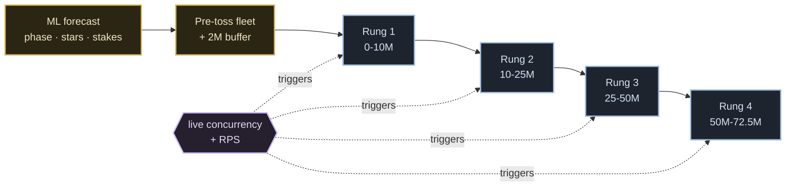
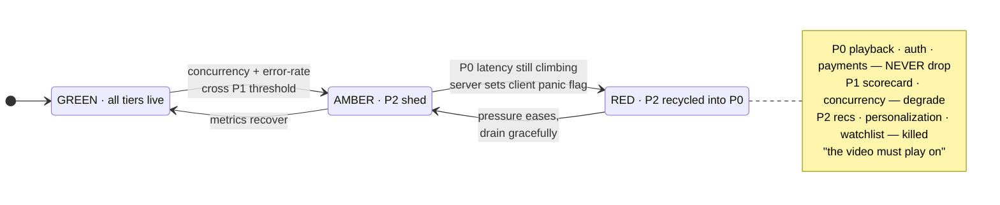
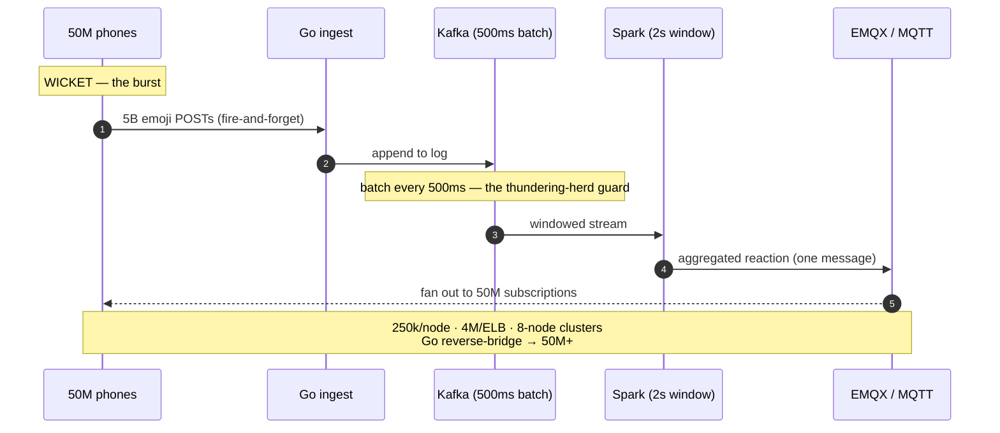

# 05 · Scale & Resilience Deep-Dive

The map is drawn; now the interviewer leans in. *"Seventy-two and a half million people
watched one ball on 8 March 2026. Don't tell me it worked — tell me **why** it didn't fall
over. Show me the machinery."* This is where "we scale" stops being a verb and becomes four
specific machines, each defending against a different way the biggest live event on earth
tries to kill itself.

Four machines make 72.5M work: **the concurrency ladder** (how capacity arrives before the
crowd), **panic mode** (what dies so the stream lives), **the socket tier** (how one wicket
reaches 50M phones), and **SSAI** (how ads ride inside the stream instead of breaking it).

The one law you may never break: **the video must play on.**

---

## A · The concurrency ladder — the twist

Every cloud tutorial teaches the same reflex: watch the CPU, add servers when it climbs.
Reactive autoscaling. For a World Cup final, it is the **wrong tool**, and the arithmetic is
the whole argument.

### The boot-race that reactive autoscaling loses

When Dhoni walks out, joins arrive at **0.5–1M+ new viewers per minute** `[V talks]`. Now
time a reactive autoscaler against that wall:

| Step | Time | Source |
|---|---|---|
| Cloud provisions an instance | **~90s** | `[R detail]` |
| App boots + warms up | **~74s** | `[R detail]` |
| **Total: capacity arrives** | **~164s later** | — |
| Meanwhile, a wall of joins hit | **~2.7M people** in that window | `[V]` join-rate |

Two and a half minutes after the surge that needed it, your new servers finally warm — and
by then millions have hit a buffering wall and left. Worse: ask AWS for tens of thousands of
instances *at once* and it answers **"insufficient capacity"** `[V]`. Reactive autoscaling
doesn't just arrive late; at this scale it may not arrive at all.

### The chosen answer — pre-provision on a business-metric ladder

Hotstar inverts it: **boot and warm the fleet before the toss**, sized by an **ML forecast**
keyed on match phase, star power, and stakes `[R-voiced]`. Then step **up a concurrency
ladder** — each rung a band of concurrency + request-rate, each band with a pre-computed
fleet already running. The trigger is not CPU; it is the **business metric** (live
concurrency + RPS). The controller is famously mundane — *"a normal Python script"*
scaling on business signals, not infrastructure ones `[V]`. A **~2M-concurrent buffer** is
held in hand at all times `[R]`.

### The decision, side by side

| Door | HPA on CPU (reactive) | Pre-provisioned ladder (chosen) |
|---|---|---|
| **Trigger** | CPU crosses a threshold | live concurrency + RPS band |
| **When capacity arrives** | ~164s *after* the surge | *before* the toss, already warm |
| **Behaviour at a tsunami ramp** | asks AWS for 10k nodes → "insufficient capacity" | fleet already booted; no cold ask |
| **Buffer** | none — reacts to what happened | ~2M concurrent held in hand |
| **Deciding number** | **spike slope: 1M joins/min** | **vs boot latency: ~164s** — the surge outruns the boot, so you must be early |

The deciding number is the **gap between spike slope and boot latency**. A million joins a
minute cannot be chased by a 164-second boot; the only winning move is to already be there.

> **Interview line:** "I refuse reactive autoscaling for the match. A million joins a minute
> against a ~164-second provision-plus-boot means capacity always arrives after the crowd has
> already bounced. So I pre-provision an ML-forecast fleet before the toss and step up a
> concurrency ladder triggered on the business metric, not CPU — with a ~2M buffer in hand."

### The cliff — scale-*in* is the more dangerous half

The follow-up hiding inside this one: scaling **down**. Dhoni gets run out, and in minutes
**~25M viewers collapse to ~1M** — a cliff `[R]`. If you scale in as aggressively as you
scaled out, you thrash: connections drop, servers churn, and the users who *stayed* get hurt.
So the ladder descends **slowly and deliberately** — draining connections gracefully, holding
the buffer. **Scale-in is more dangerous than scale-out**, because you're pulling capacity
from a system that is still bleeding users. The load generator (Project HULK — **108,000 CPU
cores, 216 TB RAM, 200 Gbps, 8 regions, simulating 50M** `[V]`) rehearses the **cliff**, not
just the **wall**. (Full rehearsal doctrine in [06 · Failures & drills](./06-failures-and-drills.md).)

---

## B · Panic mode — a state machine, not a button

"We have a panic button" is a story, not a design. A button implies a human clicking in time,
and no human is fast enough at 72.5M. **Panic mode is a state machine driven by feature
tiers**, assigned at design time and flipped by the platform itself.

### The tiers

- **P0 — never degrades:** **playback, auth, payments/subscription.** The primary feature.
- **P1 — degrades gracefully:** **scorecard, the concurrency tracker.** Serve staler, refresh
  slower, but stay up.
- **P2 — killed outright:** **recommendations, personalization, watchlist.** When panic trips
  these are shed, and **their freed servers are recycled into the P0 path** `[V]`.

The reveal: the **server sends a flag to the client** — millions of apps are told *"we're in
panic, shed your non-essential calls"* — so load drops from the **edge inward**, not just from
the center out `[V]`.

### The decision — tiered load-shedding vs throttle-everyone

| Door | Uniform rate-limit (rejected) | Feature-tier load-shedding (chosen) |
|---|---|---|
| **Mechanism** | throttle every request equally | kill P2, degrade P1, protect P0 absolutely |
| **What suffers** | *everything* slows — including playback | only the frills; the stream is untouched |
| **The insanity** | slows the video to save a recommendation | you never trade the primary for the trivial |
| **Deciding number** | fairness across all calls | **P0 must hold at 100%** — that constraint forbids uniform throttling |

You do not slow the important thing to save the trivial thing; you **kill the trivial thing
to feed the important thing.** The whole doctrine collapses into one sentence from Hotstar's
own engineer: *"Nobody cares for your surround features if they cannot consume your primary
feature. **The video must play on.**"* `[V]`

Underneath the switch sit the named guards, each a standard resilience pattern wired to the
same lever: **circuit breakers** (a slow dependency can't drag its caller down),
**bulkheads** (one flooded service can't drown its neighbours), **backpressure** (a queue
sheds load instead of toppling), and **token-bucket** rate-limiting where throttling *is*
warranted. Panic mode is just these patterns, all pulled by one flag.

---

## C · 50 million sockets — the social fanout

The scorecard you can cache; a live connection you cannot. Hotstar's own blog states they
hold **50M+ concurrent connections** for the emoji/reaction firehose — **5 billion emojis in
a single tournament** `[V]`. The naive answer — a WebSocket per user on your own fleet, every
event fanned out 50M separate times — **melts**. The right answer is a purpose-built pub/sub
pipeline that **batches on the way in, aggregates in the middle, and fans out through a broker
built for millions of cheap subscriptions.**

The pipeline `[V, Hotstar blog]`:

- **Go HTTP ingest** — a goroutine per connection is cheap, GC pauses tiny.
- **Kafka, batched every 500ms** — you process *windows* of emojis, not 5B individual events.
  (This 500ms batch is also the **thundering-herd guard**: a wicket doesn't fan out per-event,
  it fans out per-window.)
- **Spark, 2-second windows** — aggregates the reactions.
- **EMQX (MQTT)** for fan-out — ~**250k connections per node**, ~**4M per ELB**, and the
  broker's Mnesia store caps a cluster at **8 nodes**. A Go **"reverse bridge"** federates
  those 8-node clusters together to reach **50M+**.

### The decision — three transports

| Transport | Fits | Fails here |
|---|---|---|
| **Per-user WebSocket fleet** | small realtime apps | 50M *stateful* conns on your servers; every event fanned 50M× — melts |
| **SSE (server-sent events)** | one-way live feeds | **one-directional** — a viewer can't send an emoji *up* |
| **MQTT batched pub/sub (chosen)** | millions of tiny bidirectional subscriptions | none at this shape — **deciding number: 250k conns/node × 8-node clusters, bridged to 50M+** |

The pattern to remember: **you never fan out per user.** Batch inbound, aggregate in the
middle, fan out through a broker built for millions of cheap subscriptions — and the video
never notices five billion emojis.

---

## D · SSAI — putting the ad inside the stream

Ads: eight hours of cricket, **100+ ad breaks**, on an audience that is **~85% mobile on
marginal 2G/3G networks** `[V, Demuxed]`. The obvious approach — let the app play the ad, like
YouTube — is **wrong** at this scale.

### Why client-side ads break

Client-side insertion makes the player **stop the match stream, open a second connection to an
ad server, fetch a different video, play it, then rejoin live.** On a stable laptop: fine. On
a 2G phone in a moving train — most of the audience — that ad fetch **stalls**, the adaptive-
bitrate logic panics, and the viewer misses the next ball. Unacceptable.

### The chosen answer — server-side ad insertion

The match feed already carries **SCTE-35 markers** — cue points that say *"ad break here,
40 seconds"* (one 40s slot fills as **1×40s or 2×20s**) `[V]`. The server **splices the ad
directly into the video segments**, so the phone plays **one continuous stream** — ad and
match are the same bytes, same connection, **no stall.**

The scale trick: they don't cut a unique stream per person. Viewers are grouped into **~10
demographic cohorts**, each cohort gets one stitched "virtual feed" → **only tens of streams
total**, and an **nginx in-memory cache absorbs ~50%** of the ad load before it even reaches
the CDN `[V, Demuxed 2019]`.

### The decision — cohorts vs cache efficiency

| Knob | More cohorts | Fewer cohorts |
|---|---|---|
| **Ad targeting** | sharper, sells better | blunter |
| **Cache behaviour** | each extra cohort = another distinct stream → **fragments the cache** | fewer distinct streams → higher hit-rate |
| **Deciding number** | **~10 cohorts** — targeted enough to sell, few enough that **nginx still absorbs ~50%** | — |

Ten is the balance point where targeting and cacheability meet.

### Two honesty notes

- **[V §11] Hybrid in 2026.** The stack is no longer pure SSAI — on **Android** they've added
  **CSAI via multi-period DASH** (ExoPlayer). The core teaching still holds: *at 2G scale you
  move the ad **into** the stream, not next to it* — but name the hybrid honestly.
- **Don't conflate two "cohorts."** The **SSAI ad-cohort** (~10 demographic buckets, this
  section) is a *stitching* axis. The **ARGUS "cohort"** (ASN · country · state · city ·
  usertype, `[V §11]`) is a *CDN-routing* axis in the traffic-steering brain — a different
  machine entirely (see [04 · Services & interactions](./04-services-and-interactions.md)).
  Same word, two unrelated partitionings — call them apart.

---

## What to carry forward

- **The ladder beats autoscaling on arithmetic:** 1M joins/min vs ~164s provision+boot means
  reactive capacity always arrives after the crowd left. **Pre-provision an ML-forecast fleet
  before the toss**, step up a **business-metric** concurrency ladder, hold a **~2M buffer.**
- **Scale-in is the dangerous half** — the Dhoni cliff (~25M→~1M) — so drain gracefully; the
  load generator rehearses the cliff, not just the wall.
- **Panic mode is a tiered state machine, not a button:** **P0 (playback/auth/payments) never
  drops**, P1 degrades, **P2 is killed and recycled into P0**; a **server→client flag** sheds
  load from the edge inward. Tiered shedding beats uniform throttling because **you never slow
  the video to save a recommendation.** *"The video must play on."*
- **50M sockets by batching, not per-user fan-out:** Go ingest → Kafka (500ms) → Spark (2s) →
  **EMQX MQTT** (250k/node, 4M/ELB, 8-node clusters, Go reverse-bridge → 50M+). SSE can't send
  *up*; a per-user WebSocket fleet melts.
- **SSAI puts the ad inside the stream** so a 2G phone never stalls: SCTE-35 markers, **~10
  cohorts → tens of streams**, nginx cache **~50%** — cohorts-vs-cache is the tension, ~10 is
  the balance. Hybrid CSAI on Android in 2026. The **SSAI ad-cohort ≠ the ARGUS routing
  cohort.**

Next: [06 · Failures & drills →](./06-failures-and-drills.md)
