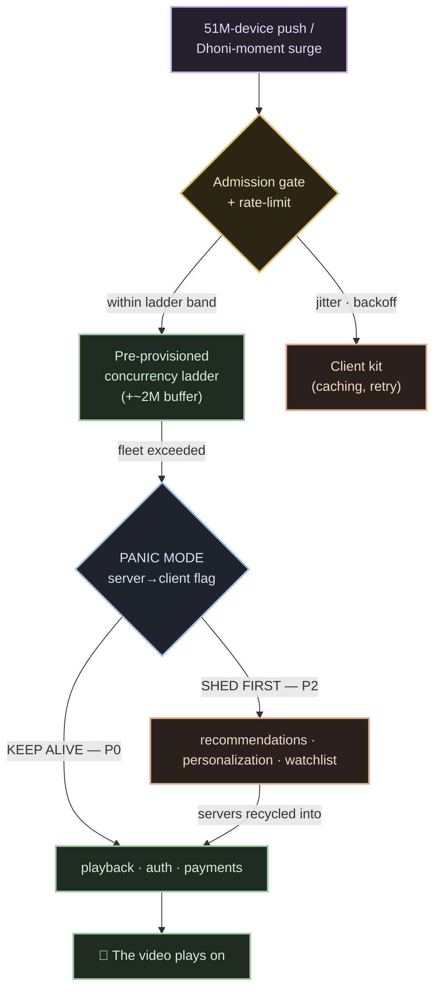

# 06 · Failures & Drills

The round that separates a design that survives the demo from one that survives **10:00 p.m.
on final night, IND–NZ, 72.5 million people watching the same ball.** `[V]` This doc breaks
the system four ways, names the guard that contains each break, and then shows the program
Hotstar built to *rehearse* all of them before the crowd arrives. The theme of the whole
series lands here: at this scale you don't scale *to* the disaster — **you attack yourself
first, so the final is a rerun of a night you already survived in a lab.**

Every drill is the same shape: **the failure → what breaks → the NAMED pattern that contains
it → the number.**

---

## Drill 1 — the push-stampede (a DDoS your own marketing schedules)

Marketing fires a **51M-device rich push** — "IND vs NZ starts NOW." `[V vendor]` Taps land
in a wall: users join at **0.5–1M per minute**, and your reaction budget from push-fire to
absorbed load is **90 seconds** — because a fresh instance needs ~90s to provision and ~74s
more to boot, and at that ramp AWS itself starts throwing *insufficient-capacity* errors.
`[V] / [R detail]` React-to-load loses the race before it starts.

| | Naive | Guarded |
|---|---|---|
| Capacity | autoscale on CPU when joins spike | **pre-scale BEFORE marketing fires** — the push is a scheduled capacity event; step up the pre-computed **concurrency ladder**, keep a **~2M-concurrent buffer** in hand `[V]/[R]` |
| Front door | let every device hammer login/playback | **admission gate + rate-limit + request jitter/backoff** on the client kit — meter WHO gets in per second `[R]` |
| Overflow | pray | **load-shed** the surround features, recycle their servers into playback (panic-readiness armed, Drill 4) `[V]` |

> **The push is a self-inflicted DDoS scheduled by the marketing team.** The fix isn't more
> servers at 10:00:01 — it's a calendar invite: *engineering pre-scales before the button is
> pressed.* `[R]`

**The number:** 90-second reaction budget vs 1M joins/min — which is exactly why the ladder
is climbed *before* the toss, never after the push.

---

## Drill 2 — the CDN browns out mid-final `[V — chaos-rehearsed]`

An edge/CDN partner starts browning out in the middle of the innings — rising rebuffering,
climbing RTT, packet-first-response degrading in one region. On a single-CDN design this is
the whole event stalling for millions. It is not, because CDN failure is a **chaos test
Hotstar runs on purpose** (Drill program below). `[V]`

The guard is **multi-CDN steering with an origin shield** — now confirmed, not inferred:

- **ARGUS + the QoS Routing Manager** score each CDN with a **Cumulative Health Score**
  (packet-first-response + rebuffering + RTT, linear-piecewise, **EWMA α ≈ 0.6**) and reroute
  the affected **cohort (ASN · Country · State · City · UserType)** to the healthy CDNs —
  **Akamai · AWS CloudFront · Jio CDN.** `[V §11]`
- Safety gates keep the reroute from causing a *second* incident: **ASN hard-binding**,
  **max-deviation dampening**, and a **5% warm-up floor** — a CDN is never dropped to 0%, so
  its cache stays warm and it can be brought back without a cold-start stampede. `[V §11]`
- The **origin shield** holds behind all of it: video is static HLS files, cache-hit **>90%**,
  so the origin fetches each segment ~once no matter how the edges are steered. `[R]`

The steering is proven live, not just in theory: an A/B on a live T20 lifted packet-first-rate
**+11%.** `[V §11]`

**Pattern:** multi-CDN steering + origin shield + 5%-warm-up floor.
**The number:** never 0% — every CDN holds at least a 5% warm floor so a reroute is a dial,
not a switch.

---

## Drill 3 — the cliff (Dhoni is run out)

The tsunami has a twin, and it's the more dangerous one. **CWC'19 semi:** ~10M users joined
in ~10 minutes when Dhoni walked out to bat — then the **run-out emptied the room, ~25M → ~1M
in minutes.** `[R]` A naive fleet reacts to the drop by scaling *in* hard and fast — and mass
connection teardown is its own outage: churned sockets, dropped sessions, thundering
reconnects.

| | Naive | Guarded |
|---|---|---|
| Scale-in | terminate instances as soon as load falls | **graceful scale-in / connection draining** — drain in-flight requests, retire nodes slowly, **hold the buffer** so a re-surge (super-over, review, DRS) doesn't refill an empty room `[V]/[I]` |
| Rehearsal | only test the wall | **HULK tests the cliff too** — the load generator simulates *both* tsunami walls AND cliffs on game days `[V]` |

**Pattern:** graceful scale-in / connection draining, buffer held through the trough.
**The number:** the cliff is bigger than most systems' peak — **~24M concurrent drained in
minutes**, and the design's job is to make that a non-event.

---

## Drill 4 — the API melt (panic mode, live)

The video is fine — the CDN is carrying 60–80 Tbps of segments without breaking a sweat. What
saturates is **everything around the video**: recommendations, personalization, watchlist,
scorecards, social. When that storm exceeds even the pre-provisioned fleet, Hotstar flips a
literal switch it calls **panic mode**, and walks the degradation ladder *live*:

The mechanics, verbatim from Hotstar engineering: a tier of **P0 services must never go down —
playback, auth, payments.** Non-critical dies **first — recommendations, personalization,
watchlist** — and the servers those features were using are **recycled into the playback
path.** A **server→client flag** tells clients the platform is in panic so they *stop making*
non-essential calls, starving the storm from the edge. `[V]`

Underneath, the API storm is managed structurally: **circuit breakers** trip on the wounded
downstreams (fail fast, stop feeding them), **bulkheads** isolate the surround features from
the playback path, and cacheable APIs (scorecards, summaries) are split from must-compute ones
and served from a dedicated CDN JSON domain with staggered TTLs to beat the thundering herd.
`[V]/[R]`

> The doctrine, quoted: *"Nobody cares for your surround features if they cannot consume your
> primary feature. **The video must play on.**"* `[V]`

**Pattern:** feature-tier load-shedding + circuit breakers + bulkheads.
**The number:** the P0 *promise* is exactly **three things** — playback, auth, payments (the
services on that critical path are tagged P0 in [04](./04-services-and-interactions.md)). Everything else is
negotiable. See the design in [05 · Scale & panic ↗](./05-scale-and-resilience-deep-dive.md).

---

## Real incidents — even giants trip at the toss `[R, dated]`

Honest history, because the drills above are not hypothetical:

- **IPL '23 opener — JioCinema crashed** on the tournament launch under the first-ball rush.
  `[R]`
- **Hotstar down, Feb 2023** — a public outage window. `[R]`
- **Hotstar down, Feb 2025** — again. `[R]`

None of this is a knock; it's the point. The system that holds **72.5M concurrent** on the
T20WC'26 final (8 Mar 2026, ICC-confirmed world record) `[V]` is the same lineage that tripped
on lighter nights — which is *why* the chaos program exists. **Even giants trip at the toss.**

---

## The chaos program — Project HULK

You cannot A/B a system whose peak happens twice a year on a night you can't reschedule. So
Hotstar built the crowd in a lab. **Project HULK** is an in-house load generator: `[V]`

| HULK — exact numbers `[V]` | |
|---|---|
| CPU cores | **108,000** |
| RAM | **216 TB** |
| Egress | **200 Gbps** |
| Regions | **8** |
| Simulates | **50M concurrent users** |

What it rehearses — the full menu, on **game days** before the real match:

- **Tsunami tests** (the wall) — join-storms at 1M/min against the ladder (Drill 1).
- **Cliff tests** (the drain) — mass scale-in without connection churn (Drill 3).
- **AZ-kill** — pull an availability zone, prove the fleet holds.
- **CDN-fail** — brown out an edge, prove ARGUS reroutes (Drill 2).
- **Push-storm replays** — replay a 51M-device push against the pre-scaled fleet.

> **Interview line:** "At this scale you don't scale *to* the crowd — you build the stadium
> empty and pressure-test it before anyone arrives. The final is a rerun of a disaster you
> already survived in a lab: HULK fires 50M simulated users at 108k cores, kills an AZ, browns
> out a CDN, and replays the push — so on the night, nothing is new." `[V]`

Note the honesty boundary: **"10k+ EC2 instances" is folklore — don't quote it.** HULK's
**108k test cores** is the verified big number. `[V §10.5]`

---

## Observability — concurrency is the business metric, and CPU lies

The trap: grading this system on **CPU or five-minute averages.** At tsunami ramps CPU is a
lagging, lying signal — an average smears the one 90-second spike you exist to survive into a
flat line. So the whole doctrine is keyed on a *business* metric, not a machine one:

- **Concurrency is THE metric.** The ladder scales on **platform concurrency + request rate**,
  not CPU threshold — "a normal Python script" stepping fleets per band. `[V]/[R]` And
  concurrency is quoted **ICC-official only**: 72.5M final, 25.3M CWC'19 (the engineering-era
  anchor) — never the fabricated "82 crore," which is cumulative *views*, not people watching
  the same second. `[V §10.1]`
- **The 24/7 Watchdog validation stack** grades the *output*, not just the servers `[V §11]`:
  - **Video Validator** (server-side) — **manifest integrity**, **SSAI CUE-IN / CUE-OUT**
    checks, and **cross-CDN chunk parity** (the same segment must be byte-identical on Akamai,
    CloudFront and Jio CDN, or steering re-sells a broken stream).
  - **Play Portal** — real-device simulation, the way a phone on 3G actually sees it.
  - Ops scale it grades: **12 languages · 5 camera angles · 74 matches / 2 months · ~55
    concurrent live streams**, on **Grafana + ARGUS** dashboards.

The lesson generalizes: **instrument the thing the business is graded on** (viewers watching,
manifests valid, chunks matching), because the machine metric will tell you everything is
"fine" right up until the video isn't playing.

---

## What to carry forward

- **Push-stampede** → **pre-scale before marketing fires** + admission-gate/rate-limit +
  load-shed. 90s reaction budget vs 1M joins/min. *The push is a DDoS you scheduled.* `[V]/[R]`
- **CDN brownout** → **multi-CDN steering (ARGUS) + origin shield + 5% warm-up floor**;
  chaos-rehearsed, +11% PFR live. `[V]`
- **The cliff** → **graceful scale-in / connection draining**, hold the buffer; ~24M drained
  in minutes is a non-event. HULK tests the cliff too. `[R]/[V]`
- **API melt** → **panic mode**: feature-tier load-shedding + circuit breakers + bulkheads;
  P0 = playback/auth/payments, recs die first, servers recycled — *the video must play on.*
  `[V]`
- **History is honest** → JioCinema IPL'23 opener, Hotstar down Feb'23 + Feb'25 — *even giants
  trip at the toss.* `[V]`
- **Chaos = Project HULK** → 108k cores · 216 TB · 200 Gbps · 8 regions · simulates 50M;
  tsunami + cliff + AZ-kill + CDN-fail + push-replay on game days. **Attack yourself first.**
  `[V]`
- **Observability** → **concurrency is the business metric** (CPU lies), ICC-only numbers; the
  **24/7 Watchdog** (Video Validator manifest/SSAI/cross-CDN parity + Play Portal) grades the
  output, not the servers. `[V]`

Next: [07 · Build it yourself →](./07-build-it-yourself.md)
