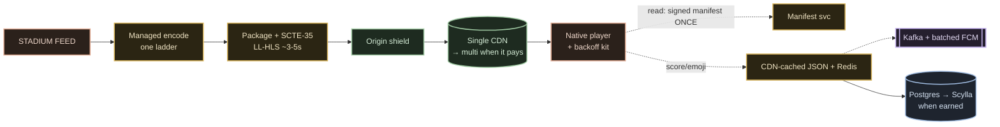

# 07 · Build It Yourself

The payoff. You've seen the machine and defended it ten times; now build a toy of it, pick
every stack choice on purpose, and answer the question the whole two-part video was built to
earn: **how do you buy capacity for a spike you need for three hours a year — and why is the
entire infrastructure bill a rounding error on one match?**

Two parts: **pick your stack** (what the real world runs vs what you'd choose today), and the
**design philosophy** that ties this whole series together — correctness where money moves,
availability where eyes watch.

---

## What's actually public (and what isn't)

**On record `[V]`:**

- **AWS** underneath: EC2 (diversified instance types + Spot fleets, **pre-baked AMIs** so a
  box needs no config at boot), S3, ELB/ALB; Kubernetes **KOPS → EKS** `[R strong]`, ~800
  microservices, **200+ load balancers collapsed behind one Envoy gateway layer** `[R]`.
- **Go on the hot paths** — emoji ingest, the pub/sub bridge (Hotstar's own blog); **Java /
  Python** across the mass of services (job posts). **Kafka + Spark** for the social pipeline. `[V]`
- **ScyllaDB** replaced a **500 GB Redis cluster + 20 TB Elasticsearch** for
  continue-watching / user-state (vendor case study, named engineers). `[V]`
- **Multi-CDN, named in their own 2026 blog: Akamai + AWS CloudFront + Jio CDN**, steered live
  by an in-house engine, **ARGUS + QoS Routing Manager** (cohort = ASN·country·state·city·
  user-type, 5% warm-up floor, **A/B PFR +11%**). `[V 2026]`
- **Pub/sub:** MQTT on **EMQX** — ~250k connections/node, ~4M/ELB, 8-node clusters federated by
  a Go "reverse bridge" to **50M+ concurrent sockets**; **5B emojis** in one tournament. `[V]`
- **Chaos:** **Project HULK** — 108,000 CPU cores, 216 TB RAM, 200 Gbps, 8 regions, simulates
  50M. **Panic mode** is real (P0 = playback/auth/payments; recs die first). `[V]`
- **Bandwidth:** 2019 = 10+ Tbps + 1M+ RPS at 25.3M concurrent; **2026 = 60–80 Tbps per live
  event**. `[V]` **Cost receipts:** media rights ≈ **₹118 cr per match**; **FY26 gross revenue
  ₹36,248 cr** `[R]`.

**NOT public — keep UNKNOWN, never invent:** the **encoder vendor** and the **DRM vendor** (a
"standard multi-DRM trio" is an industry *pattern* `[I]`, not a named fact); the exact segment
length / rendition-ladder rungs today (old "~10–12 renditions" is `[R]`, hedge it); the
observability stack internals; the exact peak instance count (**"10k+ instances" is folklore —
never use it**; HULK's 108k *test* cores is the verified big number).

---

## Pick your stack — real vs build-your-own

The **"you'd build"** and **"rejected"** columns are **`[I]` — engineering judgment, opinion
not fact.**

| Layer | Real Hotstar `[V/R]` | You'd build today `[I]` | Rejected + why `[I]` |
|---|---|---|---|
| **Encode** | vendor UNKNOWN; 100+ h/day transcode `[V]` | **Managed encode (MediaLive-class)** — skip the 3 a.m. encoder page; ffmpeg+OSS only if broke | GPU-DIY encoding = pager duty for pennies |
| **Protocol** | HLS + SCTE-35, ~15–20s behind `[V]` | **LL-HLS / CMAF (~3–5s)** | **WebRTC at 10M+** = a stateful session **per viewer on your servers** — dies |
| **CDN** | Akamai + CloudFront + Jio, ARGUS-steered `[V]` | **Single CDN + origin shield → multi-CDN when revenue justifies** | No CDN = 60–80 Tbps from *your* origin = instant death |
| **API** | Envoy gateway, EKS microservices `[R]` | **CDN-cache the JSON + Redis + jitter/backoff** | "More servers" *before* cache discipline |
| **Fanout** | Kafka → Spark → EMQX/MQTT, 50M `[V]` | **Kafka + batched FCM; MQTT only when sockets earn it** | A per-user WebSocket fleet, unbatched |
| **Scaling** | pre-provisioned ladders `[V]` | **K8s HPA on RPS for normal days; pre-provision for events** | CPU-threshold autoscale at a tsunami ramp |
| **User state** | ScyllaDB (ex Redis+ES) `[V]` | **Postgres → Scylla/Cassandra-class when row count demands** | Keeping 20 TB of bookmarks in Elasticsearch |
| **Language** | Go hot paths + JVM/Python `[V]` | **same split** | Rust everywhere (a velocity tax on I/O-bound infra) |
| **Cost** | egress-dominated; AI-encode −25% data `[V-press]` | **Codec spend (HEVC/AV1) + committed CDN contracts** | Ignoring egress until the bill arrives |

Your build-your-own board, one flow:

---

## Tech stack: database & language decisions

The two follow-ups that separate levels, made concrete: **which database per store**, and
**which language per service** — with the deciding constraint written down each time. The
**pick** and **why** columns are **`[I]` engineering judgment**; the real internal engines are
**`[V]`.**

### Database — SQL vs NoSQL, per store

**The core move: there is no one database.** Continue-watching is a bookmark, not a bank
balance — the engine that's right for it is exactly wrong for a payment ledger, and vice versa.

| Store | Job | You'd pick `[I]` | Deciding reason + constraint |
|---|---|---|---|
| **User state / continue-watching** | last-position per user, updated every few seconds | **Wide-column (ScyllaDB / Cassandra)** — the **real Hotstar runs Scylla `[V]`** | **Write-heavy, keyed by user, and NOT money** — lose a second of it and nobody files a dispute. You don't need joins or multi-row ACID; you need **write throughput at 500M users** and a simple key lookup. Partition by user, cluster by content, **last-write-wins**. Scylla replaced **500 GB Redis + 20 TB ES `[V]`** — two heavy systems collapsed into one built for this shape. |
| **Metadata / catalog / scorecard** | title info, EPG, live score reads | **KV over a managed store (DynamoDB + DAX)** — reportedly **>10M req/min @ P99 < 100 ms `[R]`** | **Read-heavy and cacheable** — the score is a *rumour* you refresh, not a truth you protect. A DAX-class cache in front turns the hot key into an in-memory hit. Never compute it per request. |
| **Event log** (emoji, analytics, plays) | append-only stream, replayed by many consumers | **Kafka — a log, not a database** `[V]` | Emojis and play-events are an **ordered append-only stream**; batch on the way in (500 ms), let Spark and the analytics tier **replay** the same log. A database here would be a bottleneck; a log is the right primitive. |
| **Ad cache (SSAI)** | absorb ~half the ad-segment load | **In-memory (nginx)** `[V]` | The stitched cohort feeds are hot and small; an in-memory cache **absorbs ~50%** before the CDN even sees it. Ephemeral by design — it's a buffer, not a record. |
| **The video itself** | the actual bytes, at 60–80 Tbps | **The CDN _is_ the database** | Video is **immutable files**; segment 419 is the same bytes for everyone forever. The store is a global read-through cache with a >90% hit rate — **not a database you query, a filesystem you replicate.** |

**The rule:** **wide-column** for write-heavy user-state at extreme scale (no ACID needed — it's
a bookmark); **KV + cache** for the metadata/score rumour; a **log (Kafka)** for append-only
events; **in-memory** for the ephemeral ad buffer; and for the video, **the CDN is the store.**
Match the engine to the invariant — here the invariant is *throughput and availability*, not
*correctness* — the exact inverse of the [UPI ledger](../upi/) and the
[IRCTC berth](../irctc/).

### Language — Rust vs Go vs Java vs Node/JS

**Languages are budgets, not religions.** The socket hot paths earn Go; the mass of services
want boring hireable JVM/Python; Rust stays home.

| Language | Where it fits `[I]` | Deciding criterion |
|---|---|---|
| **Go** | the **hot paths — emoji ingest + the pub/sub bridge** (real Hotstar `[V]`) | Millions of **cheap concurrent connections**: a **goroutine per socket** is nearly free and the **GC pauses are tiny** — exactly the workload that melts a heavier runtime. This is where nanoseconds and tail-latency actually live. |
| **Java (JVM) / Python** | the **mass of stateless services** — manifest, entitlement, metadata, recs | The criterion here isn't nanoseconds, it's **ecosystem and hiring** — you can staff a Java team tomorrow and debug it at 3 a.m. Behind a CDN and a cache, these services aren't latency-bound at the language level. |
| **Node / JS** | (optional) the **public BFF / web edge** | Fine for **I/O fan-out** on the API edge — but never on the socket hot path, where Go's concurrency model wins outright. |

**Rejected, and why:** **Rust everywhere.** Rust is glorious for a **CPU-bound** core — but most
of this system is **I/O-bound**, waiting on the network, and Rust would tax your development
velocity for a P99 improvement **you can't even measure behind a CDN**. Spend it only where a GC
pause on a hot socket path would actually hurt — and Go already covers that seam cheaply. **A
budget line, not a religion.**

### Frontend — answer the trap like a senior

There is **no clever web-framework question** here, and saying so is the senior move. The
interesting client is **not** React-vs-Vue — it's the **native player** (an ExoPlayer /
AVPlayer-class engine) and the **resilience kit** wrapped around it: **request jitter** so a
million phones don't retry in the same millisecond, **client-side caching**, **exponential
backoff**, and the code that **honors the panic flag** from
[05](./05-scale-and-resilience-deep-dive.md). On this system the client is not a rendering
surface — it's the **outermost ring of the distributed system, a load-shedding participant.**
So name the skip out loud: *which JS framework* is the wrong question for a streaming core; the
client engineering that matters is the player and the backoff logic.

---

## The real-vs-build matrix, in one line

You'd build it **this weekend:** **managed encode → LL-HLS → a single CDN with an origin
shield → CDN-cached JSON + Redis for the API → a signed manifest so auth is checked once, not
per segment → Kafka + batched FCM for fanout → Postgres for user-state (swap to Scylla when the
row count demands it) → Go on the socket path, JVM everywhere else.** That toy reproduces the
properties that *are* Hotstar — **video is files the CDN fans out, auth off the hot path, the
API storm behind a cache, ads stitched into the stream, the video degrades last** — without
the 50M sockets, the ARGUS steering brain, or a 108k-core chaos robot.

---

## The design philosophy — degrade everything except the stream

Step back and it's one sentence: **this system prices the failure of everything except the
pixels.** Recommendations, personalization, the watchlist — all of it is a **priced bet** that
*can* vanish at peak, and when it does, that isn't failure, it's **policy**. The one thing never
gambled is **playback** — and the machinery that protects it (panic mode, pre-provisioned
ladders, the origin shield, the resilience kit on the client) exists only to keep one promise:
*the video must play on.* `[V]` **Drama at the edges. Silence at the pixels.**

And the twist that makes the whole thing work: **you don't autoscale for the mega-event — you
rehearse it.** A World Cup final is a spike you need for **three hours a year**, arriving at **a
million joins a minute** — far faster than any reactive autoscaler's **~90s provision + ~74s
boot** can catch. So capacity is **bought, booted and warmed before the toss**, sized by an ML
forecast, stepped up a **concurrency ladder**, with a **~2M-viewer buffer** always in hand — and
**Project HULK attacks the platform first**, so the final is a rerun of a disaster you already
survived in a lab. **You rehearse the disaster so the match is boring.**

Then the cost inversion that ends the argument: at 60–80 Tbps the bill is **egress**, and even a
generous estimate puts a peak hour in the **tens of thousands of dollars** `[I estimate]` — while
the **media rights are ~₹118 cr per match** `[V]` and yearly revenue is in the **tens of
thousands of crores** `[R]`. **The entire infrastructure bill is a rounding error on the content
bill.** Engineer accordingly: a codec change that cuts data 25% saves crores; a day chasing a 2%
compute saving does not.

> **The Hotstar-unique answer no other system in this series can give:** UPI guards a single
> rupee with its life. IRCTC guards a single berth. **Hotstar cheerfully degrades everything
> except the stream** — because its data is 72 million *reads of the same bytes*, not writes
> racing for one scarce thing. **Correctness where money moves; availability where eyes watch.**
> Same engineer, opposite philosophy — because the *data* demanded it.

---

## What to carry forward

- Public facts are specific but bounded: **AWS/EC2-Spot/EKS-Envoy, Go hot paths + JVM/Python,
  Kafka+Spark, EMQX, ScyllaDB, Akamai+CloudFront+Jio (ARGUS), HULK, AI-encode −25%** — with real
  money (**₹118 cr/match**, **FY26 ₹36,248 cr**). The **encoder & DRM vendors are UNKNOWN**; never
  say "10k instances."
- **You'd build:** managed encode + LL-HLS + single-CDN-and-shield + CDN-cached JSON + signed
  manifest + Kafka/FCM + Postgres→Scylla + Go-on-sockets.
- **Tech-stack rule:** **wide-column** for write-heavy user-state (no ACID — it's a bookmark),
  **KV+cache** for the metadata/score rumour, a **log (Kafka)** for append-only events,
  **in-memory** for the ad buffer, and **the CDN as the store** for video. Language: **Go on the
  socket hot path, JVM/Python for services, Node only at the edge** — **Rust stays home** (I/O-bound).
  Frontend = **native player + resilience kit; skip the JS-framework question and say so.**
- The philosophy: **price the failure of everything except the pixels**; **rehearse the spike,
  don't autoscale it**; **the infra bill is a rounding error on the rights bill.**
- The trilogy: **correctness where money moves (UPI, IRCTC), availability where eyes watch
  (Hotstar)** — one engineer, three philosophies, chosen by the shape of the data.

← Back to [the Hotstar index](./README.md)
