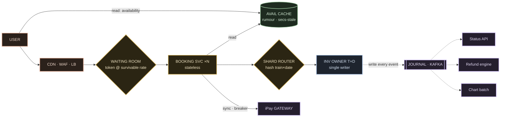

# 03 · High-Level Design

The board. Nine components, a diagram, and a numbered trace of one booking through all of
them — then the same board at 10:00 a.m. under the tatkal storm. The recurring question
this doc answers: **how do you absorb a month of demand hitting one minute without ever
selling one berth twice?**

---

## The nine components

| # | Component | State it owns | Why it exists |
|---|---|---|---|
| 1 | **User** | — | the human tapping "Book". |
| 2 | **Edge (CDN · WAF · LB)** | none | static assets, TLS, first bot filter, L7 least-connections load balancing. Doesn't know what a train is — the point. |
| 3 | **Waiting room (gate)** | queue positions | issues **admission tokens** at the rate the core survives; the tatkal answer. |
| 4 | **Booking service ×N** | **none — stateless** | validates, captures payment, orchestrates one booking. Kill one, nobody notices. |
| 5 | **Availability cache** | stale counts (rumour) | serves the 4-lakh/min read road from Redis; never the truth. |
| 6 | **Shard router** | routing map | hashes **train × journey-date** to the owner. Zero cross-train contention. |
| 7 | **Inventory owner (T×D)** | **the berths of one train-date** | the **only writer** of a train-date's inventory — contention becomes a queue, not a race. |
| 8 | **iPay gateway** | payment state | the payment aggregator (IRCTC owns its own, iPay); synchronous, breaker-wrapped. |
| 9 | **Journal (Kafka)** | append-only event log | every attempt/allocation/payment/cancellation; read by status API, refund engine, chart batch. |

Only **component 7** owns bookable inventory. Everything else routes, gates, caches, pays,
or records.

---

## The board

Read it as bands:

- **Client / edge band** (user → CDN·WAF·LB → gate) — absorb and filter before anything
  touches the core.
- **Stateless service band** (booking svc, shard router) — N identical photocopies; scales
  by adding boxes.
- **Truth band** (the inventory owner) — the **only** stateful, correctness-critical
  writer, owning *only its own* train-date.
- **Log band** (iPay, journal + its three async consumers) — money and the append-only
  record.

---

## The edge, the gate, the stateless middle

- **Edge (CDN · WAF · LB).** The real IRCTC fronts with **Akamai** `[V fingerprint]` +
  DigiCert TLS. Three cheap jobs: static assets from the edge, TLS terminated, first bot
  filter. Behind it an **L7 least-connections** load balancer ejects unhealthy boxes on
  failed health checks.
- **Waiting room.** Three ways to build admission control — throttle-and-drop, a Kafka
  request-log, or an **edge waiting room** that issues tokens at the survivable rate and
  shows an honest queue position. We take the edge waiting room (Ticketmaster/Cloudflare
  run it at planet scale); the spike dies at the CDN before it costs a single connection.
  Full compare-table in [06 · Failures](./06-failures-and-drills.md).
- **Booking service — stateless.** No session in the box → **N identical copies** behind
  the balancer. Boxes that remember nothing multiply forever; the **journal** remembers
  everything for them.

## The read road vs the truth

Availability queries outnumber bookings **12.5:1** (NGeT-launch actuals ran ~40:1). `[V]`
So **reads never touch the reservation truth:**

- **Rejected:** database read replicas — replicas melt under 4 lakh hits/min all on the
  same handful of hot trains.
- **Chosen:** a **Redis availability cache** keyed `train-date-class-quota`, refreshed
  every few seconds, invalidated on every booking commit. **Stale by design** — and that's
  fine, because we already told the user the truth: the search number was **never a
  promise.** `[V contract]`

> **Cache the rumour. Never cache the truth.**

---

## The centre: shard router → inventory owner

- **Shard router.** Partition key = **train × journey-date.** Natural, because two trains
  never fight for the same berth: every booking for Rajdhani 12301 on the 9th goes to the
  one shard that owns it; a different train or date → a different shard → **zero
  contention.** `[I structural]`
- **The beautiful part:** the real PRS has run this *physically* since the 1990s —
  regional centres (Delhi, Mumbai, Kolkata, Chennai, Secunderabad), each owning its own
  territory's trains, stitched by **RTR (Reliable Transaction Router)**, which is
  documented to route each transaction to the backend node that **owns that data
  partition.** `[V]` **Your shard map is their country map.**
- **Inventory owner (T×D).** The **only process allowed to write** that train-date's
  berths. One owner per shard means contention becomes a **queue, not a race.** *How* the
  owner enforces one-berth-one-passenger — locks, versions, or a single-writer loop — is
  the [seat-correctness deep-dive](./05-seat-correctness-deep-dive.md). The board just needs
  the law: **all writes for one train-date flow through one door.**

## The money hop and the journal

- **iPay.** The booking service calls the payment aggregator (IRCTC's own **iPay**) over a
  **synchronous call with a hard timeout and a circuit breaker.** When the gateway slows,
  the breaker trips → fail fast into retry-or-refund; a hung payment call never holds a
  thread hostage during the storm. Remember the ordering: **money first, berth second,
  refund as the apology.** `[V/R]`
- **Journal (Kafka-class).** An **append-only event stream** — every attempt, allocation,
  payment event, cancellation, one ordered log. **Three consumers:** the status API, the
  refund engine, and the **chart batch.** The services stay stateless because this log
  remembers everything.

---

## Trace 1 — one booking, calm day

1. You tap **book** → edge + WAF wave you through.
2. **Waiting room** spends your **admission token.**
3. **Booking service** validates and **captures payment** — money leaves (pay-first).
4. **Shard router** hashes **train + date.**
5. **Inventory owner** allocates two berths **atomically.**
6. **PNR** minted, **journal** appended.
7. **Status** flips to confirmed.
8. Your phone buzzes.

**Total wall-clock — seconds. Total races — zero.**

## Trace 2 — the same board at 10:00 a.m.

- **4 lakh reads/min** slam the **cache** — the truth never feels them.
- The **gate narrows** to the core's survivable rate; a lakh of humans hold **queue
  positions.**
- The **owners chew their queues in arrival order.** Bookings complete at ~40k/min — and
  **nothing double-sells, because nothing ever raced.**

The storm was absorbed in **three places: edge, gate, and queue.** That's the whole trick.

---

## DR falls out of sharding — for free

One beat on disaster, because this system has receipts. When the **Kolkata reservation
centre caught fire, another regional centre picked up its territory's trains for ~4 days**
while the country kept booking. `[V/R]` That's the payoff of **shard-by-territory:** your
**disaster-recovery unit equals your partition unit.** Lose a shard owner → promote its
replica, reroute the keys. No global failover, no thundering herd. Full drill in
[06](./06-failures-and-drills.md).

> **Interview line:** "The storm is absorbed at the edge, the gate, and the queue; the
> truth lives behind a single-writer per train-date; and DR is the partition scheme, not a
> bolted-on standby."

---

## What to carry forward

- **Nine components**, only **one** owns bookable inventory (the T×D owner).
- **Two roads:** a Redis rumour cache for reads (12.5:1), a metered gate + single-writer
  for writes.
- **Shard by train × date** — the real PRS's regional grid is exactly this, physically.
  `[V]`
- **Pay-first, breaker on iPay, append-only journal** feeding status / refund / chart.
- **DR = the partition scheme** — proven by the Kolkata fire. `[V/R]`

Next: [04 · Services & interactions →](./04-services-and-interactions.md) ·
[05 · Seat correctness →](./05-seat-correctness-deep-dive.md)
