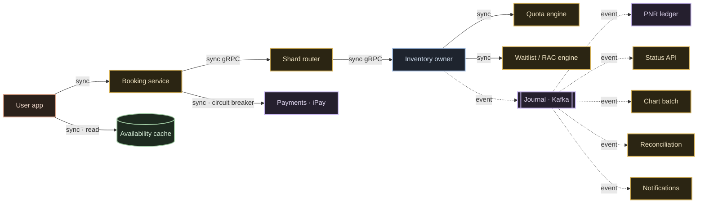

# 04 · Services & Interactions

The follow-up round opens here. The high-level design ([03](./03-high-level-design.md))
draws nine boxes. But **boxes aren't services** — a box is a region of responsibility. The
first question a senior interviewer asks is: *"Your map had nine boxes. Carve this into real
microservices. Name them, give each ONE job, and then — the part juniors skip — tell me
exactly who calls whom, and how."*

> This is **domain decomposition** — how *you'd* carve it, a **design decision `[D]`**, not
> a claim about CRIS's internal service list, which is **not published (UNKNOWN).**

---

## The service census — twelve services, one job each

| # | Service | The one sentence |
|---|---|---|
| 1 | **Edge gateway** | TLS, routing, and the bot wall. |
| 2 | **Search** | Trains and routes — read-only. |
| 3 | **Availability cache** | The stale rumour (the read road). |
| 4 | **Admission service** | The tatkal waiting room — issues admission tokens. |
| 5 | **Booking service** | Stateless orchestrator — owns nothing, drives one booking. |
| 6 | **Shard router** | Hashes train-and-date to an owner. |
| 7 | **Inventory owner** | The only writer of a train-date's berths. |
| 8 | **Quota engine** | The nineteen fences over one physical array. |
| 9 | **Waitlist & RAC engine** | The numbered queues and the promotion cascade. |
| 10 | **Chart batch** | The nightly settlement. |
| 11 | **PNR ledger** | The system of record. |
| 12 | **Payments (iPay)** | Money in, refunds out. |

Plus the always-async pair off the log: **notification** and **reconciliation**.

Each is **a card you could hand a team and say: own this, and nothing else.**

## The one rule that keeps it from becoming soup

> **Every service gets exactly one sentence of responsibility.**

- If **two services share a sentence → merge them.**
- If **one service needs the word "and" to describe it → split it.**

Microservices are not the goal — **sentences are.** The service boundaries are wherever the
sentences divide.

---

## The interaction matrix — the *actual* architecture

Boxes are furniture. **Who calls whom, and how** is the architecture. One rule decides
sync vs async on every edge:

> **If the user is waiting on the answer, the hop is synchronous. If nobody is waiting,
> it's an event on the log.**

### The synchronous spine — every hop, three stamps

The user's screen is blocked on these, so every millisecond and every failure is on the
critical path. **No synchronous arrow ships without three stamps:**

| Hop | Sync? | Timeout | Retry | Idempotency |
|---|---|---|---|---|
| **book → shard-router → owner** | **sync gRPC** — you need the allocation answer in the same breath | hard timeout | **one** retry | **key on every call** — a retry must never double-book |
| **owner → quota engine / WL-RAC** | **sync** — the commit needs the counter decision now | tight | in-txn | same booking key |
| **book → payments (iPay)** | **sync, wrapped in a circuit breaker** — iPay can get slow, and you will not hold a thread hostage | hard | breaker, not blind retry | payment ref |
| **app → availability cache** | **sync read** — but it's a rumour, cheap and stale-tolerant | short | — | n/a (read) |

The **idempotency key is non-negotiable on any hop that can move money or a berth.** The
second attempt with the same key is recognised and **collapsed**, not re-executed. (IRCTC's
own internal dedup is **UNKNOWN** — we require it by design.)

### The async fan-out — everything on the log is replayable

The **inventory owner → journal** hop is **asynchronous, fire-and-forget onto Kafka.** The
**PNR ledger, status API, chart batch, reconciliation, and notifications** all read that
log *later*, at their own pace. Nobody's screen waits for them.

That "read at your own pace, replay any time" property is exactly why the journal is a
**log (Kafka)**, not a delete-on-consume work queue — the chart batch replays tonight's
events at chart time; reconciliation replays the day at settlement.

> **The rule that keeps you sane:** every synchronous hop gets a **timeout, a retry budget,
> and idempotency.** Every fan-out that can wait goes **on the log.** Draw that matrix and
> you've answered half the follow-ups before they're asked.

---

## The takeaway

One booking is **a handful of internal service calls** — a synchronous gRPC spine
(book → router → owner → quota/WL, plus a breaker-wrapped iPay hop) and an async fan-out
off the journal. When you're asked to "design IRCTC," the boxes earn you the first mark.
**Naming the twelve services, giving each one sentence, and drawing the sync/async matrix
with its three stamps** — that's what separates the engineer who can draw the system from
the one who can be trusted to run it.

**Next:** [05 · Seat-correctness deep-dive →](./05-seat-correctness-deep-dive.md) — the
serialization menu and why one berth can never sell twice.
