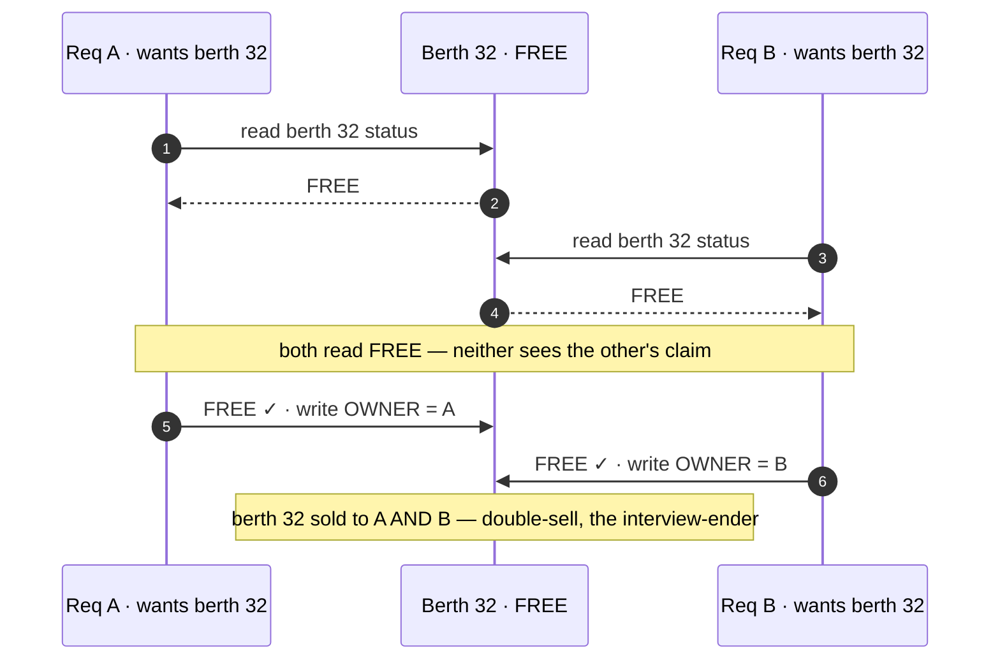

# 05 · Seat-Correctness Deep-Dive

The heart of the whole design. The interviewer stops nodding and leans in: *"Prove one
berth can't sell twice. Show me the transaction, the states, the failure paths."* This is
where "correctness over everything" turns into a concrete serialization choice, an ACID
transaction, and a defended ordering.

The one law you may never break: **one berth, one passenger.**

---

## The inventory model — policy over one physical array

A berth is a **five-part address:** `train × journey-date × class × coach × berth-number`.
One train-date is a few thousand such cells — small enough that a train's **entire hot
inventory fits in memory.** `[I structural, behaviourally consistent]`

Over that one physical array sit the **quota fences.** The **wrong** answer is nineteen
separate inventories — nineteen copies of the coach, so a berth can exist in two pools at
once and you've built the double-sell you swore to prevent. The **right** answer:

> **ONE physical berth array per train-date; each quota is a policy layer on top — a
> counter, plus its own waitlist, plus a rule about which berths it may claim.**

General and tatkal draw from the **same coach** through **separate fenced counters**, so
tatkal running dry says nothing about general. That's why you and a friend see different
numbers: **you're reading different fences over the same steel.** It's **inventory sharding
done as policy — partition the counters, never the berths.** `[V quotas / I framing]`

---

## THE question — two requests, one berth, same millisecond

The entire interview is secretly about this. **Two requests want berth 32 of the same
coach, same train, same date, in the same millisecond. Who wins — and how do you guarantee
exactly one does?**

### The read-committed trap (the anomaly that loses a seat)

Under plain **READ COMMITTED**, both transactions can read berth 32 as *free* and both
claim it:

Both read the pre-claim state, both pass the check, both write. **Berth 32 is now sold
twice** — a classic **lost update**, and the bug that ends the interview if you miss it.

### The serialization menu — four honest answers

| Door | How | Best when | Why it hurts at tatkal |
|---|---|---|---|
| **1 · Pessimistic lock** | `SELECT … FOR UPDATE` on the berth row; second writer blocks | genuine hot rows | at hundreds of writes/s on **one** hot train, lock queues pile up and the **DB becomes the queue, badly** |
| **2 · Optimistic / CAS** | version column, compare-and-swap, retry on conflict | contention is **rare** | tatkal is the opposite of rare — ~95% of attempts retry into each other |
| **3 · Redis TTL hold** | atomic hold + time-to-live on the seat while payment runs (the BookMyShow pattern) | **reserve-then-pay** | exists to serve holds; drags in a second stateful system that can disagree with the DB at the worst moment |
| **4 · Single-writer** | **one single-writer loop per train-date; every claim is a message in that owner's queue, processed strictly in order** | a hot, shardable resource | none for correctness — **no locks, because there's nothing to lock against** |

**We take door four.** Contention stops being a *correctness* problem and becomes what it
always really was — a **throughput** problem, and queues are how civilised systems do
throughput.

> **And we're in verified company.** The real PRS routes every transaction through **RTR**,
> which delivers it to the one regional backend that **owns that train's territory.** `[V]`
> The exact locking discipline *inside* those backends is **never published — UNKNOWN.**
> But the architecture **strongly suggests** what we chose: **one owner per slice of
> inventory, writes in single file.** `[I — voice as inference]` The eighties called it a
> transaction router; we call it a partitioned single-writer. Same law: one door per train.

---

## The booking commit — one ACID transaction

Inside the owner, the commit is **one ACID transaction**, and every word earns its letter:

- **Atomic** — allocate both passengers' berths, decrement the quota counter, mint the
  PNR, write the payment linkage: **all or nothing.** A family never half-books.
- **Consistent** — the constraint **`unique berth per train-date`** lives in the **schema
  itself.** Even a bug can't double-sell without the database screaming.
- **Isolated** — the read-committed trap above is real; you need the conflict to surface,
  via **serializable isolation, an exclusive lock, or — our answer — the single-writer,
  where true concurrency never enters the room.**
- **Durable** — committed means **fsynced.** This row is someone's seat home for Diwali.

> **Interview line:** "Read-committed loses the seat; I serialize every claim for a
> train-date through one single-writer owner, and I keep `unique berth per train-date` in
> the schema so the DB refuses a double-sell even if my code is wrong."

---

## Pay-then-allocate — defend the weird ordering

BookMyShow holds your seat for ten minutes while you fumble your card — **reserve, then
pay.** IRCTC **inverted** it: **pay, then allocate.** Why choose the frustrating order?

**Scale.** A hold is inventory taken hostage by the slowest human — at tatkal volume,
ten-minute holds would **freeze entire trains solid** while payments dawdle. Pay-first
keeps inventory **liquid** for the ninety seconds that decide everything, and pushes the
failure into a **compensating transaction: the automatic refund.** `[V/R]`

The real system wears this honestly: "money debited, ticket not booked" triggers an
**auto-refund of the full amount incl. convenience fee**, no user action `[V]`, and the
**RBI TAT rule backstops it — reversal within T+5 working days, with compensation for
delay.** `[V]` **Failure here isn't prevented. It's priced.** (Full recon in
[06 · Failures](./06-failures-and-drills.md).)

---

## Idempotency — the double-click problem

Payment hangs, the user panics and taps again — two booking requests, same money. Whether
the real IRCTC deduplicates internally has **never been published — UNKNOWN**, so we design
it: the **idempotency key** from [02](./02-requirements-and-api.md) rides every `book`
call; the owner keeps a **small ledger of keys it has already answered** and **replays the
original answer** on a repeat. **One rule, one table — and an entire class of Twitter
complaints never gets born.** `[D]`

---

## Allocation logic — which berth do you hand out?

Two layers:

- **Official policy `[V]`:** earmarked lower berths for **senior citizens and 45+ women
  travelling alone** — the system auto-allots a lower even with no preference set (approx.
  6–7/coach SL, 4–5 in 3AC, 3–4 in 2AC).
- **Folklore `[R]`:** fill lowers before uppers, and fill **from the middle of the coach
  outward** to keep the rake's weight balanced — physics leaking into a DB allocator.
  **Widely reported, never officially documented — so say it as that, not as fact.**

IRCTC's own T&C: "allotment per existing allocation logic available in the PRS," berth of
choice **not guaranteed.** `[V]` Honesty about what's policy vs folklore is the answer an
interviewer remembers.

---

## Waitlist, RAC, and the quota engine as data

Per quota, per train-date: a **confirmed set**, a **RAC array**, and a **numbered waitlist
queue** (GNWL, RLWL, TQWL — each a different clearance pool). `[V/R]`

- **RAC = fractional inventory `[V]`.** Each **side-lower berth carries TWO RAC tickets**;
  both passengers travel, sharing the berth until a confirmed cancellation frees a full
  one. So the allocator doesn't count berths — it **counts berth-halves** for that pool.
  **Overbooking done honestly, printed on the ticket, modelled right in the data.**
- **Waitlist = the priced bet** on top: officials say roughly **20–25% confirm** `[R]`;
  the sourced cost is **~93,000 people/day auto-dropped at chart** and **₹1,229 cr in
  cancellation charges over 3 years** `[R, RTI]` — use those absolutes, never a made-up %.
- **The promotion cascade:** every cancellation triggers a deterministic climb — **RAC-1 →
  confirmed, WL-1 → RAC** — which is **just one more single-file job for the same inventory
  owner.** No new machinery, no new race: the waitlist **reuses the exact serialization you
  already built.**

The **quota engine** is the nineteen fenced counters; the **WL/RAC engine** is these
numbered queues and the cascade. Both are policy over the one physical array.

---

## What to carry forward

- **One physical berth array per train-date; quotas are policy counters on top** — never
  duplicate the berths.
- The **read-committed lost-update** loses a seat; fix with **single-writer per train-date**
  (chosen), or serializable / row-lock, plus a **`unique berth` schema constraint.**
- The real PRS's **RTR routes each txn to the partition owner** `[V]`; single-writer
  discipline inside is **UNKNOWN** — voice it as inference.
- **Pay-then-allocate** trades a hold for liquidity; the **auto-refund + RBI TAT** is the
  priced compensator.
- **Idempotency key + a small answered-keys ledger** kills the double-click double-book.
- **RAC = fractional (berth-halves); WL = priced oversell** (RTI absolutes, not a %); the
  **promotion cascade reuses the single-writer.**

Next: [06 · Failures & drills →](./06-failures-and-drills.md)
