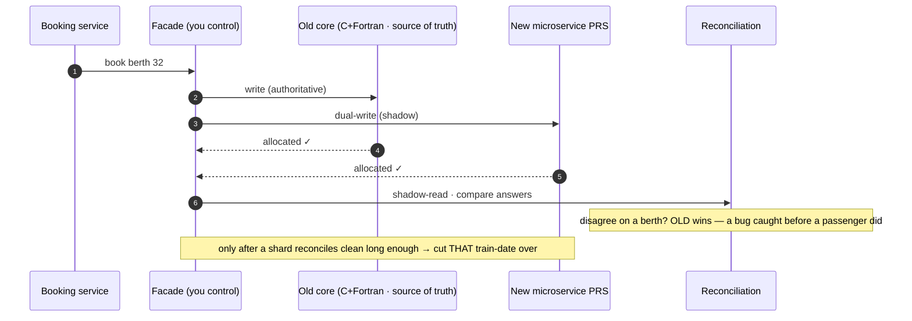

# 07 · Build It Yourself

The payoff. You've seen the machine; now build a toy of it, defend every stack choice —
and then answer the question this entire two-part video was built to earn: **it's July
2026 — where's the replacement for the forty-year-old Fortran core?**

Two parts: **pick your stack** (what the real world runs vs what you'd choose today), and
**modernise** (retiring a live, fire-proven core without ever double-selling a berth).

---

## What's actually public (and what isn't)

**On record `[V]`:**

- The core: **C (~70%) + Fortran (~30%) on OpenVMS** (VAX minicomputer lineage → Compaq
  Alpha → **Itanium, deployed 2010**, per Vaishnaw in Rajya Sabha, 8 Aug 2025), with **RTR
  (Reliable Transaction Router)** middleware over an **in-house CRIS proprietary DB.** **NOT
  a mainframe, NOT COBOL — never say COBOL.**
- **NGeT** built on **Pivotal GemFire, a distributed in-memory data grid** (Forbes Jan-2015
  + Pivotal case study): the old system crashed above **~40k concurrent users**; GemFire
  took it to **120k+ concurrent (capacity "200k+"), a 300% lift**, at ~30M users / ~700k
  bookings/day. App tier: **Oracle WebLogic Suite + Oracle Database EE.** `[V]`
- Edge: **Akamai CDN + DNS**, DigiCert TLS, Oracle HTTP Server + Node/Express detected
  (W3Techs). `[V fingerprint]`
- Payments: **iPay — IRCTC's own aggregator** (RBI in-principle PA authorisation letter
  **4 Aug 2025**; iPay revenue ₹126 cr FY25). `[V/R]`
- **Cost receipts, real:** **₹74 cr** for the 2014 NGeT engine; **~₹1,000 cr** for the
  rebuild now under way. `[V]`

**NOT public — keep UNKNOWN, never invent:** the core's **exact locking/serialization
discipline** (the RTR single-writer reading is `[I]`); NGeT's app language (Java = `[R]`
only); the internal broker; gateway recon internals.

---

## Pick your stack — real vs build-your-own

The **"you'd pick"** and **"why"** columns are **`[I]` — engineering judgment, opinion not
fact.**

| Layer | Real IRCTC `[V]` | You'd build today `[I]` | Rejected + why `[I]` |
|---|---|---|---|
| **Seat store** | GemFire in-memory grid | **Postgres `SELECT … FOR UPDATE` + short Redis TTL hold** (or single-writer owners) | Grid only pays at 100k+ concurrent; Redis-only loses the relational audit |
| **Admission** | login throttle + forced logout; anti-bot CDN | **Rented Cloudflare-WR-class edge queue** (token, FIFO, bot filter) | Kafka admission = you absorb the spike on your own disks |
| **Availability** | separate enquiry tier | **Redis rumour cache, seconds-stale OK** | read replicas alone can't take 40:1 at peak |
| **Ledger of record** | proprietary DB → Oracle era | **Postgres** (constraints, audit) | NoSQL loses the multi-row booking txn |
| **Comms** | UNKNOWN internal | **REST edge + gRPC internal** | **GraphQL: no client-graph problem — skip** |
| **Observability** | per-minute records prove instrumentation | **OpenTelemetry + burn-rate SLO alerts** on the booking funnel | five-minute averages smear the one minute that matters |
| **Language** | Fortran/C core + Java-era front | **Java/Spring or Go**; **Rust only for the gate** | Rust everywhere = a velocity tax for a 50-eng org |

### The language war, settled like an engineer

The **gate and cache path** — where p99 lives or dies in the storm — is the **one** place a
garbage-collector pause hurts you; that's the argument **Discord** made famous rewriting a
hot service Go → Rust. Fine — **spend Rust there, on one service.** Everything else (owners,
batch, refunds) wants **boring Java or Go:** hire-able in India, debuggable at 3 a.m., fast
enough behind a queue that already smoothed the spike. **Languages are budgets, not
religions.**

---

## Tech stack: database & language decisions

The two follow-ups that come next, made concrete: **which database per store**, and **which
language per service** — with the deciding constraint written down each time. The **pick** and
**why** columns are **`[I]` engineering judgment**; the real internal engines are **`[V]`.**

### Database — SQL vs NoSQL, per store

**The core move: there is no one database.** Each store has a different job, and the right
engine for the berth ledger is the wrong engine for the availability rumour.

| Store | Job | You'd pick `[I]` | Deciding reason + constraint |
|---|---|---|---|
| **Inventory owner / berth ledger / PNR ledger** (system of record) | allocate berths, decrement quota, mint PNR, link payment | **Relational (Postgres)** | The booking commit is a **multi-row ACID transaction** (both passengers' berths + quota counter + PNR + payment linkage, all-or-nothing) with the **`unique berth per train-date`** constraint **in the schema**, FKs, and an audit trail. **NoSQL loses the multi-row transaction** — you cannot express "one berth, one passenger, atomically, under concurrent claims" in a schemaless model as cleanly as a relational constraint + serialized writer. |
| **Availability cache** | answer "seats free?" off the hot path | **KV / in-memory (Redis)** | Read-heavy at the official **12.5:1** enquiry:booking ratio; a **seconds-stale rumour** is fine (you can pay and still land WL). Key = `train × date × class × quota`. **Never the source of truth** — only the ledger commit is authoritative. |
| **Quota counters / waitlist queues** | the 19 fenced counters + numbered WL/RAC queues | **KV / in-memory, owner is the sole writer** | These are **policy layers over the one physical berth array** — counters and numbered queues, not their own inventory. Keep them in fast storage but let the **single-writer inventory owner** be the only writer, so the cascade (WL-1 → RAC → CNF) reuses the exact serialization the ledger already has. |
| **Hot inventory grid** | the whole train-date working set in RAM at extreme concurrency | **In-memory data grid** — the **real IRCTC runs Pivotal GemFire `[V]`** | GemFire took NGeT from **~40k → 120k+ concurrent (300% lift) `[V]`**. But a grid **only pays at 100k+ concurrent** — a build-your-own **starts with Postgres + Redis** and adds a grid **only if scale demands it.** Don't reach for it on day one. |
| **Search / analytics** (off the hot path, via CDC) | route/PNR search, dashboards, recon, investigations | **Document / search store (Elasticsearch-class)** | Query-heavy, fed by **CDC off the ledger** — **never the source of truth**, never on the booking path. |

**The rule:** **relational** for the money/inventory system-of-record (multi-row ACID +
schema constraint); **KV/cache** for the availability rumour and the policy counters; an
**in-memory grid only at extreme concurrency** (real IRCTC does this — you probably don't need
to); **document/search only off the hot path, fed by CDC.** Match the store to the invariant you
must enforce — one berth, one passenger — not to fashion.

### Language — Rust vs Go vs Java vs Node/JS

**Languages are budgets, not religions.** One hot service earns Rust; the correctness core and
back office want boring, hireable JVM/Go; the public edge wants Node. The deciding criterion is
in the last column.

| Language | Where it fits `[I]` | Deciding criterion |
|---|---|---|
| **Rust** | the **admission gate + cache path** — the p99 that lives or dies in the tatkal storm | The **one** place a **GC pause** is a tail-latency risk under a thundering herd — the **Discord Go → Rust** argument for a single hot service. **Spend Rust there, not everywhere.** |
| **Go / Java (JVM)** | the **inventory owners, chart batch, refunds, reconciliation** | **Hireable in India, debuggable at 3 a.m., fast enough behind a queue that already smoothed the spike.** The single-writer owner isn't latency-bound at the language level — it's serialized by design, so GC pauses hide behind the queue. The real front tier was **Java-era `[R]`.** |
| **Node / JS** | the **public edge / BFF + the web & app frontends** | Great for the **REST edge and I/O fan-out** (enquiry, PNR status, session). IRCTC's real edge fingerprints as **Node/Express `[V fingerprint]`.** **NOT for the correctness core** — you never put berth allocation on the event loop. |

**Rejected, and why:** **Rust everywhere = a velocity tax** for a 50-engineer org (borrow
checker on CRUD you'll rewrite twice) — spend it only where p99 pays. **A GC language on the p99
admission gate = a tail-latency risk** exactly in the one minute that decides everything —
that's the seam Rust is worth buying. Keep the choice a **budget line, not a religion.**

---

## The real-vs-build matrix, in one line

You'd build it **this weekend:** Postgres with the **berth constraint in the schema**,
**single-writer owners partitioned by train-date**, **Redis** for the rumour cache, an
**edge waiting room you rent instead of write**, **REST outside / gRPC inside**, and
**OpenTelemetry** watching the one minute that matters. That toy reproduces the properties
that *are* IRCTC — one-berth-one-passenger, the two roads, pay-first with a compensating
refund — without the 19 quotas, GemFire, or a proprietary DB.

---

## The design philosophy — price failure, don't prevent it

Step back and it's one sentence: **this system prices failure instead of preventing it.**
The **waitlist** is a priced bet (a fifth to a quarter confirm; ~93,000 people/day pay the
cancellation fee to learn it). **RAC** is honest overbooking, printed on the ticket.
**Pay-first** is a frustration with a *regulated refund* attached. And **correctness** — the
one thing never gambled — lives in the **most boring machine on the board: a single-file
queue in front of a forty-year-old database.** Drama at the edges. Silence at the core.

---

## MODERNISE — retiring the 40-year core (the killer)

Part One said the core is forty-year-old C and Fortran on OpenVMS. The follow-up that ends
interviews: **it's July 2026 — where's the replacement you said was coming?**

### The real-world timeline IS the lesson

The railways announced a full rebuild — a **~₹1,000 cr, open-source, cloud-native
microservice PRS**, targeting **1.25–1.5 lakh bookings/min + 40 lakh enquiries/min (~5×/10×)**,
with **seat selection and a fare calendar**, explicitly retiring the Fortran-era core. `[V]`
The deadline **slipped, and the trajectory is the story** — **treat the exact month as soft,
the direction as solid:**

- **Dec 2025** — the named deadline (PIB PRID 2140614). `[V]`
- **"Early 2026"** — a CRIS engineer, 21 Oct 2025. `[R]`
- **"Phased from ~August 2026"** — Rail Bhawan review, 7 May 2026. `[R paraphrase]`
- **Still rollout-tense at CRIS Foundation Day, 1 Jul 2026.** `[R]`

**As of now it is rolling out, not finished** — hedge it exactly that way. Meanwhile the
**storefront shipped dead on time: RailOne, the super-app, crossed 3.5 crore installs in
under a year.** `[R]`

### Why did the app ship in months while the core slipped for years?

Because the **front end is stateless glue and the core is the system of record.** RailOne is
a **new face over the SAME PRS** — low risk, ship it. But the core owns **live inventory for
~1.4 million bookings a day**, and you cannot restart the country's train reservations for a
weekend maintenance window. **This is the hard 20%: not writing the new system, but cutting
over to it without ever, for one second, double-selling a berth across the old world and the
new one.** `[I]`

### The strangler-fig migration — how *you'd* do it

**Never a big-bang switch** — that bets the nation on one cutover night. The pattern is the
**strangler fig:**

1. Stand the **new microservice PRS beside the old core.** Route **reads through a facade
   you control.**
2. **Dual-write:** every booking goes to **both** the old core **and** the new system.
3. **Shadow-read** compares their answers continuously — if they ever disagree on a berth,
   **the old core wins**, and you've caught a bug **before a passenger did.**
4. Only when a **shard reconciles clean for long enough** do you cut **that train-date**
   over — **per-shard, per-territory**, exactly the partition unit that survived the Kolkata
   fire.

**The correctness risk is the whole game:** during the overlap, **two systems believe they
own the same berth**, so reconciliation and **a single source of truth per shard are not
optional** — they're the only thing standing between you and selling **seat 32 twice on
national television.** You migrate the way you charted the waitlist: **one train-date at a
time, settled and verified, never all at once.**

> **The IRCTC-unique answer no other system in this series can give:** anyone can shard a
> database. Almost nobody has to keep a **forty-year-old, fire-proven core selling tickets
> while replacing its engine mid-air**, with no downtime and no double-sell. **Old and
> correct beats new and racy — until you can prove the new one is correct too, one
> reconciled shard at a time.**

---

## What to carry forward

- Public facts are narrow: **C+Fortran/OpenVMS/Itanium + RTR core, GemFire in-memory front,
  Oracle app tier, Akamai edge, iPay** — with real costs (**₹74 cr → ₹1,000 cr**). The
  core's **locking discipline is UNKNOWN.** **Never COBOL.**
- **You'd build:** Postgres (schema constraint) + single-writer owners + Redis rumour cache
  + rented edge queue + REST/gRPC + OTel; **Rust only for the gate.**
- **Tech-stack rule:** **relational** for the money/inventory system-of-record (multi-row
  ACID + schema constraint), **KV/cache** for the rumour + policy counters, an **in-memory
  grid only at 100k+ concurrent** (real IRCTC = GemFire `[V]`), **document/search only off the
  hot path via CDC.** Language: **Rust for the gate, Go/JVM for owners + batch, Node for the
  edge `[V fingerprint]`** — never on the correctness core.
- The philosophy: **price failure, don't prevent it** — except correctness, which lives in
  a boring single-file queue.
- **Modernise = strangler-fig:** dual-write + shadow-read + **per-shard cutover**, old core
  wins on disagreement, **zero double-sell.** The deadline **slipped Dec-2025 → early-2026 →
  phased-from-Aug-2026 and is still rolling out** (soft month, solid direction).

← Back to [the IRCTC index](./README.md)
