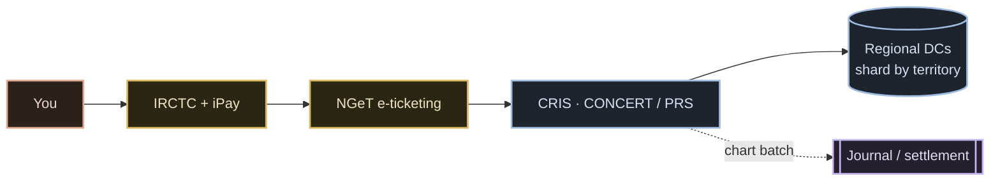

# IRCTC — System Design

**IRCTC / CRIS's PRS** is the machine behind India's train-ticket booking: ~14.5 lakh
tickets booked online a day, a recorded peak of **37,410 bookings in a single minute**
(16 Aug 2025), 5 lakh+ concurrent sessions — all against a **fixed, shared seat inventory**
that must never sell one berth twice. This folder breaks it down the way a system-design
interview does — the map, then the follow-up round — and hands you enough to build a
working toy.

## The one-paragraph version

The thing you call **IRCTC is the storefront** (website, app, payments via its own
aggregator **iPay**). The reservation **brain** is **CONCERT**, the core of **CRIS's PRS**,
spread across regional data centres and stitched by a transaction router. Checking a train
and booking a train travel **two separate roads** (officially sized **12.5:1** reads to
writes). Booking is **pay-then-allocate** — no cart, no hold — so "money debited, ticket not
booked" is a routine failure with an automatic refund machine around it. One train is carved
into **~19 quota pools** over one physical berth array; the **waitlist is a priced oversell**
and **RAC is fractional inventory** (two passengers, one side-lower berth), both settled by a
nightly **chart batch**. Correctness — one berth, one passenger — is enforced by a
**single-writer per train × date**, and the whole thing runs on a **C+Fortran/OpenVMS** core
that survived a data-centre fire. **Never COBOL — it's C and Fortran.**

## Myth-busts (what most explainers get wrong)

- **"IRCTC's servers" ≠ the reservation system.** IRCTC is the storefront; **CRIS's PRS**
  owns every berth. `[V]`
- **The core is NOT a mainframe and NOT COBOL** — it's **C + Fortran on OpenVMS** with an
  RTR transaction router. `[V]`
- **Booking is pay-then-allocate** — nothing is held during payment; you can pay and still
  land waitlist. `[R→V-adjacent]`
- **Availability is a rumour, not a promise** — it's an enquiry-tier answer off the cheap
  road. `[V ratio]`
- **The waitlist is a deliberate priced oversell**, not a queue for leftovers; **RAC is
  overbooking done honestly** (two per side-lower berth). `[V/R]`
- **The chart is a nightly settlement batch** (window widened to ~8–10h in 2025), not a
  real-time process. `[V/R]`
- **Identity is not admission control** — the 2025 Aadhaar wall cut *fraud*, but the
  17-Apr-2026 outage proved it never touched the thundering-herd *load*. `[R]`
- **The Fortran core is being retired — but the deadline slipped** Dec-2025 → early-2026 →
  phased-from-Aug-2026; as of Jul 2026 it's rolling out, not finished. `[V/R]`
- **The PNR digit map** (centre prefix + serial) is **commonly documented, never officially
  published.** `[R only]`

## Contents

| # | Doc | Interview stage |
|---|---|---|
| 01 | [How it really works](./01-how-it-really-works.md) | The machine today |
| 02 | [Requirements & API](./02-requirements-and-api.md) | Scope · FR/NFR · BOE · contract |
| 03 | [High-level design](./03-high-level-design.md) | The 9-node board + a booking trace |
| 04 | [Services & interactions](./04-services-and-interactions.md) | 12 services + the sync/async matrix |
| 05 | [Seat-correctness deep-dive](./05-seat-correctness-deep-dive.md) | Serialization menu · ACID · the lost-seat race |
| 06 | [Failures & drills](./06-failures-and-drills.md) | Failure drills · DR · observability · trade-offs |
| 07 | [Build it yourself](./07-build-it-yourself.md) | Pick-your-stack · SQL-vs-NoSQL & language matrix · retiring the Fortran core |
| — | [API contracts](./api-contracts.md) | REST · gRPC · GraphQL — payloads, headers, admission token, idempotency `[D]` (+ [Postman](./postman-collection.json)) |

**Video 1 — "Crack the Map"** covers docs 01–03 (+ the seat-correctness LLD and failure
drills). **Video 2 — "The Follow-Up Round"** covers 04–06 and the modernise section of 07.
The docs mirror the ten follow-up questions one-to-one. *(Video links in the descriptions.)*

Fact labels: `[V]` verified (primary/official) · `[R]` reported (reputable secondary) ·
`[I]` inferred/estimate (spoken as inference) · **UNKNOWN** where nothing is published.
