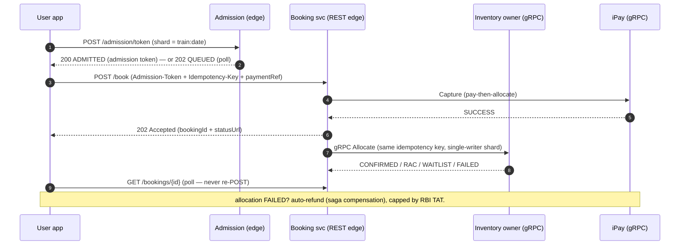

# API Contracts — REST · gRPC · GraphQL

A copy-pasteable, interview-grade API reference for the IRCTC design in this folder. Every
contract here is a **`[D]` design decision** — the buildable spec you'd defend on a
whiteboard, with concrete payloads, headers, status codes, idempotency, the admission-token
gate, and the `202`-async booking lifecycle.

> **Read this once:** IRCTC's / CRIS's **real internal booking API, dedup/idempotency scheme,
> and service list are not published — UNKNOWN.** This doc is **not** a claim about the real
> API. It is the **REST/JSON edge + typed internal contract you'd build** for a train-booking
> system today — faithful to the on-screen decisions from the two videos: **REST at the public
> edge, gRPC between internal services, GraphQL deliberately skipped; `Admission-Token` +
> `Idempotency-Key` on `POST /book`; `202 Accepted` async allocation; pay-then-allocate with a
> compensating refund.** Fact labels: `[V]` verified · `[R]` reported · `[I]` inferred ·
> `[D]` design · **UNKNOWN** where nothing is published.

Companion file: [`postman-collection.json`](./postman-collection.json) — import it, point
`{{baseUrl}}` at a mock, and hit every REST endpoint below.

---

## 1. Decision recap — why these three styles `[D]`

| Style | Where | Why |
|---|---|---|
| **REST / JSON** | **Public edge** (app → edge gateway) | Availability is a **cacheable, seconds-stale rumour** read at **~4 lakh checks/min** — exactly the CDN-cache shape. Dumb-simple clients, easy idempotent retries, `202`-async for the slow booking path. `[I]` |
| **gRPC** | **Internal** (booking service → shard router → inventory owner → quota/WL, + iPay) | Typed contracts, low latency on the booking hop where **one booking = a handful of internal calls** ([04](./04-services-and-interactions.md)) inside a seconds budget. Deadlines, one-retry budgets, and the idempotency key are first-class per hop. `[I]` |
| **GraphQL** | **Deliberately skipped** | The client asks a **small, fixed set of questions** (availability, book, status, cancel) — **there is no client-graph** to traverse. A resolver fan-out in the 10:00 tatkal minute is a self-inflicted wound. No client-graph problem = no GraphQL. `[I/D]` |

> **Correctness is the #1 NFR** ([02](./02-requirements-and-api.md)) — one berth, one
> passenger. Every contract below is shaped by that: mutations are idempotent, allocation is
> async and metered behind an admission gate, and money is a saga with a compensating refund,
> never a two-phase commit across the payment gateway.

---

## 2. REST — the public edge

**Base URL (design):** `https://api.railbook.example/v1`
JSON in, JSON out. Availability is cacheable and stale-tolerant. **Booking is async**
(`202 Accepted` + a booking id + a status-poll URL) because allocation resolves behind the
admission gate and the shard owner. `[D]`

### 2.0 Common headers

| Header | On | Purpose |
|---|---|---|
| `Authorization: Bearer <token>` | all authed calls | User session (Aadhaar-verified in the tatkal window — the 2025 identity gate). `[V context]` |
| `Idempotency-Key: <uuid>` | **every mutation** (`book`, `cancel`) | So a double-tap in the storm never books/cancels twice. **IRCTC's own internal dedup is UNKNOWN** — this is a **design requirement**, not an IRCTC fact. `[D]` |
| `Admission-Token: <jwt>` | **`POST /book` only** | Proof you passed the waiting-room gate — issued at the rate the inventory owners can survive. Without it, `POST /book` is refused at the edge. `[D]` |
| `Content-Type: application/json` | all with body | — |
| `X-Request-Id: <uuid>` | all | Per-hop trace id. |

### 2.1 `GET /availability` — check seats (the read road)

Cheap, **cacheable, seconds-stale OK.** It is a **rumour, not a promise** — you can read
"available" and still land waitlist, because only the booking commit touches the system of
record. Served from the Redis availability cache, keyed `train·date·class·quota`. `[V/D]`

**Request**

```http
GET /v1/availability?train=12951&date=2026-08-15&class=3A&quota=GN HTTP/1.1
Host: api.railbook.example
```

**Response — `200 OK`**

```json
{
  "train": "12951",
  "trainName": "MUMBAI RAJDHANI",
  "date": "2026-08-15",
  "class": "3A",
  "quota": "GN",
  "status": "AVAILABLE",
  "availableCount": 42,
  "fare": { "value": "2145.00", "currency": "INR" },
  "note": "availability is a rumour; only booking commits against the system of record",
  "asOf": "2026-07-08T09:59:58Z",
  "stale": true
}
```

- `status` ∈ `AVAILABLE` \| `RAC` \| `WL` \| `REGRET`. When `WL`, `availableCount` becomes the
  **waitlist number** (`"wlNumber": 37`). `[V/R]`
- `stale: true` + `asOf` — the contract says *out loud* the number may have moved. `[D]`

`Cache-Control: public, max-age=5` on the response — CDN- and client-cacheable.

### 2.2 `POST /admission/token` — pass the tatkal gate

The waiting-room gate. At 10:00 you do **not** let raw traffic touch `/book`. This issues an
**admission token** at the rate the inventory owners can survive (token bucket, FIFO); everyone
else holds a **queue position, not a database connection.** `[D]` (The real system rations
harder — force-logout after each completed booking since Mar 2015. `[V]`)

**Request**

```json
{ "train": "12951", "date": "2026-08-15", "class": "3A", "quota": "TQ" }
```

**Response — `200 OK`** (admitted)

```json
{
  "admissionToken": "eyJhbGciOiJIUzI1NiJ9.eyJzaGFyZCI6IjEyOTUxLTIwMjYwODE1Iiwi...",
  "state": "ADMITTED",
  "expiresAt": "2026-07-08T10:03:00Z",
  "shard": "12951:2026-08-15"
}
```

**Response — `202 Accepted`** (queued — hold your place, poll)

```json
{
  "state": "QUEUED",
  "queuePosition": 18423,
  "estimatedWaitSeconds": 90,
  "pollUrl": "/v1/admission/token/ticket/9f31c0a4"
}
```

- The token is **bound to the shard** (`train:date`) and short-lived. `POST /book` without a
  valid, unexpired token for that shard → `403`. `[D]`

### 2.3 `POST /book` — book (async, gated, idempotent)

Carries **both** headers (`Admission-Token` + `Idempotency-Key`). Returns **`202 Accepted` +
a booking id** — allocation resolves **async** behind the shard owner. **Pay-then-allocate:**
the `paymentRef` proves money was captured *first*; allocation may still land WL or fail, and
a failed allocation triggers an **automatic refund** ([2.5](#25-the-money-path--pay-then-allocate--compensating-refund)). `[R→V-adjacent]`

**Request**

```http
POST /v1/book HTTP/1.1
Host: api.railbook.example
Authorization: Bearer eyJhbGciOi...
Admission-Token: eyJhbGciOiJIUzI1NiJ9...
Idempotency-Key: 9f31c0a4-6b2e-4d1a-9c77-2f8e5a1b0c33
Content-Type: application/json
```

```json
{
  "train": "12951",
  "date": "2026-08-15",
  "class": "3A",
  "quota": "TQ",
  "boardingStation": "BCT",
  "destinationStation": "NDLS",
  "passengers": [
    { "name": "ARJUN RAO",   "age": 34, "gender": "M", "berthPref": "LOWER" },
    { "name": "MEERA RAO",   "age": 31, "gender": "F", "berthPref": "NO_PREF" }
  ],
  "paymentRef": "IPAY-TXN-77db19c2",
  "contact": { "phone": "+919999999999", "email": "arjun@example.com" }
}
```

**Response — `202 Accepted`** (received; allocation is async)

```json
{
  "bookingId": "BKG-2026-9f31c0a4",
  "state": "PENDING_ALLOCATION",
  "statusUrl": "/v1/bookings/BKG-2026-9f31c0a4",
  "acceptedAt": "2026-07-08T10:00:12Z"
}
```

**Status codes**

| Code | Meaning |
|---|---|
| `202 Accepted` | Received; allocation is async. **The normal happy path.** |
| `200 OK` | Idempotent replay — same `Idempotency-Key`; returns the *original* booking, does not re-book. |
| `400 Bad Request` | Malformed body / >6 passengers / bad station codes. |
| `401 / 403` | No session, **or missing/expired/wrong-shard `Admission-Token`.** |
| `409 Conflict` | `Idempotency-Key` reused with a **different** body. |
| `402 Payment Required` | `paymentRef` not captured / not found (pay-then-allocate violated). |
| `429 Too Many Requests` | Rate limit / not admitted — go back through `/admission/token`. |
| `503 Service Unavailable` | Shard owner unavailable (DR failover in progress). |

### 2.4 `GET /bookings/{bookingId}` — booking status (poll the async result)

Polling a pending booking is the **honest UX**. Returns the resolved allocation once the owner
commits. `[D]`

```http
GET /v1/bookings/BKG-2026-9f31c0a4 HTTP/1.1
Authorization: Bearer eyJhbGciOi...
```

**Response — `200 OK`**

```json
{
  "bookingId": "BKG-2026-9f31c0a4",
  "state": "CONFIRMED",
  "pnr": "2741369805",
  "train": "12951",
  "date": "2026-08-15",
  "class": "3A",
  "quota": "TQ",
  "passengers": [
    { "name": "ARJUN RAO", "status": "CNF", "coach": "B2", "berth": "32", "berthType": "LOWER" },
    { "name": "MEERA RAO", "status": "RAC", "racNumber": 7, "coach": "B1", "berth": "18", "berthType": "SIDE_LOWER" }
  ],
  "chartPrepared": false,
  "updatedAt": "2026-07-08T10:00:14Z"
}
```

- `state` ∈ `PENDING_ALLOCATION` \| `CONFIRMED` \| `RAC` \| `WAITLIST` \| `FAILED` \|
  `CANCELLED` \| `REFUNDED`. Per-passenger `status` ∈ `CNF` \| `RAC` \| `WL`. `[V/R]`
- `pnr` — 10 digits, passenger-visible. (Encoding **commonly documented** as centre-prefix +
  serial, never officially published — say so, don't state it as fact. `[R only]`)
- `425 Too Early` if you poll faster than the allocation SLA (design guard). `404` if unknown.

### 2.5 The money path — pay-then-allocate + compensating refund

`POST /cancel` and the refund flow. Cancellation is itself a **small financial transaction**,
so it is **idempotent**. `[V/D]`

**`POST /cancel`**

```http
POST /v1/cancel HTTP/1.1
Authorization: Bearer eyJhbGciOi...
Idempotency-Key: c4a0-... 
Content-Type: application/json
```

```json
{ "bookingId": "BKG-2026-9f31c0a4", "passengers": ["ARJUN RAO"], "reason": "USER" }
```

**Response — `202 Accepted`**

```json
{
  "bookingId": "BKG-2026-9f31c0a4",
  "state": "CANCELLATION_PENDING",
  "refund": {
    "refundId": "RFND-2026-11a2",
    "grossFare": { "value": "2145.00", "currency": "INR" },
    "cancellationCharge": { "value": "180.00", "currency": "INR" },
    "estimatedRefund": { "value": "1965.00", "currency": "INR" },
    "slaWorkingDays": 5,
    "statutoryBasis": "RBI TAT — auto-reversal within T+5 working days + compensation for delay"
  },
  "statusUrl": "/v1/bookings/BKG-2026-9f31c0a4"
}
```

**The compensating-refund contract.** Because we chose **pay-then-allocate**, a payment can
succeed while allocation fails. That failed allocation is **not** a lost rupee — it is a
**compensating transaction (automatic refund)**, discovered by the reconciliation service and
**bounded by law**: RBI's TAT rule forces auto-reversal within **T+5 working days** with
mandatory compensation for delay. The failure path isn't prevented — it's **priced, logged,
and legally capped.** `[V]`

The user-facing repair of the April-2026 tatkal failure — **"Resume Booking"** (finish a
booking whose money was deducted but ticket didn't complete, without paying again) — is that
compensating transaction promoted into a **visible** action the user can drive. `[V]`

---

## 3. gRPC — the internal booking spine

Between the booking service and the shard router / inventory owner / quota-WL engines / iPay
([04](./04-services-and-interactions.md) interaction matrix). Proto-style; **every synchronous
hop carries a deadline, a one-retry budget, and the idempotency key** so a retry never
double-books. The **inventory owner is the only writer of a train-date's berths** — the
single-writer-per-shard serialization is the whole correctness story. `[D]`

```proto
syntax = "proto3";
package railbook.booking.v1;

// Stateless orchestrator; owns nothing, drives one booking.
service BookingService {
  rpc Book (BookRequest) returns (BookAck);            // client-facing edge maps POST /book here
}

// Hashes train-and-date to the owner of that shard.
service ShardRouter {
  rpc RouteAllocate (AllocateRequest) returns (AllocateReply);  // deadline 800ms, 1 retry, idempotency_key
}

// The ONLY writer of a train-date's berths (single-writer-per-shard).
service InventoryOwner {
  rpc Allocate (AllocateRequest) returns (AllocateReply);       // deadline 500ms, 1 retry (idempotent by key)
  rpc Cancel   (CancelRequest)   returns (AllocateReply);       // promotion cascade runs after
}

// Nineteen fenced counters over ONE physical berth array.
service QuotaEngine {
  rpc Claim (QuotaClaim) returns (QuotaReply);                  // in-txn with Allocate, same booking key
}

// Numbered queues + the deterministic promotion cascade.
service WaitlistEngine {
  rpc Enqueue (WlRequest) returns (WlReply);                    // in-txn
}

// Money in, refunds out — wrapped in a circuit breaker at the caller.
service Payments {                                             // iPay adapter
  rpc Capture (CaptureRequest) returns (CaptureReply);          // deadline 3s, breaker (NOT blind retry), payment_ref
  rpc Refund  (RefundRequest)  returns (RefundReply);           // compensating action
}

message AllocateRequest {
  string idempotency_key = 1;   // same key on a retry => at-most-once allocation
  string shard           = 2;   // "train:date" — the partition unit
  string train           = 3;
  string date            = 4;
  string cls             = 5;   // "3A"
  string quota           = 6;   // "GN" | "TQ" | ...
  repeated Passenger passengers = 7;
  string payment_ref     = 8;   // pay-then-allocate: money already captured
}
message AllocateReply {
  string booking_state = 1;     // CONFIRMED | RAC | WAITLIST | FAILED
  string pnr           = 2;
  repeated Allotment allotments = 3;
}

message Passenger { string name = 1; uint32 age = 2; string gender = 3; string berth_pref = 4; }
message Allotment { string name = 1; string status = 2; string coach = 3; string berth = 4;
                    uint32 rac_number = 5; uint32 wl_number = 6; }

message QuotaClaim  { string shard = 1; string quota = 2; uint32 count = 3; string idempotency_key = 4; }
message QuotaReply  { bool granted = 1; uint32 remaining = 2; }   // fenced counter, NOT a berth copy

message CaptureRequest { string payment_ref = 1; string amount = 2; string idempotency_key = 3; }
message CaptureReply   { string outcome = 1; string gateway_ref = 2; }   // SUCCESS | FAILURE | PENDING
message RefundRequest  { string payment_ref = 1; string amount = 2; string reason = 3; }
message RefundReply    { string refund_id = 1; string outcome = 2; }
```

### Per-hop discipline (the three stamps, on every synchronous edge)

| Hop | Deadline | Retry | Idempotency |
|---|---|---|---|
| `BookingService.Book → ShardRouter.RouteAllocate` | 800 ms | 1 | `idempotency_key` |
| `ShardRouter → InventoryOwner.Allocate` | 500 ms | 1 (safe — key-idempotent) | `idempotency_key` |
| `InventoryOwner → QuotaEngine.Claim` / `WaitlistEngine.Enqueue` | in-txn | in-txn | same booking key |
| `BookingService → Payments.Capture` | 3 s | **circuit breaker, not blind retry** | `payment_ref` + key |

> **The non-negotiable:** the idempotency key is required on any hop that can move money or a
> berth. `InventoryOwner.Allocate` is safe to retry **only because** the same key is
> recognised and collapsed — that plus single-writer-per-shard is what makes "one berth, one
> passenger" hold under a retry storm. `[D]`

The **owner → journal (Kafka)** hop is **asynchronous, fire-and-forget** — the PNR ledger,
status API, chart batch, reconciliation, and notifications all read that log later. Not RPC;
it's an event. `[D]`

---

## 4. GraphQL — deliberately skipped `[D]`

We do **not** expose a GraphQL API. Stated plainly because "why not GraphQL" is a real
interview follow-up ([02](./02-requirements-and-api.md)).

**The one query it would replace.** A GraphQL client-graph would let an app ask, in one round
trip:

```graphql
# The query we are choosing NOT to support:
query {
  availability(train: "12951", date: "2026-08-15", class: "3A", quota: "GN") {
    status
    availableCount
    fare { value }
    booking(id: "BKG-2026-9f31c0a4") {
      state
      pnr
      passengers { name status coach berth }
    }
  }
}
```

**Why we skip it:**

1. **No client-graph problem.** The client asks a small, fixed set of questions — check
   availability, book, status, cancel. That's four REST resources, not a graph to traverse.
2. **Resolver fan-out in the 10:00 minute.** At ~4 lakh reads/min and a booking spike behind
   an admission gate, a generic resolver layer invites N+1 fan-out and unbounded query cost on
   the exact minute the whole system is graded on. A self-inflicted wound.
3. **Cacheability + the gate.** REST `GET /availability` is trivially CDN-cacheable
   (`max-age=5`); a single POST-`/graphql` endpoint is neither URL-cacheable nor easy to meter
   behind the admission token. Correctness- and fairness-first design wants the simple,
   cacheable, gateable edge.

> **The honest line:** *"There's no client-graph here — the client asks four fixed questions.
> GraphQL would add resolver fan-out and query-cost risk on the tatkal minute to solve an
> over-fetch problem we don't have. So: REST at the edge, gRPC inside, skip GraphQL."*

---

## 5. Async · idempotency · admission (the repeats)

The patterns that recur across the whole contract:

- **Admission before booking.** `POST /book` is **refused without a valid `Admission-Token`**
  for that shard. The gate meters admission to *exactly* the rate the inventory owners can
  commit — not one token more. Identity (the 2025 Aadhaar wall) is a rate limiter on **who**;
  the waiting room is a rate limiter on **how many** — **you need both** (identity ≠ admission
  control). `[V/D]`
- **Idempotency on every mutation.** `book` and `cancel` carry an `Idempotency-Key`; the second
  attempt with the same key is **collapsed**, not re-executed. Enforced as a fast KV/TTL check +
  a durable unique-constraint backstop. IRCTC's own internal dedup is **UNKNOWN** — this is a
  **design requirement**. `[D]`
- **`202`-async allocation.** `POST /book` returns a **booking id + status-poll URL**;
  allocation resolves behind the owner. Poll `GET /bookings/{id}` for the result — **do not
  re-POST** the booking (double-book risk). `[D]`
- **Pay-then-allocate + compensating refund.** Money is captured first; a failed allocation is
  a **saga compensation (automatic refund)**, discovered by daily 3-way reconciliation (IRCTC
  records ⋈ gateway settlement file ⋈ bank) and **legally capped** by the RBI TAT rule (T+5
  working days + delay compensation). Never a 2PC across the payment gateway. `[V/D]`



---

## What to carry forward

- **REST at the edge** (cacheable availability, `202`-async booking), **gRPC inside** (typed,
  deadline + retry + idempotency-key per hop, single-writer shard owner), **GraphQL skipped**
  (no client-graph; resolver fan-out in the tatkal minute). `[D]`
- **`POST /book` carries two headers:** `Admission-Token` (passed the gate) + `Idempotency-Key`
  (no double-book) → `202 Accepted` + booking id.
- **Pay-then-allocate** with an **automatic compensating refund**, reconciled 3-way daily and
  **legally capped by the RBI TAT rule**.
- The **real** IRCTC/CRIS internal API + dedup scheme is **UNKNOWN / unpublished** —
  everything above is the `[D]` spec you'd build, faithful to the on-screen decisions.

Import [`postman-collection.json`](./postman-collection.json) to try the REST surface.
