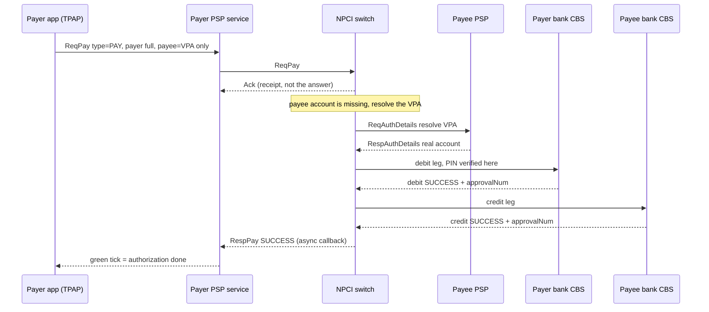

# 01 · How UPI Really Works

The machine as it exists today. Before you can design UPI, you have to see what it
*actually is* — and almost every explainer gets the shape wrong. This doc fixes the
mental model. Everything downstream (requirements, the board, the data layer) hangs
off these five facts.

---

## 1. It's a four-party model

There is no single company called "UPI." A payment involves **four parties**, and
knowing which one holds money is the whole game.

| Party | What it is | Holds money? |
|---|---|---|
| **Payer PSP app** | The app you tap — PhonePe, Google Pay, Paytm. A **TPAP**. | No |
| **Payer's bank (remitter)** | The bank whose account gets debited. | **Yes** |
| **NPCI switch** | The central router in the middle. | **No** |
| **Payee's bank (beneficiary)** | The bank whose account gets credited. | **Yes** |

Money lives *only* at the two banks. The app and the switch move messages, not
rupees. `[R]`

### A TPAP is not a bank

**TPAP** = Third-Party Application Provider. PhonePe, Google Pay and Paytm are TPAPs.
A TPAP cannot hold your balance and cannot connect to the network on its own — it
**rides a sponsor bank** (a PSP bank) that fronts it on the switch. So when you "pay
with PhonePe," PhonePe is a messaging client bolted onto a real bank's rails; your
money never sat with PhonePe. This is why a TPAP going down never means your money is
gone — it isn't there to begin with.

### The NPCI switch is a stateless router

The **NPCI switch** in the center is a **stateless L7 router**. It:

- terminates TLS,
- validates the message,
- routes on the `@handle` (the part after the `@` in a VPA),
- and **never holds balances**. `[R]`

All state — every rupee of every balance — lives at the banks. The switch is closer
to a smart load balancer for payment messages than to a database of accounts. This
single fact is why UPI scales: you can add more switch capacity horizontally because
no node "owns" the truth (see [03 · High-level design](./03-high-level-design.md)).

---

## 2. One payment = two legs

An authorization is not one atomic write. It is **two legs**:

1. **Debit leg** — the payer's bank removes money from the payer's account. The PIN is
   verified *here*, at the issuer bank.
2. **Credit leg** — the payee's bank adds money to the payee's account.

Both are driven by the same money-movement API (`ReqPay` / `RespPay`), with a
`Txn@type` that says whether this hop is a `DEBIT`, a `CREDIT`, a `REVERSAL`, etc.
`[V]`

Because it's two legs and not one atomic transfer, the interesting failure is
"debit succeeded, credit didn't" — and the entire correctness machinery
([06 · Failures](./06-failures-and-operations.md)) exists to make that case safe.

---

## 3. Instant authorization, deferred settlement

This is the fact that most "UPI in 200ms" explainers destroy.

- **Instant authorization** — the two legs above complete in roughly **2–3 seconds**
  on the happy path. `[R]` Your balance really did change. The payee's balance really
  did change. That is the "instant" part.
- **Deferred net settlement** — the banks do **not** wire each other real central-bank
  money per transaction. Instead, NPCI **nets** each bank's position across many
  transactions and settles the net figure in **batched cycles**: **12 cycles/day**
  since 3 Nov 2025 (10 authorization cycles roughly every 2 hours 9am–9pm, plus 2
  dispute cycles). `[V]` NPCI is an **RTGS Type-D member**: it computes one net number
  per bank and posts it to each bank's **RTGS account at the RBI**. `[V]`

So during the day, banks are running a tab against each other. Your money moved
instantly *between accounts*; the banks square up *between themselves* a few times a
day. Settlement even physically moves as files over SFTP — see
[07 · Build it yourself](./07-build-it-yourself.md).

> **Interview line:** "UPI is instant *authorization* plus deferred *net settlement* —
> the tick and the settlement are two different clocks."

---

## 4. The three identifiers (never confuse them)

A single payment carries **three** different IDs. Mixing them up is an instant tell in
an interview. `[V]`

| ID | Length / form | Who generates it | What it's for |
|---|---|---|---|
| **Txn ID** | 35-char UUID | the originating PSP | machine identity of the transaction; the idempotency key |
| **RRN** (`custRef`) | 12-digit number | constructed per OC-107 rules | the human-readable trace; ≈ the UTR you see on a bank statement |
| **approvalNum** | 6-char code | the issuer bank, **per leg** | per-leg authorization reference |

The `Txn id` is echoed unchanged on **every hop** of the flow — it's the spine that
lets NPCI, both banks, and later reconciliation all agree they're talking about the
same payment. The RRN is what a human quotes to support. The approval number is
per-leg. Three IDs, three jobs. `[V]`

---

## 5. The green tick = authorization

When your app shows the green tick, it means **the authorization succeeded** — the
debit and credit legs completed. It does **not** mean interbank settlement has
happened; that comes later, in a batch cycle. `[R]`

And **"pending" is not a settlement state.** `[V]` There is no half-settled limbo in
the settlement system. "Pending" is purely a UX artifact — your app's PSP is polling
for the transaction's outcome and hasn't heard back yet. The settlement ledger only
knows `SUCCESS | FAILURE | DEEMED` per leg (see
[06 · Failures](./06-failures-and-operations.md)); "pending" lives entirely in your
phone.

---

## The whole thing, as one PAY

Here is a single P2P `PAY` where the app knows only the payee's VPA. NPCI has to
resolve the VPA to a real account before it can drive the two legs.

Two things to notice, because they drive everything later:

- **`Ack` is not the answer.** The synchronous `Ack` is a delivery receipt. The real
  result comes back **asynchronously** as a `RespPay` callback. This async shape is
  *why* timeouts, the `DEEMED` state, and status-check APIs exist at all. `[V]`
- **NPCI never learned the payee's account number to store it.** It asked the payee's
  PSP to resolve the VPA *for this transaction only*. NPCI does not keep a table of
  everyone's `@`-VPA → account number. `[V]` (The one exception — the mobile-number
  central mapper — is covered in [05 · Data layer](./05-data-layer.md).)

---

## What to carry forward

1. Four parties; **only the two banks hold money**.
2. The NPCI switch is a **stateless router** — no balances, no single account DB.
3. One payment = **two legs** (debit, then credit).
4. **Instant authorization**, **deferred net settlement** (12 cycles/day). `[V]`
5. **Three IDs**: 35-char Txn ID, 12-digit RRN, 6-char approval. `[V]`
6. The **green tick is authorization**, not settlement; **"pending" is UX, not a
   ledger state**. `[V]`

Next: [02 · Requirements & API →](./02-requirements-and-api.md)
