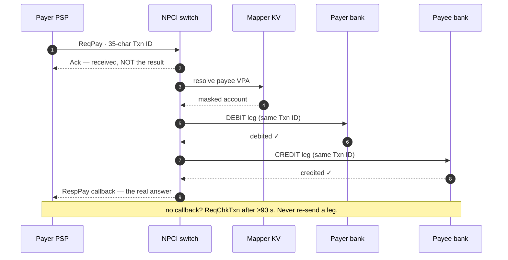

# 02 · Requirements & the API Contract

The first ten minutes of the interview. Before any boxes, you scope the problem:
what must it do, how well, how big, and what does the contract on the wire look like.

---

## Functional requirements

What the system must *do*:

- **Address a payee without exposing a bank account.** Pay to a `user@psp` VPA or a
  mobile number; the payer never learns the payee's account number. `[V]`
- **Move money in two directions of intent:** `PAY` (push — I send) and `COLLECT`
  (pull — I request, you approve). Both are the **same API with roles flipped**. `[V]`
- **Authorize with a PIN** captured securely, verified at the payer's issuer bank —
  never seen by the app or by NPCI. `[V]`
- **Complete a transfer as two legs** — debit at the remitter bank, credit at the
  beneficiary bank — and return a definitive per-leg outcome. `[V]`
- **Be idempotent under retries** — the same transaction submitted twice must not move
  money twice. `[V]`
- **Auto-reverse and make-whole** — a debit with no credit must be reversed, with legal
  time-bound compensation if it isn't. `[V]`
- **Settle between banks** — net each bank's position and post it at the RBI. `[V]`
- **Reconcile and resolve disputes** — daily three-way recon plus an API-driven
  dispute flow. `[V]`

## Non-functional requirements

How well it must do them:

- **Correctness over everything.** No lost money, no double debit. A slow payment is a
  nuisance; a wrong ledger is a catastrophe.
- **Low latency for authorization** — ~**2–3 s** end-to-end on the happy path. `[R]`
- **High availability** across hundreds of independently-operated banks, where any one
  bank can be slow or down without taking the network with it.
- **Massive horizontal scale** — see the envelope below.
- **Auditability** — every transaction and every settlement must survive an audit
  years later.
- **Data residency** — all payment data stored **only in India** (RBI, 6 Apr 2018).
  `[V]` This bounds the DR design to **multi-city, not multi-continent** (see
  [06 · Failures](./06-failures-and-operations.md)).

---

## Back-of-envelope

These are **`[I]` estimates** — arithmetic off published volumes, not official figures.
Say "estimate" out loud; NPCI does not publish a peak-second TPS. `[V-absence]`

**Volume (published, `[R]`):** ~**22.7 billion** transactions/month, ~**757 million/day**
(Jun 2026). `[R]`

**Average TPS `[I]`:**

```
757,000,000 txns/day ÷ 86,400 s/day ≈ 8,760 txns/s sustained
```

**Peak TPS `[I]` — label as estimate:** real traffic is spiky (evenings, salary day,
festivals). Assume a **3–4× peak-to-average** factor:

```
~8,760 × 3–4 ≈ 26,000–35,000 txns/s at peak   [I — estimate]
```

**API request rate `[I]`:** one *transaction* is several *API calls* (ReqPay, possibly
ReqAuthDetails, RespPay callbacks, status checks). At ~8–10 API calls per txn the
switch sees on the order of **200,000–350,000 API requests/s** at peak. `[I — estimate]`
(NPCI has stated ~**240K API req/s** on record — see
[07](./07-build-it-yourself.md).) `[V]`

**Storage `[I]`:** at ~1 KB of durable ledger/journal record per transaction:

```
757M txns/day × ~1 KB ≈ ~0.76 TB/day of write-once journal   [I — estimate]
≈ ~275 TB/year before replication and indexes                [I — estimate]
```

Small per-record, but it is **write-once, keep-forever, replicated** — so plan for
cheap tiered storage and CDC off the log, not for one giant hot database.

**Mapper lookup rate `[I]`:** VPA/mobile resolution is read-heavy and cache-friendly —
on the order of **10,000–30,000 lookups/s**, mostly served from cache with ms-stale
tolerance. `[I — estimate]`

> The shape these numbers force: a **stateless router that fans out**, a **read-heavy
> cache** in front of a small source-of-truth mapper, an **append-only journal**, and
> **per-bank ledgers** that each only carry their own slice. Nobody needs one giant
> global database.

---

## The API contract

UPI's protocol is **stateless XML over HTTPS**. `[V]` The URL itself carries the
transaction id so the switch can load-balance on it:

```
https://<host>/upi/<api>/<ver>/urn:txnid:<id>
```

### Three properties that define the contract

**1. Idempotency key = the 35-char Txn ID.** The originating PSP mints a Txn ID that is
mandated to be **exactly 35 characters** (OC-193), and the originator carries the
liability for any duplicate. `[V]` The same Txn ID is echoed on every hop; re-sending
it is a *duplicate*, not a new payment.

**2. Async accepted + callback — `Ack` ≠ the answer.** The model is:

```
request  →  synchronous <Ack> (a receipt only)  →  asynchronous Resp callback (the real result)
```

The `Ack` tells you the switch *received* the message. The outcome arrives later as a
separate callback. **This asynchrony is why timeouts, the DEEMED state, and status
checks exist.** `[V]`

**3. Status check only after a timeout — never a blind retry.** If you don't hear back,
you do **not** re-send the financial leg (that risks a double debit). You query with
`ReqChkTxn` — and only **after** the timeout window, not immediately. A real April-2025
outage was caused by exactly this discipline being violated at scale (a *retry storm*
of status checks); the fix mandated status checks **≥ 90 s** after auth. `[V]` See
[06 · Failures](./06-failures-and-operations.md).

> **Rule:** *Timeout ⇒ query, don't re-execute. A user "retry" is a brand-new Txn ID
> and RRN — a new payment, not a resend.* `[V]`

The three properties, drawn as one payment — the `Ack` is a receipt, the two legs share
one Txn ID, and the *answer* comes back as a later callback:



### The protocol shape (stateless XML)

Every money message is `ReqPay` / `RespPay`. The important sub-structures:

- **`<Txn>` spine**, echoed unchanged every hop: `id` (35-char UUID), `custRef`
  (12-digit RRN), `type` (`PAY` / `COLLECT` / `DEBIT` / `CREDIT` / `REVERSAL` /
  `REFUND` — all values on the *one* `ReqPay` API), `note`. `[V]`
- **`<Payer>` / `<Payee>`** — symmetric blocks: `addr` (the VPA), `<Ac>` (account
  detail, filled in after resolution), `<Creds>` (the base64 credential ciphertext —
  **payer only**), `<Device>` fingerprint, `<Amount curr="INR">`. `[V]`
- A **`<Device>` fingerprint rides every transaction** (mobile/geocode/IP/OS/app), part
  of the identity chain.

Because the protocol is **stateless**, the switch keeps no session — each message
carries everything needed to route and correlate it. That is what lets the center scale
out horizontally.

### The 19 APIs — the ones that matter on screen

There are **19 APIs** `[V]`; you only need a handful to reason about a payment:

| API | Job |
|---|---|
| **ReqPay / RespPay** | *All* money movement — PAY, COLLECT, DEBIT, CREDIT, REVERSAL, REFUND are `Txn@type` values on this one API. `[V]` |
| **ReqAuthDetails** | NPCI → payee's PSP: resolve VPA → real account, via live callback. `[V]` |
| **ReqValAdd** | Validate a VPA when adding a beneficiary. `[V]` |
| **ReqChkTxn** | Status poll — **only after a timeout**. `[V]` |
| **ReqListKeys** | Fetch NPCI's public key for building credential blocks. `[V]` |
| **ReqRegMob** | First-time MPIN registration (card last-6 + expiry + OTP). `[V]` |

The rest (`ReqListAccount`, `ReqHbt` heartbeat, `ReqPendingMsg`, `ReqTxnConfirmation`,
…) round out the set but don't change the payment mental model.

### The two intents

- **PAY** — push. Payer sends; the payer's PIN authorizes on the payer side.
- **COLLECT** — pull. Same `ReqPay`, **roles flipped**, carries a `<Rule EXPIREAFTER>`
  (default 30 min, max 45 days). The payer's PIN is captured **after** the collect
  request lands on their device. `[V]`

---

## The three IDs, restated as a contract concern

From the caller's point of view:

- **Txn ID (35-char)** — your idempotency key. Mint once, reuse on retries of the *same*
  logical call, never for a new payment.
- **RRN (12-digit)** — the trace you quote to support and reconcile on.
- **approvalNum (6-char)** — the issuer's per-leg reference; you read it, you don't mint
  it.

Confusing these three is the fastest way to fail the follow-up round. `[V]`

---

## What to carry forward

- FRs: address without exposing account · PAY & COLLECT (same API) · secure PIN · two
  legs · idempotent · auto-reverse/make-whole · settle · reconcile.
- NFRs: **correctness first**, ~2–3 s auth, per-bank fault isolation, horizontal scale,
  auditability, **India-only data residency**. `[V]`
- Envelope `[I]`: ~8,760 TPS avg, ~26–35K peak, ~200–350K API req/s, ~0.76 TB/day
  journal, ~10–30K mapper lookups/s.
- Contract: **35-char idempotency key**, **async + callback (`Ack` ≠ answer)**, **status
  check only after timeout**, stateless XML, one `ReqPay` API for all money.

Next: [03 · High-level design →](./03-high-level-design.md)
