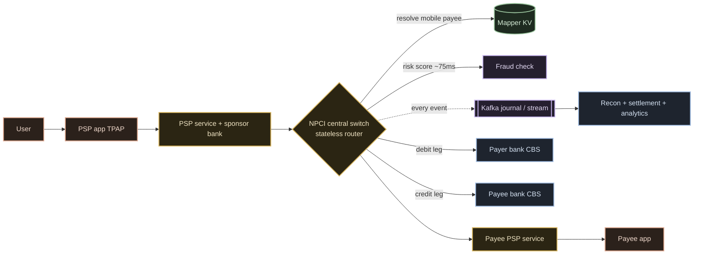

# 03 · High-Level Design

The board. Nine components, a diagram, and a numbered trace of one payment through
all of them. The recurring question this doc answers: **why is there no single central
database?**

---

## The nine components

| # | Component | State it owns | Why it exists |
|---|---|---|---|
| 1 | **User** | — | the human tapping "Pay". |
| 2 | **PSP app (TPAP)** | none (rides a sponsor bank) | captures intent + PIN in a secure component; talks only to its PSP service. |
| 3 | **PSP service** | its own txn records | the TPAP's backend + sponsor-bank gateway onto the switch. |
| 4 | **Central switch (NPCI)** | **none — stateless router** | terminates TLS, validates, routes on `@handle`, drives the two legs. Holds no money. `[R]` |
| 5 | **Mapper (KV)** | mobile → PSP pointer | resolves *mobile-number* payees to a PSP; `@`-VPAs are resolved at the owning PSP instead. `[V]` |
| 6 | **Fraud / risk check** | in-memory features | in-path risk score on a hard latency budget (~**75 ms** on record). `[V]` |
| 7 | **Journal / stream** | append-only event log | every backend writes into a **Kafka** stream; source for recon, fraud, analytics. `[V]` |
| 8 | **Payer bank core (CBS)** | **the payer's money** | verifies PIN at its HSM, performs the debit leg. |
| 9 | **Payee bank core (CBS)** | **the payee's money** | performs the credit leg; fires a reversal if it must decline. |

Components 8 and 9 are the **only** two that hold money. Everything else routes,
resolves, scores, or records.

---

## The board

Read it as three horizontal bands:

- **Client band** (user → app → PSP) — intent capture and the sponsor-bank on-ramp.
- **Router band** (the switch, mapper, fraud, journal) — **all stateless or
  cache/log**; this is what scales out.
- **Money band** (the two bank cores) — the only stateful, correctness-critical stores,
  each owning *only its own* accounts.

---

## A payment, traced through all nine

A P2P `PAY` where the payer's app knows only the payee's VPA:

1. **User** taps Pay, enters the amount and payee VPA.
2. **PSP app** captures the PIN in the NPCI secure component, builds the encrypted
   credential block (bound to *this* amount + parties), and sends `ReqPay` to its PSP.
3. **PSP service** forwards `ReqPay` (type `PAY`, payer filled in, payee = VPA only)
   onto the switch via its sponsor bank.
4. **Central switch** returns a synchronous `Ack` (receipt only), then sees the payee
   `<Ac>` is missing → it must resolve the address.
   - If the payee is a **mobile number**, it consults the **mapper KV** (component 5)
     for the mobile → PSP pointer.
   - For an **`@`-VPA**, it calls **ReqAuthDetails** to the payee's PSP, which resolves
     the VPA to a real account *for this transaction only*. `[V]`
5. **Fraud check** scores the transaction in-path against in-memory features, ~75 ms.
   `[V]`
6. **Payer bank core** receives the debit leg, **verifies the PIN at its HSM**, debits
   the account, returns `SUCCESS` + a 6-char approval number.
7. **Payee bank core** receives the credit leg, credits the account, returns `SUCCESS` +
   its own approval number. (If it must decline, it fires a **debit reversal** — see
   [06](./06-failures-and-operations.md).)
8. **Journal/stream** has been recording every one of these events into Kafka the whole
   time — this log is what recon, settlement and analytics replay later. `[V]`
9. **Switch** sends the async `RespPay SUCCESS` back to the payer PSP (and notifies the
   payee PSP → payee app). The payer app shows the **green tick = authorization done**.

Interbank **settlement** happens later, off the journal, in one of the 12 daily net
cycles ([01 §3](./01-how-it-really-works.md)).

---

## Why there is no single central database

The instinct is to imagine one giant NPCI ledger holding every balance. UPI is
deliberately **not** built that way, for three reasons:

1. **The money already has an owner.** Every rupee is a liability on a *bank's* balance
   sheet, governed by that bank's core banking system, RBI regulation, and audit. A
   central balance DB would either duplicate that truth (two sources of truth = a
   reconciliation nightmare) or usurp it (NPCI is explicitly **not** allowed to hold
   customer money). So balances stay at the banks; NPCI keeps a **journal of events**,
   not a **ledger of balances**. `[R]`
2. **A single central DB is a single point of correctness failure.** With hundreds of
   banks and ~757M txns/day `[R]`, one shared transactional store would be the
   bottleneck *and* the blast radius. Keeping the center stateless means a bad node
   loses no money — the truth is elsewhere.
3. **Fault isolation.** When one bank is slow or down, only *that* bank's slice is
   affected; the switch pre-declines to it (a circuit breaker, `U90/U91`) and everyone
   else keeps paying. A shared DB couldn't give you that per-bank isolation.

What NPCI *does* centralize is deliberately small and non-authoritative: a
**mobile→PSP mapper** (a pointer, not your account number) and an **append-only
journal** (a record, not a balance). Both are covered in
[05 · Data layer](./05-data-layer.md).

---

## How the stateless center scales out

Because the switch holds **no per-transaction state**, scaling is almost boring — which
is the point:

- **The Txn ID rides in the URL.** `…/urn:txnid:<id>` lets an ordinary L7 load balancer
  fan requests across a fleet of identical switch nodes; any node can handle any
  message because none of them "owns" a session. `[V]`
- **Add nodes, not coordination.** More traffic → more stateless switch instances
  behind the balancer. There is no shared lock, no leader, no global transaction table
  to contend on.
- **The stateful parts scale on their own axes:** the **mapper** scales as a read-heavy
  cache (component 5), the **journal** scales as a partitioned Kafka log (component 7),
  and each **bank core** only ever carries its own accounts (~50M txns/day for even a
  large bank — a sharded RDBMS, not a planet-scale store). See
  [05 · Data layer](./05-data-layer.md) and
  [07 · Build it yourself](./07-build-it-yourself.md).

> **Interview line:** "The center is stateless on purpose. State lives where it has an
> owner — money at the banks, the journal in Kafka, the mapper in a KV — so scaling the
> switch is just adding identical boxes behind a load balancer."

---

## What to carry forward

- **Nine components**, only **two** hold money (the bank cores).
- The **router band is stateless / cache / log** — that's the scalable part.
- **No single central balance DB** — NPCI keeps a *journal of events*, not a *ledger of
  balances*; banks keep the balances.
- Statelessness → **horizontal scale by adding identical switch nodes**, with the Txn ID
  in the URL doing the load-balancing.

Next: [04 · Services & interactions →](./04-services-and-interactions.md) ·
[05 · Data layer →](./05-data-layer.md)
