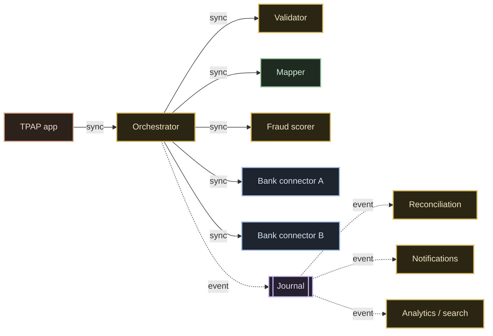

# 04 · Services & interactions

The high-level design ([03](./03-high-level-design.md)) draws nine boxes. Production runs closer
to **forty services**. A box is not a server — it's a region of responsibility. This doc opens the
boxes: the real service catalog, the one rule that keeps it from turning into soup, and the
interaction matrix that is the *actual* architecture.

> This is the "follow-up round" question: *"Your diagram has nine boxes. Name what actually runs
> when I tap pay."* Everything here is a **design decision** `[D]` — how you'd carve it — not a
> claim about NPCI's internal service list, which is not published (**UNKNOWN**).

## The service catalog

The **central switch** box alone decomposes into a cluster of single-purpose services. Grouped by
where they sit:

| Region | Service | One-sentence responsibility |
|---|---|---|
| **Edge** | Auth & limits | Authenticates the app/device and enforces per-user/per-bank limits. |
| | Status API | Answers "what happened to my payment?" — read-only, cache-shaped. |
| | Notifications | Pushes receipts/collect requests — async, off the hot path. |
| **Switch core** | Validator | Rejects malformed requests: schema + signatures at the door. |
| | Router | Picks the destination bank / PSP from the `@handle`. |
| | Orchestrator | Owns one transaction's state machine, born → settled. |
| | Dedup | Slams the door on duplicate transaction IDs. |
| | Timeout manager | Decides when *pending* becomes *deemed*. |
| **Money** | Ledger writer | Performs the double-entry inserts. |
| | Reconciliation engine | Three-way match (switch vs both banks) by RRN. |
| | Settlement batcher | Nets and settles between banks on a schedule. |
| | Dispute service | Exposes chargeback/complaint handling as an API. |
| **Lookup** | Mapper | Resolves `@handle`/mobile → PSP/bank (key-value). |
| **Risk** | Fraud scorer | Scores each payment inline within a tight latency budget. |
| | Feature store | Serves the scorer its features from memory. |
| **Bank edge** | Bank connector (adapter, one per bank) | Speaks each bank's core-banking dialect; bilingual, not modern. |

That's ~16 named services from one diagram box — and it's still a simplification.

## The one rule: one sentence per service

The rule that keeps forty services from becoming forty tangled problems:

> **Every service gets exactly one sentence of responsibility.**

- The **validator** rejects malformed requests. It never routes.
- The **orchestrator** owns transaction state. It never scores fraud.

Two tests fall straight out of the rule:

- **If two services share a sentence → merge them.**
- **If one service needs the word "and" to describe it → split it.**

Microservices are not the goal. Sentences are. The service boundaries are wherever the sentences
divide.

## The interaction matrix

Boxes are furniture. **Who calls whom, and how** is the architecture. One rule decides sync vs
async on every edge:

> **If the user is waiting on the answer, the hop is synchronous. If nobody is waiting, it's an
> event.**

- **Synchronous** (solid): app → orchestrator → validator, mapper, fraud, bank connectors. The
  user's screen is blocked on the answer, so every millisecond and every failure is on the
  critical path.
- **Asynchronous** (dashed): the journal, reconciliation, notifications, analytics, search — all
  ride the append-only stream and run *after*. Nobody's screen waits for them.

### Every synchronous arrow carries three stamps

No exceptions:

| Stamp | Why |
|---|---|
| **Timeout** | A downstream that never answers must not hang the user forever. |
| **Retry policy** | Transient failures are normal at this scale. |
| **Idempotency key** | **A retry without idempotency is how money moves twice.** |

The idempotency key is non-negotiable on any hop that can move money. It's what makes a retry
safe: the second attempt with the same key is recognized and collapsed, not re-executed. (See the
dedup service above and the [data layer](./05-data-layer.md) for the two-layer enforcement.)

### Every asynchronous arrow must be replayable

The events on the journal aren't fire-and-forget — they're a log. Reconciliation replays this
morning's events at 3pm; analytics replays the whole month. That "read at your own pace, replay
any time" property is exactly why the journal is a **log (Kafka)** and not a delete-on-consume
work queue. (See [06 · failures & operations](./06-failures-and-operations.md) and the queueing
discussion.)

## The takeaway

One payment is **six to ten internal service calls**. When you're asked to "design UPI," the boxes
earn you the first mark. Naming the services, giving each one sentence, and drawing the sync/async
matrix with its three stamps — that's what separates the engineer who can draw the system from the
one who can be trusted to run it.

**Next:** [05 · Data layer](./05-data-layer.md) — the engine behind each store, and why the ledger
refuses to lose your money.
