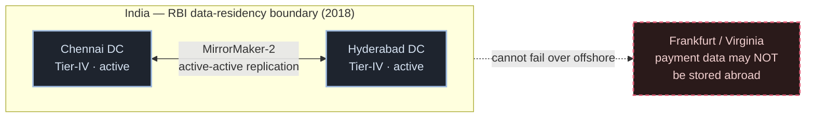

# 06 · Failures & Operations

The round that separates a design that *works in the demo* from one that *works at
757 million/day*. Two legs across two independent banks means failure is the common
case, not the exception. This doc is the failure matrix, a real outage, and the
operational spine: replication, DR, edge, observability, CDC, lifecycle.

---

## The failure matrix

Every leg resolves to exactly one of **`SUCCESS | FAILURE | DEEMED`**. `[V]` There is
**no "pending"** in the settlement system — "pending" is UX ([01 §5](./01-how-it-really-works.md)).
`DEEMED` is the dangerous one: *we don't know yet, treat as maybe-succeeded until recon
proves otherwise.*

| Scenario | System behavior | User sees |
|---|---|---|
| **Debit leg times out** | `U67/U85/U87` → **FAILURE**, nothing moved | instant "failed" |
| **Debit ok, credit declined** | beneficiary bank declines + fires a **debit reversal** (`00 REVERSAL SUCCESS`) → clean **FAILURE** | debited, then refunded in minutes |
| **Debit ok, credit times out** | → **DEEMED**; beneficiary bank later files **TCC** (credit did land) or **RET** (return it) | "pending", resolved ≤ T+1 or ₹100/day compensation |
| **Credit fails AND the reversal also fails** | `96 REVERSAL FAILURE` → **DEEMED SUCCESS** — money in limbo; recon + UDIR + law resolve it | the worst path; made whole by T+1 |
| **Switch crash between legs** | `OC/OD ORIGINAL CREDIT/DEBIT NOT FOUND`; 3-way recon catches it | brief pending, auto-corrected |
| **Double-tap / network flap** | second tap = new Txn ID; the duplicate is rejected centrally; `UT4 Duplicate` at recon | no double debit, by design |
| **A bank is consistently slow** | **circuit breaker:** `U90/U91 DEEMED HIGH RESPONSE TIME` — NPCI **pre-declines** to that bank | "bank server down" |
| **A bank can't fund settlement** | SGF waterfall; net-debit-cap limits blast radius; >2 misses/month → debarred | nothing |

Key mechanisms behind the rows:

- **Reversal sub-protocol.** Credit fails → beneficiary bank declines *and* fires a
  debit reversal. `00 REVERSAL SUCCESS` → the whole txn is a clean `FAILURE`.
  **`96 REVERSAL FAILURE` → the txn becomes `DEEMED SUCCESS`** — money is in limbo,
  presumed good until reconciliation or UDIR resolves it. `[V]`
- **Dedup at three points** — origination, NPCI central validation, and recon
  (`UT4 Duplicate Processing`) — so a double-tap can't become a double debit.
  Crucially: **no blind retry of a financial leg.** A timeout becomes a decline +
  reversal; doubt becomes a `ReqChkTxn` *query* (not a re-execution); a user "retry" is
  a **new Txn ID + RRN**. `[V]`
- **The legal make-whole (RBI TAT circular, 2019, operative).** A debit without a credit
  must be auto-reversed by the beneficiary bank **≤ T+1 (P2P) / ≤ T+5 (P2M)**, else
  **₹100/day compensation, paid suo moto** (no complaint needed). `[V]` This is *why*
  DEEMED is survivable — the regulator turned "eventually consistent" into a
  time-bounded, compensated guarantee.
- **Honest framing:** UPI is **at-most-once per leg + guaranteed eventual consistency**
  (reversal codes + DEEMED + daily recon + the legal T+1 make-whole), **not
  exactly-once**. `[I]`

---

## The real outage — 12 April 2025

Not a hypothetical. On **12 Apr 2025**, UPI had an outage of roughly **5 hours** caused
by a **retry storm**: PSP banks hammering **Check-Transaction-Status** calls. `[V]` The
status-check traffic — the very mechanism meant to *resolve* uncertainty — overwhelmed
the switch.

The fixes (RCA press) `[V]`:

- **Status checks must be ≥ 90 s after authorization** (stop the immediate re-poll).
- **Per-bank API rate limiters** on the switch.
- **Balance-check cap: 50/day/app.**
- Separately, API **timeouts were cut from 30 s → 10–15 s** (Jun 2025) so a stuck call
  fails fast instead of piling up. `[V]`

> **Lesson:** the retry path is part of your load. A naive "just check the status again"
> is a self-inflicted DDoS. Back-off, rate-limit per source, and never let clients poll
> tighter than the system can answer. (This is the operational face of
> [02](./02-requirements-and-api.md)'s "status check only after timeout" rule.)

Note the discipline in the fix language: NPCI **throttles** flaky banks with a circuit
breaker — it does **not** "kick banks off." That specific claim is unsupported. `[V-absence]`

---

## Replication

Money data must survive a node — or a data-centre — dying, **without losing a committed
debit**.

- **Ledger (the money): synchronous replication to a quorum.** A debit isn't
  acknowledged until it's durable on multiple replicas. This buys **RPO ≈ 0** (no
  committed transaction is lost on failover) at the cost of a little write latency —
  the right trade for money, well within the seconds-scale auth budget.
- **Journal / analytics / search: asynchronous replication.** These can lag slightly
  (small RPO) because they're rebuildable from the log and aren't the source of truth —
  favor throughput.
- **RPO / RTO framing:** RPO = *how much data can I lose* (≈0 for the ledger); RTO =
  *how fast do I recover* (minutes, via a hot standby). PhonePe runs **3 data centres
  active-active** with MirrorMaker-2 replication for exactly this. `[V]`

---

## Disaster recovery

- **Two Tier-IV data centres, active-active.** NPCI runs from **Chennai + Hyderabad**
  (Tier-IV), designed to keep serving if one is lost. `[V/R]`
- **The residency constraint shapes the whole DR map.** RBI's 6 Apr 2018 data-storage
  circular requires payment data to be stored **only in India**. `[V]` So UPI's
  multi-region strategy is **multi-city, not multi-continent** — you get geographic
  redundancy across Indian metros, but you cannot fail over to Frankfurt or Virginia.
  Latency between DR sites is intra-India (helps synchronous replication), but you
  can't escape a nation-wide correlated risk by going offshore. Design within the
  border.

> **Interview line:** "DR is active-active across two Indian Tier-IV DCs. It's
> multi-city not multi-continent — RBI data residency forbids storing payment data
> abroad, so the DR map is bounded by the border."

---

## The edge tier

- **L4 vs L7.** The outer edge does **L4** (fast connection-level load balancing /
  DDoS absorption); the switch itself is an **L7** router — it must read the message to
  route on the `@handle` and the Txn ID in the URL. Cheap L4 up front, smart L7 where
  routing decisions live.
- **Per-bank rate limiting** at the edge — a direct outcome of the April-2025 outage.
  One misbehaving bank's retry storm must not consume the whole switch; each bank gets
  its own bucket.
- **Why no CDN.** A CDN caches and serves *static, cacheable, read-only* content close
  to users. UPI traffic is **non-cacheable, per-transaction, write-path, and
  correctness-critical** — there is nothing to cache at the edge, and serving a stale
  answer would be a correctness bug. So: load balancers and rate limiters, **not** a
  CDN.

---

## Observability

- **Golden signals** — latency, traffic, errors, saturation — on every tier.
- **Page on per-bank success rate, not just the global average.** The global number can
  look healthy while *one* bank craters (the exact failure the circuit breaker exists
  for). The meaningful SLO is **per-bank technical success rate**; alert when a single
  bank drops below its threshold, because that's what pre-decline (`U90/U91`) keys off.
  (System-wide technical declines run ~**0.8%**, down from 8–10% in 2016. `[R]`)
- **Error budget.** Define the acceptable technical-decline budget; burn it too fast and
  you freeze risky changes. Ties directly to the per-bank paging above.

---

## Change data capture

**CDC off the write-ahead log.** Rather than dual-writing to the ledger *and* to
analytics/search/fraud (which can drift), you tail the **WAL** and stream every
committed change downstream. This is exactly the shape PhonePe's HBase
**WAL + MemStore** append path and NPCI's "every backend writes into a Kafka stream"
enable. `[V]` The journal *is* the integration bus: recon, fraud features, search
indexes, and the warehouse all rebuild themselves by replaying the log — no store is
ever the source of truth for another.

---

## Data-lifecycle tiers

Journal data is write-once and kept for years (audit), so tier it by age:

- **Hot** — recent transactions, in fast storage for status checks, live recon, dispute
  windows.
- **Warm** — older data for periodic recon, investigations, analytics.
- **Cold / archival** — long-retention, cheap object storage for audit and compliance;
  settlement even physically persists as **files** ([07](./07-build-it-yourself.md)).

Move data down the tiers on age; keep the hot tier small so the money path stays fast.

---

## What to carry forward

- Every leg is `SUCCESS | FAILURE | DEEMED`; **no "pending"** in settlement. `[V]`
  DEEMED = maybe-succeeded until recon; `96` reversal-failure is the limbo path.
- **Never blind-retry a financial leg** — query, don't re-execute; a user retry is a new
  Txn ID. The **RBI TAT make-whole** (≤T+1, else ₹100/day) makes DEEMED survivable. `[V]`
- The **April-2025 retry storm** → status checks ≥90 s, per-bank rate limits,
  balance-check cap 50/day/app, timeouts 30 s→10–15 s. `[V]`
- **Sync-to-quorum** replication for the ledger (RPO≈0); **async** for the rest.
- **Active-active, two Indian Tier-IV DCs; multi-city not multi-continent** (RBI
  residency). `[V]`
- **L4 edge + L7 switch, per-bank rate limits, no CDN.**
- **Page on per-bank success rate;** CDC off the WAL; tier data by age.

Next: [07 · Build it yourself →](./07-build-it-yourself.md)
