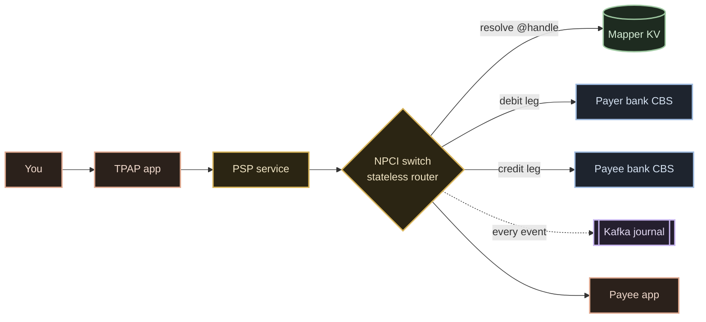

# UPI — System Design

**UPI (Unified Payments Interface)** is India's real-time retail payment network: ~22 billion
transactions a month, ~750 million a day, across 700+ banks, at ~99%+ technical success. This
folder breaks it down the way a system-design interview does — and hands you enough to build a
working toy.

## The one-paragraph version

UPI is a **four-party** network. Your app (a **TPAP** like PhonePe or Google Pay — *not* a bank;
it rides a sponsor bank) talks to its **PSP** backend, which talks to the **NPCI switch** — a
**stateless router** that terminates TLS, validates, routes on the `@handle`, and **holds no
money**. All money lives at the two **banks**. A payment is **instant authorization** (two legs:
debit at the payer's bank, credit at the payee's, ~2–3s) plus **deferred net settlement** between
banks (batched cycles at the RBI). **The green tick is the authorization, not the money movement.**

## Myth-busts (what most explainers get wrong)

- **Not "money in 200ms."** Instant **auth**; settlement is deferred and netted (batched cycles/day). `[V]`
- **NPCI doesn't store your account** for `@`-VPAs — the PSP resolves it; the central mapper is a
  mobile→PSP pointer only. `[V]`
- **Your app never sees your PIN** — it's captured in a secure component and verified at the issuer
  bank's HSM, never by the app and never by NPCI. `[V]`
- **RRN ≠ Txn-ID ≠ approval number** (12-digit / 35-char / 6-char). `[V]`
- **PAY and COLLECT are the same API** with roles flipped. `[V]`
- **The protocol is async** — the synchronous `Ack` is a receipt, not the answer. `[V]`
- **"Pending" is not a settlement state.** `[R]`

## Contents

| # | Doc | Interview stage |
|---|---|---|
| 01 | [How it really works](./01-how-it-really-works.md) | The machine today |
| 02 | [Requirements & API](./02-requirements-and-api.md) | Scope · FR/NFR · BOE · contract |
| 03 | [High-level design](./03-high-level-design.md) | The board + a request trace |
| 04 | [Services & interactions](./04-services-and-interactions.md) | Domain decomposition + the matrix |
| 05 | [Data layer](./05-data-layer.md) | DB matrix · isolation · locking · caching |
| 06 | [Failures & operations](./06-failures-and-operations.md) | Failure matrix · replication · DR · observability |
| 07 | [Build it yourself](./07-build-it-yourself.md) | Pick-your-stack · build order · cost |

**Video 1** covers docs 01–03 (+ the LLD and failure drills). **Video 2 — "The Follow-Up Round"**
covers 04–06 and the cost section of 07. *(Video links in the descriptions.)*

Fact labels: `[V]` verified · `[R]` reported · `[I]` inferred/estimate · **UNKNOWN** where nothing is published.
