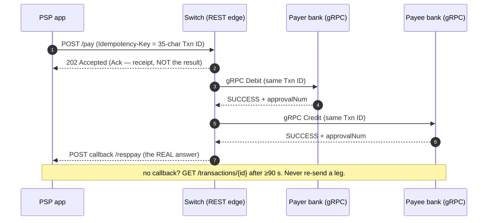

# API Contracts — REST · gRPC · GraphQL

A copy-pasteable, interview-grade API reference for the UPI design in this folder. Every
contract here is a **`[D]` design decision** — the buildable spec you'd defend on a
whiteboard, with concrete payloads, headers, status codes, idempotency, and the async
callback pattern.

> **Read this once:** UPI's real wire protocol is **stateless XML over HTTPS** (`ReqPay` /
> `RespPay`, the 19 NPCI APIs — see [02 · Requirements & API](./02-requirements-and-api.md)).
> NPCI **does not publish** its internal service-to-service API, DB, or framework
> (**UNKNOWN** — [07 · Build it yourself](./07-build-it-yourself.md)). So this doc is **not**
> a transcription of the NPCI spec and **not** a claim about the real internal API. It is the
> **REST/JSON edge + typed internal contract you'd build** if you were designing a
> UPI-shaped switch today — faithful to the on-screen decisions (35-char idempotency key,
> async `Ack` ≠ answer, status-check-only-after-timeout, one money API), rendered in the
> shapes an interviewer expects to see. Fact labels: `[V]` verified · `[R]` reported ·
> `[I]` inferred · `[D]` design · **UNKNOWN** where nothing is published.

Companion file: [`postman-collection.json`](./postman-collection.json) — import it, point
`{{baseUrl}}` at a mock, and hit every REST endpoint below.

---

## 1. Decision recap — why these three styles `[D]`

| Style | Where | Why |
|---|---|---|
| **REST / JSON** | **Public edge** (PSP app → PSP service) | Cacheable (VPA validation, txn status), CDN- and mobile-friendly, dumb-simple clients, easy retries with an idempotency key. The read-heavy calls (status polls, VPA resolve) are exactly what an edge cache is for. |
| **gRPC** | **Internal** (switch core ↔ orchestrator ↔ bank connectors ↔ mapper ↔ fraud) | Typed contracts, binary framing, low latency on the money hops where a payment is **6–10 internal calls** ([04](./04-services-and-interactions.md)) inside a ~2–3 s budget. Deadlines, per-hop retries, and idempotency keys are first-class. |
| **GraphQL** | **Deliberately skipped** | A payment client asks a **small, fixed set of questions** (pay, collect, resolve VPA, check status, register). There is **no client-graph** to traverse — no arbitrary nesting, no over-fetch problem GraphQL solves. A resolver fan-out on the money path in the opening second is a self-inflicted latency + N+1 wound, and a public GraphQL endpoint is a much larger attack/complexity surface on a system whose #1 NFR is **correctness**. `[D]` |

> **The real UPI wire protocol is stateless XML, not REST.** We choose REST/JSON here because
> the task is *"design a UPI-shaped switch,"* and REST is the honest modern edge choice. The
> **semantics** (idempotency key, async callback, timeout→query) are preserved 1:1 from the
> real protocol; only the encoding changes.

---

## 2. REST — the public edge

**Base URL (design):** `https://api.upiswitch.example/v1`
All requests/responses are JSON. All money-moving calls are **idempotent** and **async**
(`202 Accepted` + a status-poll URL). The `Ack` is a receipt — the *outcome* arrives on a
later callback or a status poll, never on the initial response. `[D]`

### 2.0 Common headers

| Header | On | Purpose |
|---|---|---|
| `Authorization: Bearer <token>` | all | PSP app / device session token. |
| `Idempotency-Key: <35-char txn id>` | all money mutations | The **35-char Txn ID** (OC-193) is the idempotency key. Same key = the *same* payment; re-sending is a **duplicate**, collapsed, never re-executed. `[V semantics]` |
| `X-Device-Fingerprint: <b64>` | all money mutations | MOBILE/GEOCODE/IP/OS/APP fingerprint that rides every txn (identity chain). `[V]` |
| `Content-Type: application/json` | all with body | — |
| `X-Request-Id: <uuid>` | all | Per-hop trace id (≠ Txn ID). |

### 2.1 `POST /pay` — initiate a PAY (push) or COLLECT (pull)

One endpoint for all money movement (`intent` = `PAY` \| `COLLECT`) — mirrors the single
`ReqPay` API. Returns **`202 Accepted`**: the switch *received* it; the outcome comes back on
the callback / status poll. `[D]`

**Request**

```http
POST /v1/pay HTTP/1.1
Host: api.upiswitch.example
Authorization: Bearer eyJhbGciOi...
Idempotency-Key: A1B2C3D4E5F6G7H8I9J0K1L2M3N4O5P6Q7R
X-Device-Fingerprint: eyJtb2JpbGUiOiI5OTk5OTk5OTk5Ii...
Content-Type: application/json
```

```json
{
  "intent": "PAY",
  "amount": { "value": "499.00", "currency": "INR" },
  "payer":  { "vpa": "arjun@okhdfcbank" },
  "payee":  { "vpa": "merchant@okaxis" },
  "note": "Order #48213",
  "credentialBlock": "BASE64(RSA(NPCIpub, AES(K0, SHA256(amount|refId|payer|payee|appId|mobile|deviceId))))",
  "rule": { "expireAfter": "PT30M" }
}
```

- `credentialBlock` — the encrypted PIN block, built in the NPCI Common Library, bound to
  *this* amount + parties. The app never sees the PIN; only the issuer bank's HSM decrypts
  it. **Payer-only** — omit for a `COLLECT` request (the payer's device supplies it after the
  collect lands). `[V]`
- `rule.expireAfter` — ISO-8601 duration; **COLLECT only** (default 30 min, max 45 days). `[V]`

**Response — `202 Accepted`** (this is the `Ack`, a receipt, *not* the result)

```json
{
  "txnId": "A1B2C3D4E5F6G7H8I9J0K1L2M3N4O5P6Q7R",
  "rrn": "412345678901",
  "status": "ACCEPTED",
  "intent": "PAY",
  "statusUrl": "/v1/transactions/A1B2C3D4E5F6G7H8I9J0K1L2M3N4O5P6Q7R",
  "acceptedAt": "2026-07-08T14:22:07Z"
}
```

- `txnId` — echoes your `Idempotency-Key` (the 35-char Txn ID). `[V]`
- `rrn` — the **12-digit** retrieval reference (the trace you quote to support). `[V]`
- `statusUrl` — poll here **only after the timeout window** (below), never as a blind retry. `[V]`

**Status codes**

| Code | Meaning |
|---|---|
| `202 Accepted` | Received; outcome is async. **The normal happy-path response.** |
| `200 OK` | Idempotent replay — same `Idempotency-Key` seen before; returns the *original* result, does not re-execute. |
| `400 Bad Request` | Malformed body / bad VPA syntax / missing credential block on a PAY. |
| `401 / 403` | Bad or expired session; device not bound. |
| `409 Conflict` | `Idempotency-Key` reused with a **different** body → duplicate-key violation. |
| `422 Unprocessable` | Business rejection at submit (limit exceeded, VPA not resolvable). |
| `429 Too Many Requests` | Per-user / per-bank rate limit (the April-2025 fix — retry-after honoured). |
| `503 Service Unavailable` | Destination bank circuit-broken (`U90/U91` pre-decline). |

**Error body shape** (all 4xx/5xx)

```json
{
  "error": {
    "code": "U30",
    "message": "Payer bank declined: insufficient funds",
    "txnId": "A1B2C3D4E5F6G7H8I9J0K1L2M3N4O5P6Q7R",
    "rrn": "412345678901",
    "retryable": false
  }
}
```

### 2.2 `GET /transactions/{txnId}` — status poll (the `ReqChkTxn` equivalent)

Read-only, cache-shaped. **Poll only after the timeout window (≥ 90 s post-auth)** — never a
blind retry of the money leg. `[V]`

```http
GET /v1/transactions/A1B2C3D4E5F6G7H8I9J0K1L2M3N4O5P6Q7R HTTP/1.1
Authorization: Bearer eyJhbGciOi...
```

**Response — `200 OK`**

```json
{
  "txnId": "A1B2C3D4E5F6G7H8I9J0K1L2M3N4O5P6Q7R",
  "rrn": "412345678901",
  "intent": "PAY",
  "state": "SUCCESS",
  "legs": [
    { "type": "DEBIT",  "bank": "HDFC", "outcome": "SUCCESS", "approvalNum": "830192" },
    { "type": "CREDIT", "bank": "AXIS", "outcome": "SUCCESS", "approvalNum": "774521" }
  ],
  "amount": { "value": "499.00", "currency": "INR" },
  "updatedAt": "2026-07-08T14:22:10Z"
}
```

- `state` ∈ `ACCEPTED` \| `PENDING` \| `SUCCESS` \| `FAILURE` \| `DEEMED`. **`DEEMED`** =
  money in limbo, presumed good until recon / RBI T+1 make-whole — the state that exists
  *because* the protocol is async. `[V]`
- `approvalNum` — the issuer's **6-char** per-leg reference (you read it; you don't mint it). `[V]`

`404` if the `txnId` is unknown. `425 Too Early` if you poll before the timeout window (design
guard against retry storms). `[D]`

### 2.3 `GET /vpa/{vpa}` — resolve / validate a VPA (`ReqValAdd`)

Validate a payee address when adding a beneficiary. Cacheable, ms-stale tolerant
(~10–30K lookups/s, cache-friendly). **Never returns the account number** — only whether the
VPA is valid and its display name. `[V]`

```http
GET /v1/vpa/merchant@okaxis HTTP/1.1
Authorization: Bearer eyJhbGciOi...
```

```json
{
  "vpa": "merchant@okaxis",
  "valid": true,
  "payeeName": "ACME RETAIL PVT LTD",
  "type": "MERCHANT",
  "verifiedName": true
}
```

`404` if the VPA does not resolve.

### 2.4 `POST /mandates` — create an AutoPay mandate

A mandate stores **consent** (not money) — replayed later by the biller PSP. `[R]`

**Request**

```json
{
  "payer": { "vpa": "arjun@okhdfcbank" },
  "payee": { "vpa": "netflix@okicici" },
  "amount": { "value": "649.00", "currency": "INR" },
  "frequency": "MONTHLY",
  "validFrom": "2026-08-01",
  "validUntil": "2027-07-31",
  "amountRule": "MAX"
}
```

**Response — `201 Created`**

```json
{
  "mandateId": "UMN-2026-8f31c0a4",
  "status": "ACTIVE",
  "requiresPin": true,
  "nextDebitOn": "2026-08-01"
}
```

### 2.5 `POST /mandates/{mandateId}/execute` — trigger an AutoPay debit

Idempotent (each cycle = one `Idempotency-Key`), async like `/pay`. `≤₹15K` skips re-PIN
(₹1L for whitelisted categories). `[R]` Returns `202 Accepted` + `statusUrl`, same shape as
[2.1](#21-post-pay--initiate-a-pay-push-or-collect-pull).

### 2.6 Async callback — the switch → PSP webhook (`RespPay`)

The **real answer** does not ride the `202`. The switch **calls back** the originating PSP
when both legs resolve (or fail). If the PSP misses it, it falls back to the status poll
([2.2](#22-get-transactionstxnid--status-poll-the-reqchktxn-equivalent)). `[V]`

```http
POST https://psp.example/upi/callbacks/resppay HTTP/1.1
X-Signature: sha256=<hmac over body>
Content-Type: application/json
```

```json
{
  "event": "RESP_PAY",
  "txnId": "A1B2C3D4E5F6G7H8I9J0K1L2M3N4O5P6Q7R",
  "rrn": "412345678901",
  "state": "SUCCESS",
  "legs": [
    { "type": "DEBIT",  "outcome": "SUCCESS", "approvalNum": "830192" },
    { "type": "CREDIT", "outcome": "SUCCESS", "approvalNum": "774521" }
  ],
  "occurredAt": "2026-07-08T14:22:10Z"
}
```

The PSP must respond `200` fast (ack the receipt) and process out-of-band. Callbacks are
**at-least-once** — dedupe on `txnId`.

---

## 3. gRPC — the internal switch

Between the orchestrator and the switch-core / money / lookup / risk services
([04](./04-services-and-interactions.md)). Proto-style; every money hop carries a **deadline**,
a **retry budget**, and the **35-char Txn ID as the idempotency key**. `[D]`

```proto
syntax = "proto3";
package upi.switch.v1;

// One payment's state machine lives in the Orchestrator; these are the hops it drives.
service Orchestrator {
  rpc SubmitPayment (PaymentRequest) returns (PaymentAck);          // deadline 500ms, no auto-retry (async result follows)
}

service Mapper {
  rpc ResolveMobile (ResolveRequest) returns (ResolveReply);        // deadline 50ms, 2 retries (idempotent read)
}

service AuthDetails {                                               // NPCI -> payee PSP: VPA -> real account, per-txn
  rpc ResolveVpa (ResolveVpaRequest) returns (AccountRef);          // deadline 300ms, 1 retry
}

service FraudScorer {
  rpc Score (ScoreRequest) returns (ScoreReply);                    // deadline 75ms HARD, 0 retries (fail-open policy)
}

service BankConnector {                                            // one adapter per bank; speaks the CBS dialect
  rpc Debit  (LegRequest) returns (LegReply);                       // deadline 3s, 0 retries; timeout => query, never resend
  rpc Credit (LegRequest) returns (LegReply);                       // deadline 3s, 0 retries
  rpc Reverse(LegRequest) returns (LegReply);                       // debit reversal on a failed credit
}

message Txn {                                                       // the spine, echoed unchanged every hop
  string txn_id      = 1;   // 35-char idempotency key (OC-193)
  string rrn         = 2;   // 12-digit custRef
  string type        = 3;   // PAY | COLLECT | DEBIT | CREDIT | REVERSAL | REFUND
  string note        = 4;
}

message Money   { string value = 1; string currency = 2; }         // "499.00", "INR"
message Party   { string vpa = 1; string masked_account = 2; string ifsc = 3; }

message PaymentRequest {
  Txn    txn              = 1;
  Money  amount           = 2;
  Party  payer            = 3;
  Party  payee            = 4;
  bytes  credential_block = 5;   // payer only
  bytes  device_fp        = 6;
}
message PaymentAck { string txn_id = 1; string state = 2; }         // ACCEPTED — receipt, not result

message LegRequest {
  Txn   txn    = 1;   // same txn_id on debit + credit => idempotent at the bank
  Money amount = 2;
  Party account= 3;
}
message LegReply {
  string outcome      = 1;   // SUCCESS | FAILURE | DEEMED
  string approval_num = 2;   // 6-char, issuer-generated
  string code         = 3;   // 00, 96 (reversal failure => DEEMED), U67/U85, ...
}

message ResolveRequest    { string mobile = 1; }
message ResolveReply      { string psp_handle = 1; }               // pointer only, NOT an account number
message ResolveVpaRequest { string vpa = 1; string txn_id = 2; }   // resolve for THIS txn only
message AccountRef        { string masked_account = 1; string ifsc = 2; }
message ScoreRequest      { Txn txn = 1; Money amount = 2; Party payer = 3; }
message ScoreReply        { double risk = 1; bool allow = 2; }
```

### Per-hop discipline (the three stamps, on every synchronous edge)

| Hop | Deadline | Retry | Idempotency |
|---|---|---|---|
| `Orchestrator.SubmitPayment` | 500 ms | none (result is async) | `txn_id` |
| `Mapper.ResolveMobile` | 50 ms | 2 (pure read) | n/a (read) |
| `AuthDetails.ResolveVpa` | 300 ms | 1 | `txn_id` (per-txn resolve) |
| `FraudScorer.Score` | **75 ms hard** | 0 (fail-open on timeout) | n/a |
| `BankConnector.Debit/Credit` | 3 s | **0** — *timeout ⇒ query, never resend a leg* | **`txn_id`** — same key on debit+credit = at-most-once per leg |

> **The non-negotiable:** on any hop that can move money, a retry without the idempotency key
> is how money moves twice. Same `txn_id` on the second attempt is **collapsed**, not
> re-executed. `[V semantics]`

---

## 4. GraphQL — deliberately skipped `[D]`

We do **not** expose a GraphQL API. Stated plainly because "why not GraphQL" is a real
interview follow-up.

**The one query it would replace.** A GraphQL client-graph would let an app ask, in one round
trip:

```graphql
# The query we are choosing NOT to support:
query {
  transaction(id: "A1B2...R") {
    state
    rrn
    legs { type outcome approvalNum }
    payer { vpa }
    payee { vpa payeeName }
  }
}
```

**Why we skip it:**

1. **No client-graph problem.** The client asks a small, fixed set of questions — pay,
   collect, resolve VPA, status, mandate. That's five REST resources, not a graph to
   traverse. GraphQL earns its keep when clients over-fetch / under-fetch a deep object graph;
   a payment has none.
2. **Resolver fan-out on the hot path.** In the opening second at ~200–350K API req/s, a
   generic resolver layer invites N+1 fan-out and unbounded query cost — the opposite of what
   a correctness-first, latency-budgeted switch wants.
3. **Cacheability + attack surface.** REST status/VPA calls are trivially CDN-cacheable;
   a single POST-`/graphql` endpoint is neither cacheable by URL nor easy to rate-limit
   per-operation, and it widens the surface on a system whose #1 NFR is correctness.

> **The honest line:** *"There's no client-graph here — the client asks five fixed questions.
> GraphQL would add resolver fan-out and query-cost risk on the money path to solve an
> over-fetch problem we don't have. So: REST at the edge, gRPC inside, skip GraphQL."*

---

## 5. Async · idempotency · the callback pattern (the repeats)

The three properties that define the whole contract ([02](./02-requirements-and-api.md)):

- **Idempotency key = the 35-char Txn ID.** Mint once; reuse on retries of the *same* logical
  call; **never** for a new payment. A user "retry" is a **brand-new Txn ID and RRN** — a new
  payment, not a resend. Enforced at two layers: a fast KV/TTL check + a durable
  unique-constraint backstop. `[V/D]`
- **Async accepted + callback.** `202 Accepted` (the `Ack`) is a **receipt**, not the answer.
  The outcome arrives on the `RespPay` **callback** ([2.6](#26-async-callback--the-switch--psp-webhook-resppay)),
  with the **status poll** ([2.2](#22-get-transactionstxnid--status-poll-the-reqchktxn-equivalent))
  as the fallback. This asynchrony is *why* timeouts, the `DEEMED` state, and status checks
  exist. `[V]`
- **Status check only after a timeout — never a blind retry.** If you don't hear back, you do
  **not** re-send the financial leg (double-debit risk). You `GET /transactions/{id}` — and
  only **after** the timeout window (≥ 90 s post-auth, the April-2025 discipline). `[V]`



---

## What to carry forward

- **REST at the edge** (cacheable, idempotent, `202`-async), **gRPC inside** (typed, deadline
  + retry + idempotency-key per hop), **GraphQL skipped** (no client-graph; resolver fan-out
  on the money path). `[D]`
- One money endpoint (`POST /pay`, `intent = PAY|COLLECT`) mirrors the single `ReqPay` API.
- **`Idempotency-Key` = the 35-char Txn ID** on every mutation; **`Ack` ≠ answer**; **poll
  only after the timeout window.**
- The **real** internal NPCI API is **UNKNOWN / unpublished** — everything above is the `[D]`
  spec you'd build, faithful to the on-screen protocol semantics.

Import [`postman-collection.json`](./postman-collection.json) to try the REST surface.
