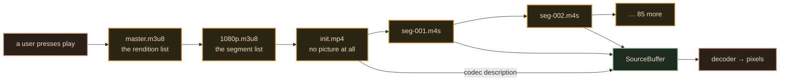

# 01 · How it really works

> **The interview line.** "A video is not a file you download. It is a negotiation your
> browser re-runs every few seconds, and almost everything you see on the control bar is a
> guess."

## The mental model everyone starts with, and it is genuinely correct

```html
<video controls poster="cover.jpg" preload="metadata">
  <source src="film.mp4"  type="video/mp4">
  <source src="film.webm" type="video/webm">
</video>
```

`[V]` This is MDN's own cross-browser pattern and it works. It is also what the rest of this
document dismantles, because it cannot switch quality mid-playback, cannot seek before the
byte range arrives, and cannot do live at all.

## What actually happens

`[V]` One three-minute video, played once, measured in a real DevTools Network panel:
**89 requests.** Not one file — a manifest, a variant playlist, an init segment, and then a
segment every few seconds, each one re-decided.



**The init segment is the one that matters and the one nobody mentions.** It carries no
video. It carries the codec description, and without it every following segment decodes to
garbage. In the video this is the open loop: one of those first requests is the reason
anything ever plays.

## Three mechanisms explainers get wrong

| the claim you usually hear | what is actually true |
|---|---|
| "the player downloads the file" | there is no file. There is a list of lists, and a segment at a time. |
| "the quality selector sets the quality" | `[D]` it sets a *ceiling*. ABR still picks under it, and already-buffered segments play first — which is why a quality change feels late. |
| "the network decides what you see" | the **buffer** decides. The network only decides how the buffer is doing. |

## Two platform lies, both load-bearing

`[V]` **There is no `stop()`.** The Media API has `play()` and `pause()` and nothing else.
Every stop button you have ever pressed is `pause()` followed by `currentTime = 0`, written
by a developer.

`[V]` **`video.duration` can be `NaN` when `loadedmetadata` fires** — and on some mobile
browsers that event does not fire at all. So the progress bar's `max` gets patched on the
first `timeupdate` instead.

> Read that twice. The player does not know how long the video is at the moment it starts
> drawing the bar that tells you how long the video is.

That is not a bug list. It is the deeper point of Part 1: the smoothness is made of
guesses, and the guesses are the product.

## The spinner is not "loading"

`[D]` A spinner means the buffer controller lost a race it started ten seconds ago. It is a
report about the past, not a status. Doc 06 has the state machine that produces it.

---

Next: [02 · Requirements and the API](02-requirements-and-api.md) — where the manifest turns
out to be the API contract.
