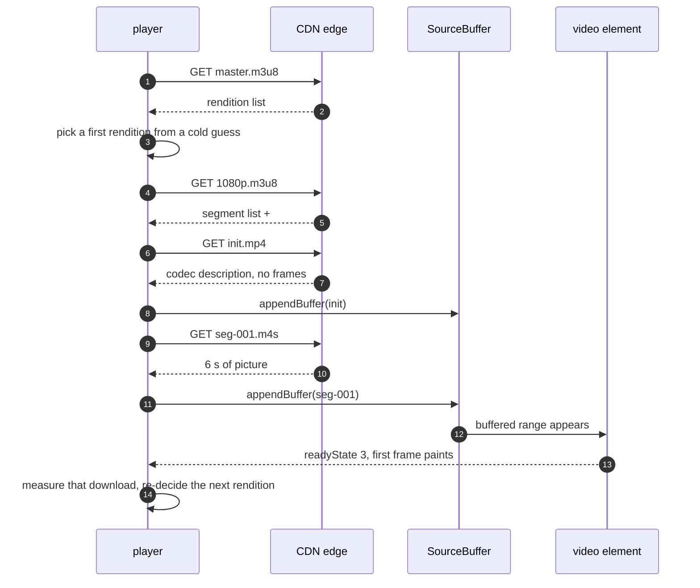

# 02 · Requirements, and the API you did not know you had

> **The interview line.** "There is no REST API in this system. The manifest is the API
> contract, and every decision downstream is one line of that file wearing a costume."

## Scope, said out loud

Refusing scope is the seniority signal, so say both halves.

| in | out |
|---|---|
| VOD playback, seek, resume position | the encoding pipeline |
| adaptive bitrate | CDN design |
| quality override UI | recommendations |
| captions | DRM — deliberately deferred to Part 2 |

## Functional requirements

1. play / pause / seek
2. adapt to bandwidth without asking
3. resume where the viewer left off
4. captions, on and off, styled by the OS
5. a quality override that is a ceiling, not a command

## Non-functional, ranked — the ranking IS the answer

| # | NFR | target | why it ranks here |
|---|---|---|---|
| 1 | time to first frame | `[I]` < 500 ms | the only number a viewer can feel before they have watched anything |
| 2 | rebuffer ratio | `[I]` < 0.5 % | above ~2 % people leave (doc 05) |
| 3 | seek latency | `[I]` < 200 ms | the interaction people repeat most |
| 4 | memory | 30 s **or** 60 MB | `[V]` hls.js's own dual cap; whichever binds first |

## Back-of-envelope, and the number that ends the "why not buffer it all" question

`[I]` 1080p ≈ 5 Mbps ⇒ a 6-second segment ≈ **3.75 MB**.
A 30-second target buffer ⇒ ~5 segments resident ⇒ **≈ 19 MB** of decoded and undecoded data
held at once.

> That is why you cannot buffer the whole film. Not policy — arithmetic. A two-hour film is
> ~4.5 GB at that bitrate and the browser will evict you long before you get there.

## The manifest IS the API contract

```
#EXTM3U
#EXT-X-STREAM-INF:BANDWIDTH=5000000,RESOLUTION=1920x1080,CODECS="avc1.64002a,mp4a.40.2"
1080p.m3u8
#EXT-X-STREAM-INF:BANDWIDTH=2800000,RESOLUTION=1280x720,CODECS="avc1.4d401f,mp4a.40.2"
720p.m3u8
#EXT-X-STREAM-INF:BANDWIDTH=1100000,RESOLUTION=854x480,CODECS="avc1.4d401e,mp4a.40.2"
480p.m3u8
```

Three lines of metadata per rendition, and every later decision reads from them:

- `BANDWIDTH` is what ABR compares its estimate against — **the declared peak, not the
  average**, which is why the up-factor in doc 05 exists.
- `CODECS` is what the SourceBuffer is created with. Get it wrong and `appendBuffer` throws.
- `RESOLUTION` is what the cap-level controller uses to avoid fetching more pixels than the
  element is actually displaying.

## One playback, end to end



Step 3 is the cold start, and it is the biggest single lever on time-to-first-frame — see
doc 07. Step 12 is where the loop closes: **every segment is also a measurement.**

## Decision — HLS vs DASH vs progressive MP4

| | chosen: **HLS, packaged CMAF** | rejected: DASH only | rejected: progressive MP4 |
|---|---|---|---|
| Safari / iOS | `[V]` native support | MSE support is uneven | works, but nothing else does |
| quality switching | mid-playback | mid-playback | **impossible** |
| live | yes | yes | no |
| deciding factor | one set of CMAF segments serves both HLS and DASH manifests | loses Safari without a second packaging path | fails FR 2 outright |

`[D]` Ship HLS, package CMAF/fMP4 so the same bytes serve a DASH manifest when you need one.

---

Next: [03 · High-level design](03-high-level-design.md) — the controller cluster.
