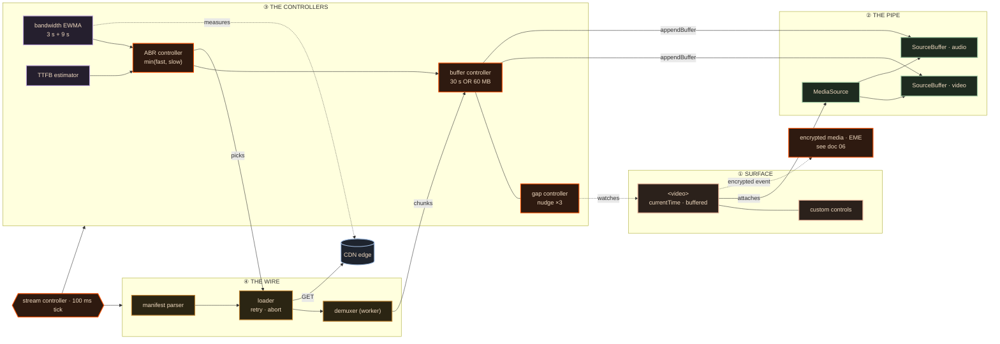

# 03 · High-level design — the controller cluster

> **The interview line.** "Front-end system design is not microservices. It is a cluster of
> controllers bolted onto one browser API, and each one has to earn its place."

This is the diagram both videos end on. Part 2 uses it as its board for ten questions
straight, which is the point: **one artifact, three jobs — agenda, progress, recap.**

> **An honest note about this diagram.** Part 1's diagram did **not** have the EME box, even
> though Part 1's own controller census says "encrypted media" out loud. Part 2 opens
> question two by pointing at that hole: *"I drew the player I explained, not the player you
> would ship."* It is added here. A correction is worth more than a tidy story.

## Why each box exists

| box | earns its place because | the number on it |
|---|---|---|
| `<video>` | it is the only thing that can put a pixel on screen | `readyState` 0→4 |
| MediaSource | the only way to feed bytes to a decoder from JS | one per playback |
| SourceBuffer ×2 | video and audio are appended and evicted **independently** | they drift; doc 06 |
| buffer controller | decides *how much* to hold | `[V]` 30 s **or** 60 MB |
| ABR controller | decides *which* rendition next | `[V]` `min(fast, slow)` |
| bandwidth EWMA | turns downloads into an estimate | `[V]` 3 s / 9 s half-lives |
| TTFB estimator | separates *waiting* from *throughput* | doc 05 |
| gap controller | the playhead can stall **inside** buffered data | `[V]` 3 nudges of 0.1 s |
| manifest parser | the contract in doc 02 | — |
| loader | retry, blacklist, and **abort** | doc 06 |
| demuxer | container → codec frames, off the UI thread | in a worker |
| stream controller | the only thing on a clock | `[V]` every 100 ms |

## The `<video>` element's real control surface

`[V]` MDN. This is what every layer above manipulates — worth knowing by name, because
interviewers ask.

- state: `paused` · `ended` · `currentTime` · `duration` · `volume` · `muted` · **`buffered`**
- events: `loadedmetadata` · `timeupdate` · `progress` · `waiting` · `encrypted`
- `buffered` is a **`TimeRanges`** — a *list of disjoint ranges*, not a bar. Doc 06 shows why
  drawing it as one bar is the lie that makes seeking look free.

## Decision — custom controls vs the native `controls` attribute

| | chosen: **ship `controls`, strip it in JS** | rejected: custom only |
|---|---|---|
| your script throws | native controls survive | a black rectangle |
| JS disabled | native controls survive | a black rectangle |
| screen reader arrives first | native controls survive | nothing to announce |
| iOS forced fullscreen | handled by the platform | you fight it |
| cost | `[V]` one line: `video.removeAttribute("controls")` | — |

`[D]` Progressive enhancement is not a philosophy here. It is a fallback that costs one line.

## Why not just `<video src="movie.mp4">`

Because it cannot switch quality mid-file, cannot seek before the range arrives, and cannot
do live. Everything above exists to buy those three things.

---

Next: [04 · Services and interactions](04-services-and-interactions.md) — who calls whom.
