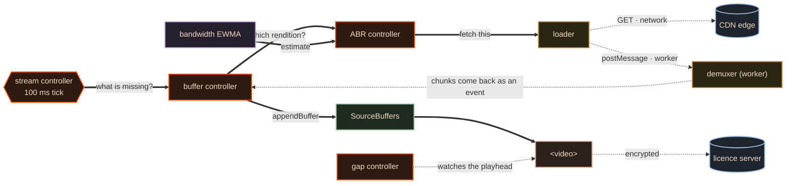

# 04 · Services and interactions — which calls can block

> **The interview line.** "Anything that can block for a network round trip is an event.
> Anything that must answer inside one tick is a call. Say that sentence and you have
> answered the question."

This is the question that catches people who memorised a diagram. A list of components is a
vocabulary. **The matrix is the design.**

## The fifteen controllers, named

`[V]` The census hls.js actually ships, so the number lands on one meaning:

`ABR` · `stream` · `audio-stream` · `audio-track` · `buffer` · `cap-level` · `FPS` · `ID3` ·
`level` · `subtitle-stream` · `subtitle-track` · `timeline` · `gap` · `latency` ·
`encrypted-media`

## The same diagram, relabelled

Doc 03's picture, with one thing changed: **what the lines mean.** Solid = synchronous,
answers inside the same tick. Dashed = asynchronous, leaves the process and returns as an
event.

## The matrix, written out

| from | to | sync? | why |
|---|---|---|---|
| stream ctrl | buffer ctrl | **sync** | it is on a 100 ms clock; it cannot await |
| buffer ctrl | ABR ctrl | **sync** | returns a rendition index immediately |
| EWMA | ABR ctrl | **sync** | reads an already-maintained number |
| ABR ctrl | loader | **sync** | hands over a URL; does not wait for it |
| buffer ctrl | SourceBuffer | **sync** call, **async** completion | `appendBuffer` returns at once, `updateend` fires later |
| loader | CDN | **async** | a network round trip |
| loader | demuxer | **async** | it is in a worker |
| demuxer | buffer ctrl | **async** | chunks arrive as events |
| EME | licence server | **async** | a different host, often a different continent |
| gap ctrl | `<video>` | **async** | it reacts to `timeupdate` |

`[D]` **No awaits in the tick path.** The stream controller asks one question ten times a
second — *what is missing?* — and everything it touches has to answer inside that tick. The
moment a network call gets into that path, the clock slips and the buffer starves.

## The shape of it, in one sentence each

- **The stream controller is the only thing on a clock.** Everything else is reactive.
- **The synchronous core is a decision path**: what is missing → which rendition → which URL.
- **The asynchronous edges are the ones that leave the process**: the network, the worker,
  the licence server. All three come back as events, not as returns.

> Draw the boxes and you have a vocabulary. Label the lines and you have the design. That is
> the whole difference between the two answers.

---

Next: [05 · Data — the ABR decision](05-data-and-the-abr-decision.md) — the four lines of
code this entire topic turns on.
