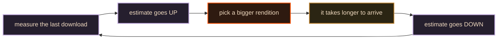
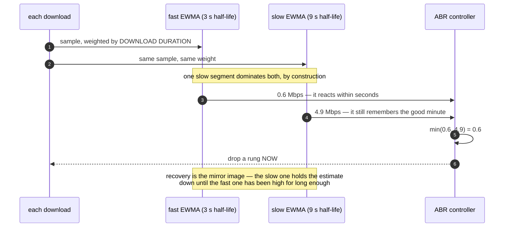

# 05 · Data — the ABR decision

> **The interview line.** "The estimator is deliberately pessimistic, and it is pessimistic
> twice. If you only mention the average, you have described half the algorithm."

This is the heart of the system and the most under-explained idea in the whole topic. It is
also four lines of real code.

## The naive design, and why it oscillates

Estimate bandwidth from the last segment. Pick the biggest rendition that fits. Repeat.



`[D]` A player chasing its own tail. Up, down, up, down — and each lap is faster than the
last, because each wrong pick produces a more extreme measurement. The viewer sees the
quality badge flicker and reads the player as broken.

## The fix — two EWMAs, and you take the lower one

`[V]` From `ewma-bandwidth-estimator.ts`, comment included:

```ts
// Take the minimum of these two estimates. This should have the effect of
// adapting down quickly, but up more slowly.
const emwaEstimate = Math.min(
  this.fast_.getEstimate(),
  this.slow_.getEstimate()
);
```



`[V]` Half-lives are **3 s fast / 9 s slow**, configurable via the `abrEwma*` options. The
weight on each sample is the **download duration**, so a single slow segment dominates the
average by design rather than by accident.

**Why `min()` and not an average:** an average treats a collapse and a recovery as equally
likely. `min()` says *a bad measurement is information and a good one might be luck.* Drop
fast, climb slow.

## Pessimism, applied a second time

`[V]` Teaching only `min(fast, slow)` undersells it. There is a second asymmetry in the
thresholds themselves:

| factor | value | means |
|---|---|---|
| `abrBandWidthUpFactor` | `0.70` | you need **≈ 1.43×** a rendition's bitrate to climb into it |
| `abrBandWidthFactor` | `0.95` | you only need **≈ 1.05×** to stay in it |

So the ladder has hysteresis: it is hard to get in and easy to stay. Two different
mechanisms, same intent, and an interviewer listening for depth wants both.

## Decision — ABR strategy

| | chosen: **hybrid (throughput + buffer)** | rejected: throughput only | rejected: buffer only |
|---|---|---|---|
| behaviour under a sawtooth network | stable | **oscillates** — the loop above | stable but slow |
| startup | fast, once seeded (doc 07) | fast | very conservative |
| reacts to a collapse | immediately, via `min()` | immediately | only once the buffer drains |
| deciding factor | oscillation under a sawtooth is what viewers actually experience | fails it | wastes headroom for the whole session |

## The measurement that is not bandwidth

`[V]` The TTFB estimator exists because **waiting is not throughput.** Two segments, same
bytes, same measured throughput, one takes four times the wall clock — because the second
spent 930 ms waiting for the first byte. If you fold that into a bandwidth number you will
drop a rung for a problem that a rung change cannot fix.

## Quality of experience — how you would know any of this works

`[D]` Server metrics measure your delivery, not anyone's experience. All green while the
video stutters is the classic failure. Measure four numbers, from the client:

| # | metric | definition | healthy |
|---|---|---|---|
| 1 | time to first frame | click → **first pixel**, not first request | `[I]` < 500 ms |
| 2 | rebuffer ratio | seconds stalled ÷ seconds watched | `[I]` < 0.5 %; over 2 % people leave |
| 3 | bitrate-weighted average | what **played**, weighted by how long it played | — |
| 4 | **exits before video start** | the sessions that never saw anything at all | the one everybody drops |

> Number 4 is the honest one. A viewer who gives up during startup never fires a playback
> event, so **your dashboard is built out of the sessions that survived.** If you only
> measure people who watched, you have measured the ones who did not have this problem.

`[D]` Events from the client, sampled, batched, fired on a timer **and** on `pagehide`. Fire
and forget — a dropped analytics beacon is not worth a millisecond of playback.

---

Next: [06 · Failures and drills](06-failures-and-drills.md) — what breaks, in order.
