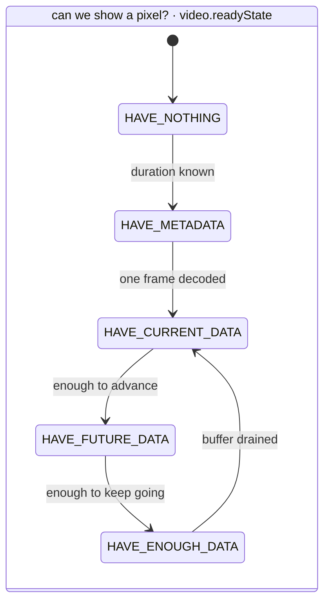
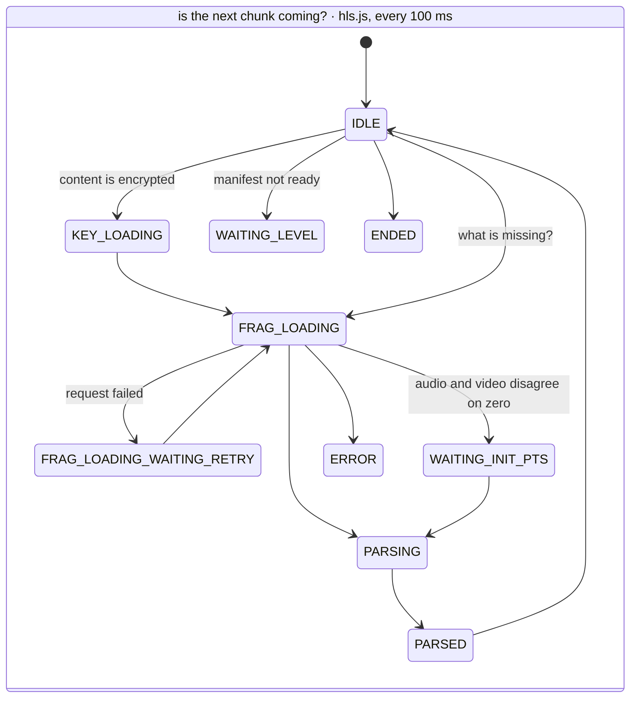
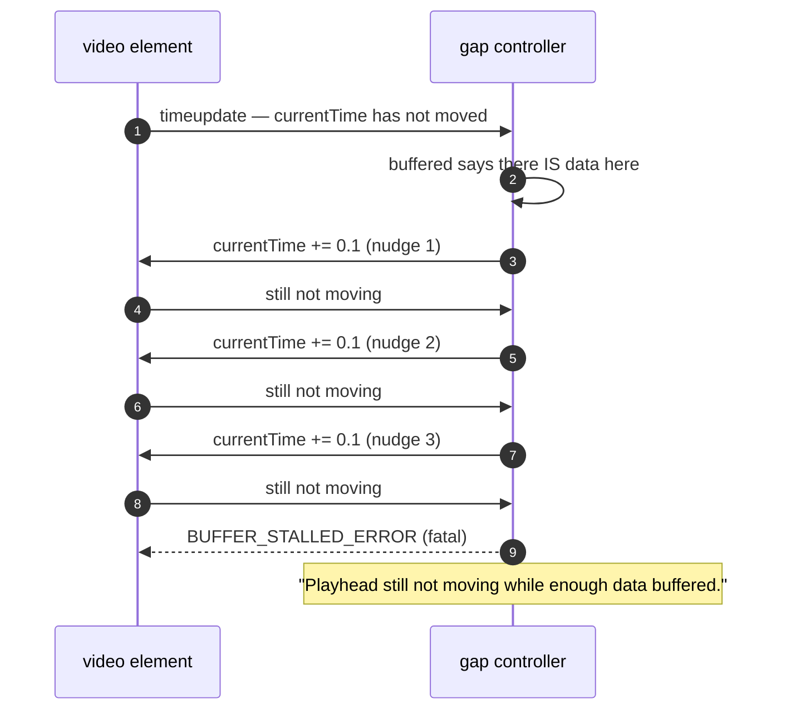
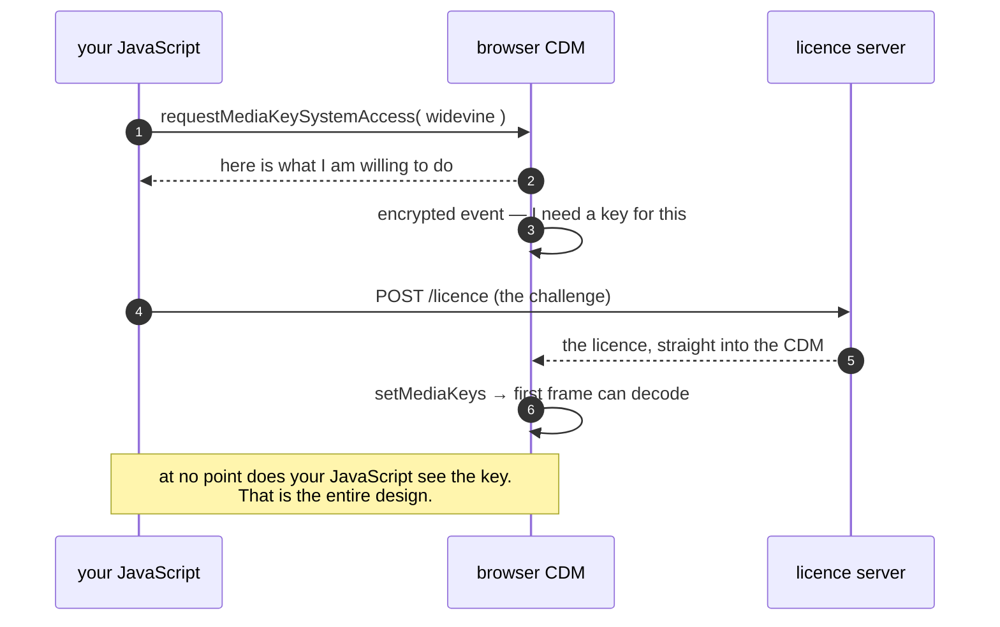

# 06 · Failures and drills

> **The interview line.** "A leak is not a crash. It is a slow decline that only shows up in
> a graph you decided to draw."

## The two state machines, and conflating them is the classic mistake

`[V]` These are different machines answering different questions. Interviewers probe the gap
between them, because almost every confusing playback bug lives there.

`[V]` The buffer targets on the box: **30 s or 60 MB**, whichever binds first.

Three states worth knowing by name:

- **`KEY_LOADING`** — a licence round trip that happens *before frame one*. See DRM below.
- **`WAITING_INIT_PTS`** — audio and video have not agreed where zero is. Every out-of-sync
  bug you have ever filed lives near this state.
- **`PARSING`** — in a web worker, off the thread that draws your UI.

## Drill 1 — bandwidth collapses mid-segment

`[V]` With fewer than two fragments buffered, if the in-flight segment will not land before
the buffer starves, hls.js **throws away the partial download**
(`FRAG_LOAD_EMERGENCY_ABORTED`) and drops a rung. Bytes already paid for, discarded on
purpose, because arriving late is worse than arriving small.

> And the quality change still feels *late* — because the already-buffered high-quality
> segments play first. The viewer sees the drop several seconds after the network caused it.

## Drill 2 — a segment 404s on one edge

Retry with backoff, then **blacklist that rendition** and re-pick. `[D]` One bad variant
should cost you one variant, not the session.

## Drill 3 — the live edge runs away

`[V]` The player **speeds up and never slows down**: `playbackRate` is clamped to
`max(1, rate)` and capped at 2×, and it is **off by default**
(`maxLiveSyncPlaybackRate: 1`).

> Worth correcting out loud, because the intuitive answer — "slow down to 0.97× and drift
> back" — is what most people say and the source disproves it.

## Drill 4 — the playhead stalls *inside* buffered data

The strongest single beat in Part 1, and the one that explains `TimeRanges`.

`[V]` Three nudges of 0.1 s, then it gives up. A shipping video player's answer to a decoder
that will not advance is *to poke it*.

**Why this happens at all:** `buffered` is a `TimeRanges` — a list of disjoint ranges. `[V]`
Whether two adjacent ranges count as one is a **tolerance of 0.1 s**. Land in a gap smaller
than that and the player treats it as continuous; land in one larger and you stall inside
what looks like buffered data.

## Seeking into nothing

Four things happen before a single new byte arrives:

1. the in-flight fragment is **abandoned** — nobody wants segment twelve now
2. `buffered` is consulted; the target time is in **none** of the ranges
3. `SourceBuffer.remove()` on the ranges **furthest** from where you landed
4. only now does it ask the network

`[V]` And the request is **not for the segment you asked for.** You cannot start decoding at
an arbitrary frame — only at a keyframe. So it fetches the segment containing the nearest
keyframe *before* your target.

> Which is why seeking **backwards** feels cheaper than seeking forwards. Backwards, that
> keyframe is often still in the buffer. Forwards, it never is.

## Drill 5 — memory on a smart TV

`[V]` An unbounded SourceBuffer OOMs a TV in under an hour. Two things to say:

- the **30 s or 60 MB** dual cap is the primary defence
- `[V]` with `preferManagedMediaSource: true` the **user agent** may evict your buffer at any
  time without asking (`bufferedchange`). You are a guest.

## Drill 6 — the eight-hour session

Three things leak, and none of them are the video:

| leak | how it happens | how you would know |
|---|---|---|
| listeners | every rendition change and track switch attaches a handler something never removes | heap snapshot, detached nodes |
| object URLs | you created one to attach MediaSource and never called `URL.revokeObjectURL` | the whole MediaSource stays alive |
| detached MediaSource | you made a new one on a fatal error; a closure still references the old one | compare snapshots |

`[D]` Take a heap snapshot at minute one and another at minute sixty, and compare detached
nodes. In production, report **session length against memory, bucketed by device** — because
the device that leaks is never the one you develop on.

## DRM, and what it costs you

`[V]` EME is not a decoder. It is a **negotiator**.

`[I]` Call it **200 ms** on a good day — a different host, a different TLS handshake, often a
different continent — and it happens **before frame one**. Against a 500 ms TTFF budget that
is 40 % of the budget gone before you fetch any picture.

> `[V]` Widevine has levels. **L1** means decryption happens in hardware the browser cannot
> reach; **L3** means it happens in software, which is every desktop browser. Studios tie
> resolution to the level, so the same account gets 4K on a TV and 720p on a laptop. That is
> not your player being cheap — that is the laptop failing a trust check.

---

Next: [07 · Build it yourself](07-build-it-yourself.md) — the stack, and the deciding number.
