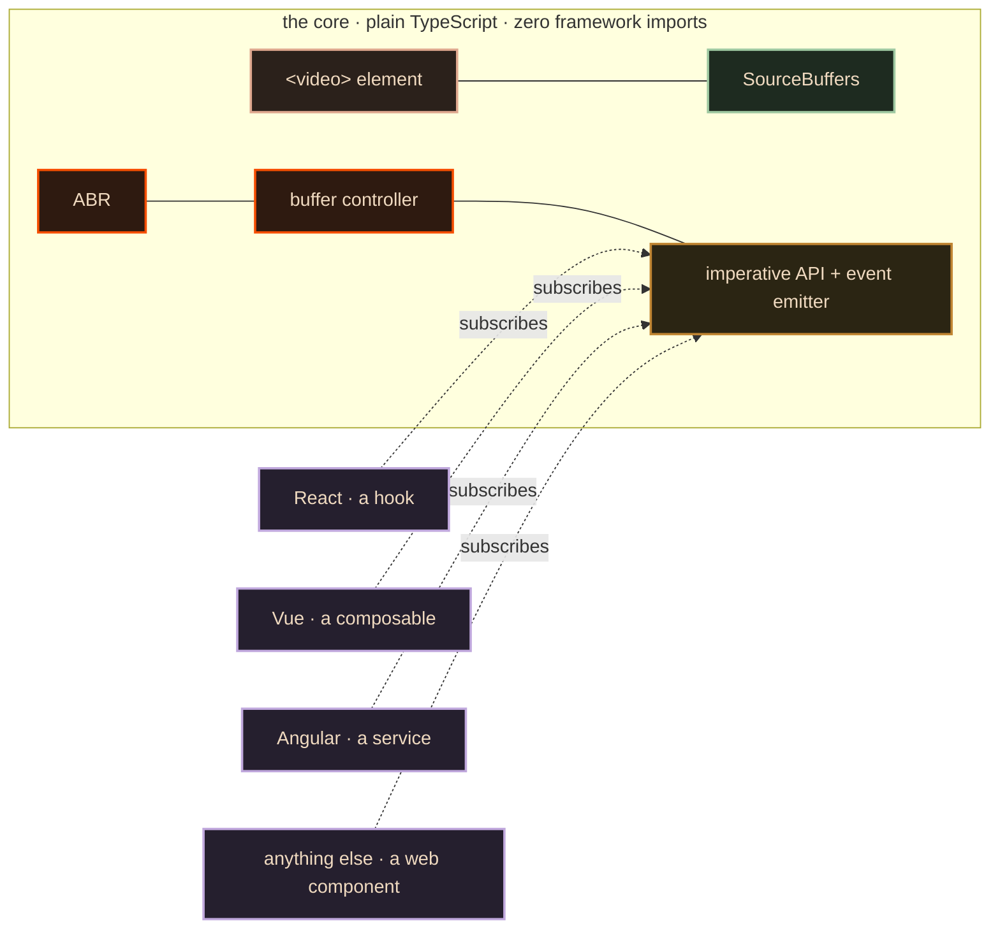

# 07 · Build it yourself — the stack

> **The interview line.** "The hard eighty percent has nothing to do with your framework. So
> the core cannot import one."

## Decision — a framework component vs a framework-agnostic core

| | chosen: **plain TypeScript core + thin adapters** | rejected: build it as a React component |
|---|---|---|
| time to a demo | one extra day | fastest |
| time to the second framework | an adapter | a rewrite |
| where the hard work lives | in code that imports nothing | coupled to one lifecycle |
| what the real ones do | `[V]` hls.js and shaka are framework-free modules; the wrappers came later | — |
| deciding factor | everything in docs 03–06 is framework-independent, so coupling it to a render cycle buys nothing and costs the exit | — |



**Fifteen boxes, and not one of them imports a framework.** The adapter is a thin ring around
the outside. That is the whole architecture.

## Decision — who owns playback state

The decision the interviewer is actually waiting for.

| | chosen: **the core owns state, the framework subscribes** | rejected: the framework owns it |
|---|---|---|
| the `<video>` element is | imperative, and it ticks 10×/s | still imperative |
| cost of putting that in a render cycle | — | `[I]` ~600 tree renders a minute to move a progress bar |
| what the framework does | subscribes and renders what changed | becomes the source of truth for a 100 ms tick |
| deciding factor | a render cycle cannot be the source of truth for something that changes ten times a second | — |

## Decision — language

`[D]` TypeScript, and **not for the types you write — for the ones you get.**

```ts
// what you assume it is                    // what the compiler knows it is
const end = v.buffered.end;                 for (let i = 0; i < v.buffered.length; i++)
if (t < end) play();                          if (inRange(i, t)) play();
// TypeError: end is not a function          // the gaps were always there
```

A `TimeRanges` the compiler knows is a **list** and not a bar is a whole class of bug you
never ship. Doc 06's stall-inside-buffered-data drill is that bug, in production.

## Decision — WebAssembly

`[D]` Mostly, no. Your controller logic is ~100 lines of arithmetic running ten times a
second. That is not a bottleneck.

WASM earns its place in exactly three places:

1. a **software decoder** for a codec the browser refuses
2. a **custom demuxer** for a container the browser will not parse
3. **subtitle rendering** for scripts the browser lays out badly

> Everything else is a rewrite you will maintain forever to save nothing.

## The deciding number — bundle size

`[V]` **Measured, not quoted.** Gzipped size of the shipped `dist` file of the current
release, produced by downloading it and running `gzip`:

| library | file | gzipped |
|---|---|---|
| hls.js 1.6.17 | `dist/hls.min.js` | **159 kB** |
| hls.js 1.6.17 | `dist/hls.light.min.js` | **105 kB** |
| shaka-player 5.2.4 | `dist/shaka-player.compiled.js` | **265 kB** |

> An earlier draft of the video said "hls.js is about 40 kB, shaka about 110." Neither number
> had a source and both were wrong. The corrected figures make the argument *better*, because
> the interesting number turns out to be the one you can get **down** to: hls.js's light
> build drops features you are not using and lands at 105 kB, less than half of shaka.

`[I]` On the device that needs your player most — a cheap phone on a slow connection — that
gap is about a second of startup. **The library you pick is a latency decision wearing a
dependency's clothes.**

## Decision — the player library

| | hls.js | shaka-player | dash.js | native `<video src>` |
|---|---|---|---|---|
| HLS | yes | yes | via CMAF | Safari only |
| DASH | via CMAF | yes | yes | no |
| DRM / EME | yes | **strongest** | yes | platform-dependent |
| LL-HLS | yes | yes | partial | no |
| gzipped | `[V]` 159 kB / 105 kB light | `[V]` 265 kB | ~120 kB | 0 |
| `[D]` pick it when | HLS-first, size matters | multi-DRM, multi-format | DASH-first | you genuinely only need Safari |

## The one lever that beats all of this on time-to-first-frame

`[V]` The cold start. The player opens with a hard-coded guess — 500 kbit in Part 1's walk-
through — and that guess picks your first rendition. Your first rendition is most of your
first frame.

`[D]` **Store the last session's estimate and seed the player with it.** A returning viewer
starts where they left off instead of at the floor. One line of `localStorage`, and you have
moved the number everybody else is chasing with infrastructure.

In order, the levers that actually matter:

1. seed the estimate from the last session — biggest single win
2. `preload="metadata"` — duration and dimensions without a byte of picture
3. warm the manifest — small, on the critical path, startable earlier than you think
4. a poster — `[D]` moves no milliseconds, moves the number the viewer *feels*, which is a
   different and equally real win

---

Back to [the index](README.md).
